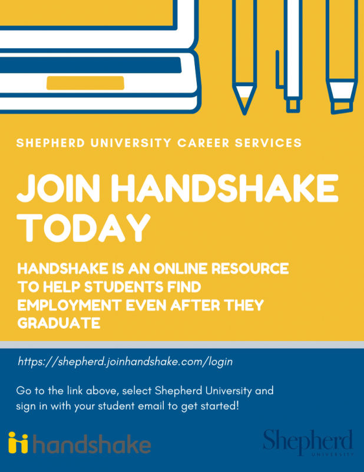
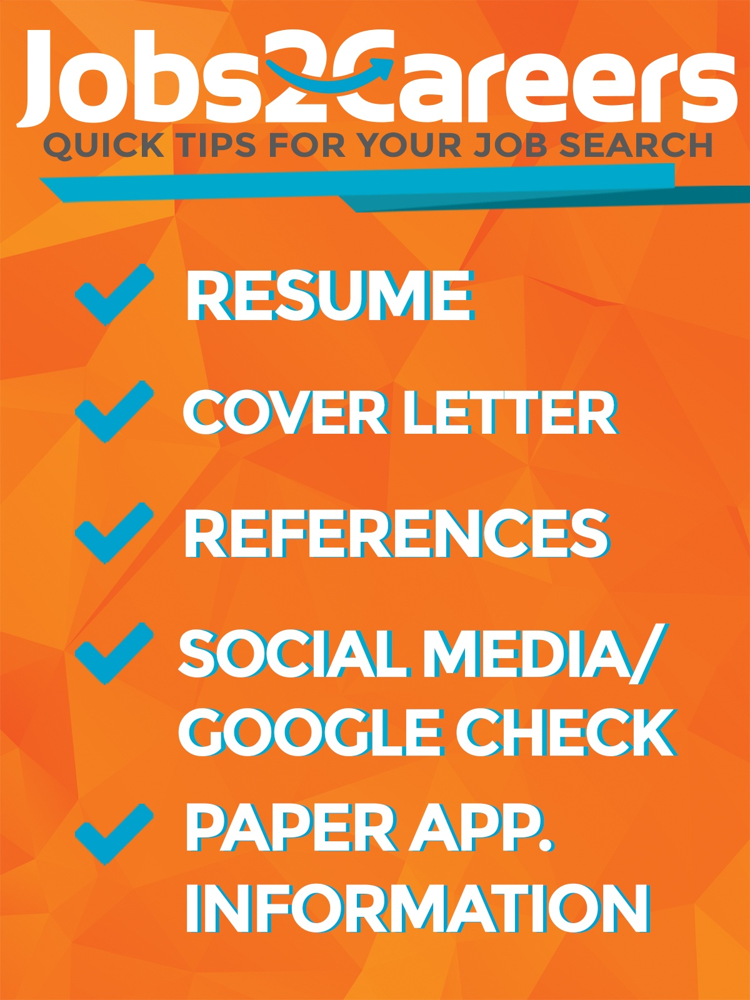
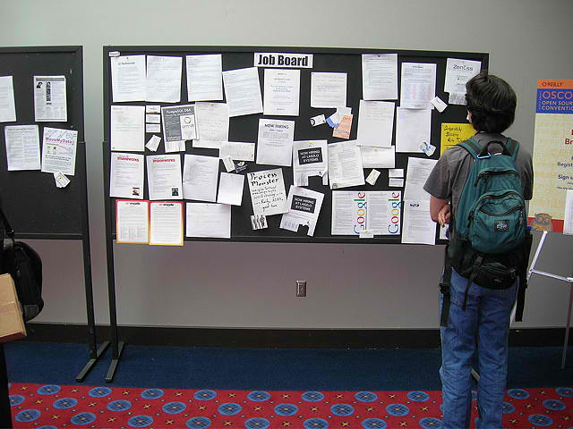

## Career services at Shepherd

 

* **Shepherd has an entire office devoted to helping you meet your career goals**
    + http://www.shepherd.edu/career-center
    + you pay for it!!!

 

* **Many tutorials around topics related to applying for jobs are available at:*
    + http://www.shepherd.edu/career-center/tutorials

 

* **Shepherd's fall career fair: **

## Preparing for a job search

 

* **Define what kind of position you are looking for**
    + Interest
    + Your qualifications
    + How does it fit with your long-term plans?
    + Type of employer (academic, government, industry, etc.)
    + Salary
    + Location
    + Time expectations
    + Family (closeness, childcare)
    + Transportation
    + Training requirements

## Be proactive throughout the search

 
 

* **You will not find a job by sitting on the computer wishing for the perfect job to come along**

 

* **Jobs don’t come along—you have to find and get them**

 
 

* **Make an action plan and set goals for yourself**

 

* **Assertive (but not annoying) applicants are more likely to stand out from the pack**

## Prepare your job tools

* **Job applications require the same basic set of components:**
    + *Up-to-date resume or CV*: a summary of your employment history, skills, and achievements
    + *Cover letter*: a letter sent in with your other application materials declaring your interest in the job
    + *Reference List*: contacts who can provide potential employers with an assessment of you as an employee (often previous supervisors)
    + *Transcript*: some positions may be required to confirm your education
    + *Licensure*: documentation of special training or endorsement

 

* **Cover letters can be recycled but need to be tailored to each position**
    + easy to forget (Dr. C forgot many times)

 

* **Social media checks may occur!**

## How to locate listings for jobs?

* **Large internet job boards:**
    + www.indeed.com
    + https://www.sciencejobs.org/
    + https://jobs.sciencecareers.org/
    
 

* **Federal government:  www.usajobs.gov**

 

* **State government:**
    + West Virginia:  https://personnel.wv.gov/
    + Maryland:  https://jobapscloud.com/MD/
    + Virginia:  https://jobs.virginia.gov/

 

* **Many large companies also maintain employment sites**
    + usually cross-posted on large internet job boards

 

* **Create an account and get updates!**

## Lets get started! Go find a damn job!

