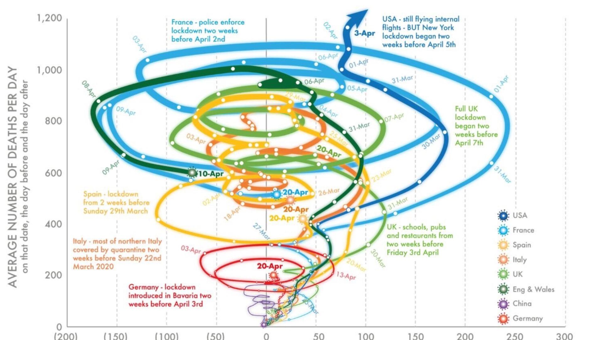

## Your goal as a science communicator

 

* **Communicate information to the reader in as clear and concise a manner as possible**
    + you want your reader to understand what you wish to say effortlessly

 

* **Visuals are a powerful addition to your articles and presentations**
    + breaks up text
    + often allows audience process info faster

 

* **Data visualization is a graphical representation of any data or information**
    + books dedicated to it

## A picture is worth a thousand words

 **Figures or tables can convey key information that is less suited to a text description**

 

* **Readers are often drawn to figures**
    + perceived as easier to understand than text

 

* **Adding figures to your capstone paper has several uses:**
  + Summarize a large amounts of data
  + Graphically compare results easily
  + Visualize trends in data clearly
  + Enhance reader interest

 

* **Poorly executed figures can confuse readers and detract from a paper**

## Rules for choosing a figure

**Which type of figure should I choose?**

 

1. Know your audience
 
2. Identify your message
 
3. Adapt the figure to the medium
 
4. Captions are not optional
 
5. Do not trust the defaults
 
6. Use color effectively
 
7. Do not mislead the reader
 
8. Avoid 'chartjunk'
 
9. Message trumps beauty
 
10. Get the right tool

## Pro Tips: When to use a table, figure, or text?

**Ask yourself:  How can you best convey the information you want your reader to know?**

    
 
 
 
 

* **Use a table:**
    + To show many numerical values or other data in a small space
    + To compare and contrast values or characteristics among related items
    + To show the presence or absence of specific characteristics

## Humans are inherently visual 

**For most people, looking at tables of numbers is not intuitive; complicated data can often be displayed and interpreted more easily in a visual format**

 
 

## Pro Tips: When to use a table, figure, or text?

**Ask yourself:  How can you best convey the information you want your reader to know?**

 

* **Use a table:**
    + To show many numerical values or other data in a small space
    + To compare and contrast values or characteristics among related items
    + To show the presence or absence of specific characteristics

* **Use a figure**
    + To summarize research results (graphs)
    + To show trends, patterns, and relationships between data when the exact numerical value is not important
    + To present a visual representation of physical results (images)

## Pro Tips: When to use a table, figure, or text?

**Ask yourself:  How can you best convey the information you want your reader to know?**

 

* **Use a table:**
    + To show many numerical values or other data in a small space
    + To compare and contrast values or characteristics among related items
    + To show the presence or absence of specific characteristics

* **Use a figure**
    + To summarize research results (graphs)
    + To show trends, patterns, and relationships between data when the exact numerical value is not important
    + To present a visual representation of physical results (images)

 
 
 
 
 
 

* **Use text:**
    + When you don’t have extensive or complicated data
    + When the data that you are presenting is peripheral to the main point

## How to use figures and tables in a narrative review?

 

* **All of your capstone papers should have tables/figures**
    + you will also convert your paper to a (mostly) visual format:  the poster

 

* **How can figures be used in a review paper?**
    + **Introduction:**
        + To introduce your topic or provide important background
        + For example:  organism, cell type, disease, molecular pathway, etc.
    + **Body:**
        + To show a key piece of data from a primary paper (graph or image)
        + To summarize data from multiple experiments (table)
        + Conceptual diagram that summarizes the results of multiple experiments
    + **Conclusion:**
        + To present a proposed model or experimental approach

##

## 

## 

##

##

##

## Considerations for use of tables and figures

 

* **Ensure that visual elements are self-contained.**
    + readers should understand a figure or table based solely on the visuals and legend

 

* **Use clear, informative captions** 
    + concisely describe the purpose or contents of the figure
    + uses to highlight key information in it

 

* **Refer but *don’t* repeat!!!**
    + Use the text to draw the reader’s attention to the key points of the table or figure.
    + highlight your main finding but don’t repeat exact values
    + “Campany et al. (2021) found that the treatment was completely effective in only 24% of cases” versus “As Table 2 in Campany et al. (2021) shows, 32% of subjects improved but relapsed, 24% eliminated the infection, 45% showed no improvement, etc.”

 

* **Be consistent.  Ensure that values and abbreviations in the text match the table/figure**

## Citing other authors tables and figures

 

* **Tables and figures taken from other sources are numbered and presented in the same format as your original tables and figures.**

 

* **You must properly cite a reference if you use data or figure, in whole or part**
    + just like citing someone's text

 

* **For the capstone, include a note at the end of your figure legend detailing the source of the figure:**
    + '[Adapted] From Figure 1 of Campany (2021).'
    + if reproducing a figure exactly, start the note with “From….”  If you have changed it for your own purposes (i.e. taken part of a figure), write “Adapted from…”

 

* **Be sure to include a full citation in your References section**

## 

