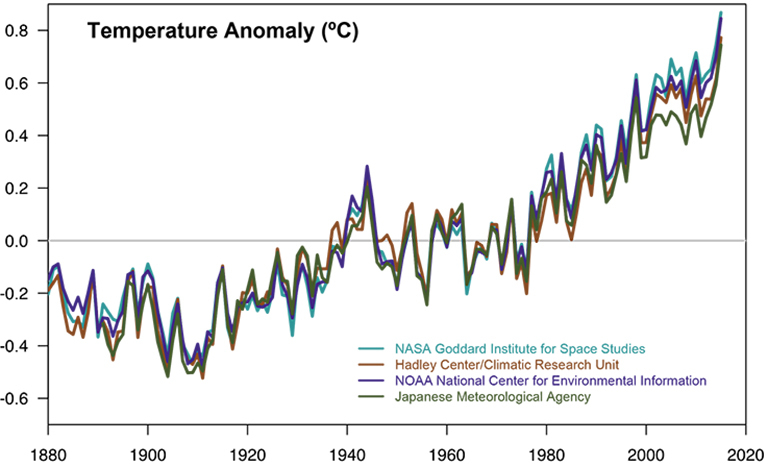

## Review: Should I make a figure or a table?

* **Tables are more complete and less visual**
    + Primarily interact with verbal / language system
    + Precise values are important
    + Need to compare individual values

 

* **Graphs visually represent an entire data set**
    + Used to show relationships between two sets of data
    + Can show overall trends in data

 

* **How to decide?**
    + Are the variables qualitative or quantitative?
    + How many data points are there?
    + How many variables are there?
    + Is it important to show trends in the data?

## Review: Should I make a figure or a table?

* **Tables are more complete and less visual**
    + Primarily interact with verbal / language system
    + Precise values are important
    + Need to compare individual values

 

* **Graphs visually represent an entire data set**
    + Used to show relationships between two sets of data
    + Can show overall trends in data

 

* **How to decide?**
    + Are the variables qualitative or quantitative?
    + How many data points are there?
    + How many variables are there?
    + Is it important to show trends in the data?

## Creating tables (Excel is easiest option)

 
 
 

* **Some practical tips:**
    + show data relevant to your main point
    + divide the data into appropriate categories
    + accurately label categories and columns
    + raw data is rarely presented
    + use summary data (means & SD)
    + Declutter your table! 
    + Include a concise caption *above* the table

 

* **Use only horizontal line borders and double line spacing**

## Pro Tips: Avoid styling tables in excel

## What type of figure should I make?

## Line graphs show trends (e.g. through time)

## Bar graphs compare groups or track changes over time

## Pie charts show the relationship of parts to the whole

## Scatter plots show the relationship between 2 varibles

## Histograms show frequence distributions

## Box plots show how values are distributed within a data set

## Box plots show how values are distributed within a data set

## Graphs can have multiple axes and types

## Creating your figures

* **Microsoft Excel is the easiest choice**
    + there are much better programs available

 

* **You must customize your Excel graph for the best results**
    + tip: start with a blank figure

 

* **Clarity is once again the name of the game:**
    + label all elements of the graph: axes, curves, labels, bars
    + include a key to explain different colors, groups, etc.
    + declutter your graph
    + avoid large areas of white space on the plot
    + modify xis ranges to emphasize what you are showing

## 

## 

## Considerations for figures

* **Identify your message—design the figure to emphasize this message!**

 

* **Be neat:  line panels and labels up, keep white space consistent**

 

* **Standardize the style of your figures:  font, font size, colors,  graph size, etc**

## Constructing figures

* **Computer type and software version matter**
    + practice and know your system
    + Excel and Powerpoint may both be necessary for capstone

 

* **Be cautious with auto-making graphs**
    + which data went on which axis???

 

* **Working with images:**
    + snapshot tool w/ PDFs
    + screenshot to capture images

 

* **Figure legends can be created in Powerpoint or Word**

## Don’t neglect figure legends

* **A legend gives the reader information to understand a figure**
    + reader understand the results presented in your figure without reading the main text
    
 
 
* **Start your legend with one sentence that declares the main result in the figure**

 

* **Explain everything depicted in the figure**
    + panels, variables, abbreviations, genotypes, p values
    + any methodological information necessary to understand the data**

 

* **Do NOT interpret patterns**

 

* **Do NOT combine Figure # and text into a sentence**

##
 
 
 
 

Figure 5. Epiphytic tropical ferns are not more drought tolerant than terrestrial or hemi-epiphytic tropical ferns. (a) Raw results from 211 pressure–volume curves from 38 tropical fern species. Box plots of turgor loss point (b) and osmotic potential at saturation (c) across tropical fern life forms. Relationship between tissue capacitance at full turgor and the bulk modulus of elasticity for tropical ferns (d) and box plots of the tissue capacitance after turgor loss (inset). Fits for panels (a) and (d) for each fern life form uses loess regression for visualization purposes. Box plot widths are proportional to the number of measured species in each life form.

## Referring to figures and tables in the text

* **Figures and tables are numbered independently of each other in the order they appear in the text**

 

* **Every figure and table MUST be referenced from the text**

 

* **Use sentences that draw the readers attention to the result, relationship, or trend you want to highlight, referring to the figure or table parenthetically**

 

**GOOD:** 
 
Germination rates were significantly higher after 24 hours in running water compared to controls (Figure 4).
 
DNA sequence homologies for the Eyeless gene from three strains show high identity (Table 1).

 

**BAD:**
 
Table 1 shows the summary results for male and female heights at Shepherd University.
See the table below for a summary of the relevant literature on tumors. 

##
 
 
 

Minimal differences in leaf pressure–volume parameters were detected among the three life forms (Figure 5a). The turgor loss point (Ψtlp) marginally varied by life form (p = 0.051) and post hoc comparisons did not detect differences in Ψtlp across terrestrial, hemi-epiphytic, or epiphytic ferns. Broadly, terrestrial and hemi-epiphytic fern species had trended towards slightly lower Ψtlp than epiphytic species (Figure 5b). The osmotic potential at saturation (Ψo) was also lower in terrestrial compared to epiphytic species (p = 0.009, Figure 5c), while the modulus of elasticity (ε) was similar across all life forms. The relative water content at turgor loss point did not vary between fern life forms. The tissue capacitance between saturation and turgor loss (Cft) was not different between life forms, however; the tissue capacitance after turgor loss (CTLP) was 54% lower in epiphytic compared to terrestrial species (p = 0.009, Figure 5d insert). Additionally, Cft declined quickly with increasing ε for all species (Figure 5d)

