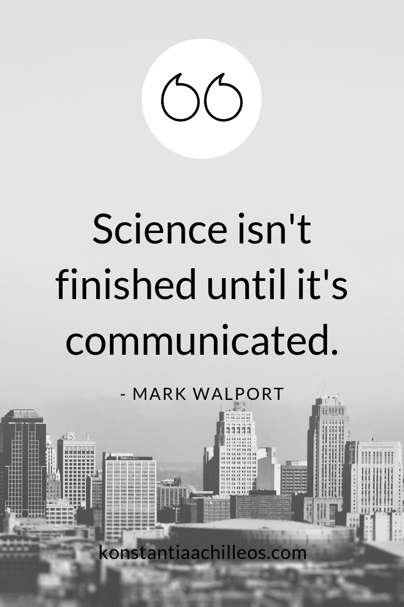

## You’ve earned a B.S. in biology…now what?  

 
 
 
 
 
 
 
 
 
 

* **Dr. C’s practical career tip^TM^: It is never too early to start planning your future**

## Career services at Shepherd University

 
 

* **Shepherd has an entire office devoted to helping you further your own professional or academic career**
    + http://www.shepherd.edu/career-center

 

* **Many tutorials around grad school and job topics are available (resume/CV, interviews, personal statements, etc.)**
    + http://www.shepherd.edu/career-center/tutorials

 

* **You pay for these!!**

 

Shepherd’s fall career fair: 

## What can I do with my degree in biology?

 

* **There are many different career paths available in the biological sciences**

 

* **Some of these are not obvious, but could be the most interesting and/or fulfilling to you**

 

* **In some cases education beyond the B.S. level is required**

## Employment you can expect as an…

 

* **Career positions in biology (including salary, benefits, responsibilities) are generally commensurate with your level of experience and/or education**

 

* **Undergraduate student:  internship (paid or unpaid) working with someone else**

 

* **B.S. or M.S. degree:  technician/assistant; somewhat independent, performs key tasks within parameters set by the boss**

 

* **Ph.D./M.D.: guides overall mission, makes decisions**

## “Why should I consider getting an advanced degree?”

 

* **Many people are tired after four years of college and don’t want to go to more school…**

 

* **Consider whether you might want:**
    + To do advanced work in a subject (guide your own research/activities)
    + A profession that requires specialization (skill set requires more advanced classes)
    + A job that requires an advanced degree (e.g. some government positions)

 

* **Graduate school directories:**
    + http://www.shepherd.edu/career-center/graduate-school 

## Where can biology take you?

* **Academic and hospital research**
* **Biotechnology**
* **Dentistry**
* **Ecology**
* **Environmental science**
* **Food industries**
* **Forensic science**
* **Government agencies (FBI, FDA, DNR, NASA, USDA)**
* **Graduate school**
* **Law**
* **Medicine**
* **Nursing**
* **Pharmaceuticals**
* **Physical therapy**
* **Physician assistant**
* **Public health**
* **Science writing or journalism**
* **Veterinary medicine**
* **Wildlife management**
* **Science Communication**

## Biological Research

 

* **Being a part of a new discovery is exciting!**

 

* **Part of the reason for this course is to give you the taste of a long-term research project**

 

* **Research careers are possible at many levels, in many settings, and in many different capacities**

 

* **Science has entered a new realm of BIG data**
    + combining related data sets to understand a larger phenomenon

 

* **You might like a research career if you:**
    + Enjoy problem solving
    + Working with your hands (in a lab or outside)
    + Don’t mind an unconventional schedule

 

 

## Disciplines of biology-related research

* **Biomedical Research: physiology, pharmacology, biochemistry, molecular biology, bacteriology, virology, anatomy, neuroscience, cell biology, developmental biology, oncology, genetics, immunology, space physiology, embryology, kinesiology**

 

* **Biological research in the field:  agriculture, botany, horticulture, plant taxonomy, paleobotany, evolutionary biology, phycology, ecology, environmental science, ichthyology, forensic biology, forensic anthropology, parasitology, entomology, ornithology, marine biology, vertebrate zoology, herpetology, wildlife biology, invertebrate zoology, biophysics, bioethics, conservation science**

 

* **Data analytics: cincludes both fields above**

## Research settings

 

* **The setting in which research is being conducted determines the kinds of questions that will be investigated**

 

* **Each setting has advantages and disadvantages**
    + Academic – small primarily undergrad institution (Shepherd)
        - Great freedom, undergrad students
        - low budget, lack of equipment
    + Academic – large research institution (WVU)
        - Great freedom, advanced equipment, graduate students 
        - constant scramble for grant money
    + Industrial – biotech, pharmaceutical, agriculture (Pfizer, Monsanto)
        - Advanced equipment, staff focused on a single task
        - No freedom
    + Government (Department of Defense)
        - Some degree of freedom
        - Red tape, scramble for money

## Healthcare opportunites are vast

## Government careers

* **All levels of government (federal, state, local) employ biologists in various capacities.**
    + Environmental regulator (rivers and streams, fish and wildlife, forest management)
    + Park ranger or interpreter
    + Water quality
    + Waste management
    + County extension agent
    + Science policy
    + Food safety
    + Drug approval
    + Occupational health and safety
    + Biodefense

 

* **Other careers work closely with governments to further scientific goals:**
    + Administrator/Researcher for a nonprofit public interest or health group
    + Lobbyist (science, technology, and education)

## 

## Education

* **Educators teach others about biology and its impact on their lives**
    + K-12 teacher
    + Technical training school teacher
    + University/college professor 
    + Less formal science educator—museums, parks, internet
    + Work with publishers on science outreach materials
    + Work for nonprofit on science education outreach

 

* **You might like an education career if you:**
    + Enjoy working with students
    + Want to help shape the next generation of scientists
    + Can communicate and present effectively

## Administrative/management careers in biology

 

* **These positions provide support to others carrying out biological research or education**
    + Professional societies
    + Grants administrator (government or nonprofit)
    + University administrator (office of research, grants, compliance, safety)
    + Project management at pharmaceutical or biotechnology company

 

* **You might like an administrative career if you:**
    + Have strong organizational and writing skills
    + Can communicate effectively with a variety of stakeholders

## Scientific communication careers

 

* **There are many forms of scientific writing and/or editing**
    + Scholarly publishing—editorial assistant
    + Technical writing
    + Marketing
    + University or professional society media relations
    + Government 
    + Journalism (including the internet)
    + Scientific/medical illustration

 

* **You might like a writing career if you:**
    + Are a strong written communicator
    + Have outstanding research or investigative skills
    + Enjoy working under deadlines

## Related Industries (Biology skills are transferrable!)

 

* **Pharmaceutical / Biotech / Medical**
    + Market Research
    + Regulatory affairs
    + Quality control
    + Sales and marketing
    + Product development and testing

 

* **Aerospace**
* **Scientific Consultation**
* **Entrepreneurship**
* **Brewing**
* **Baking**
* **Law (patent, environmental, medical)**
* **Bioinformatics**
* **Biostatistics**
* **Public Relations**

