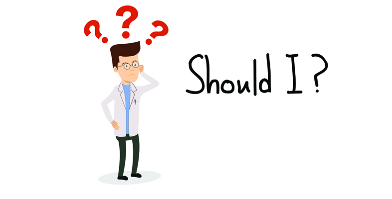
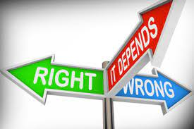
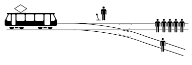
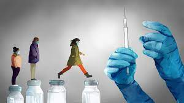
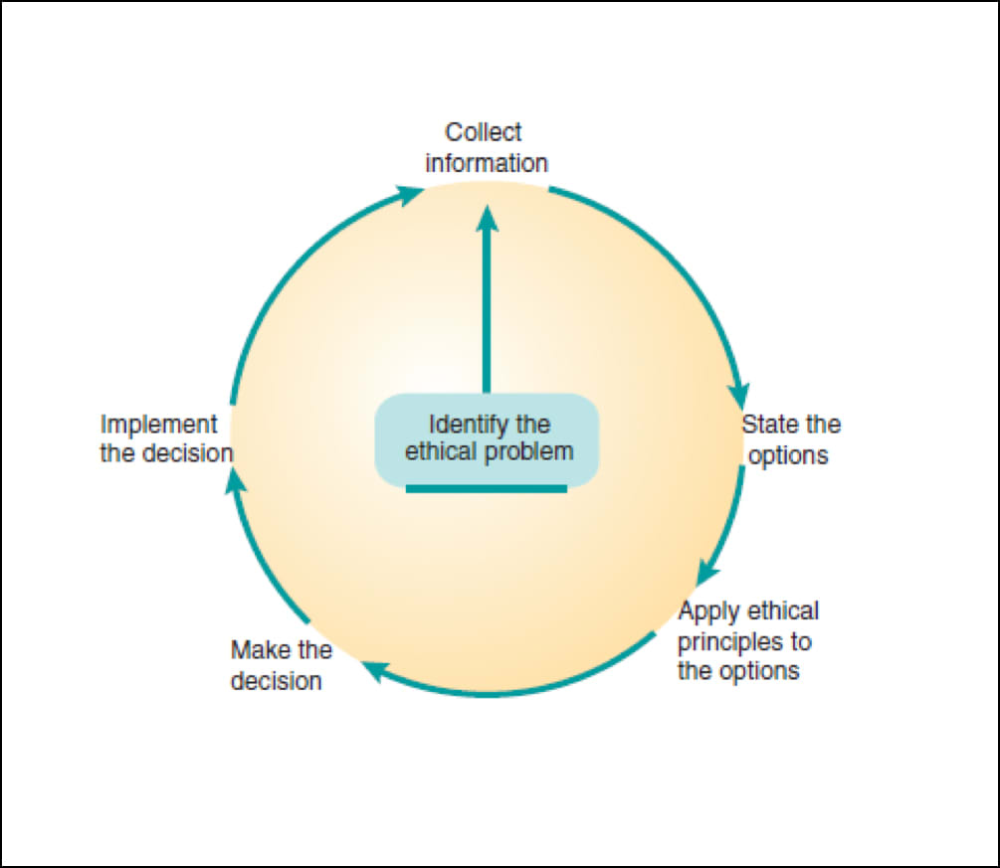
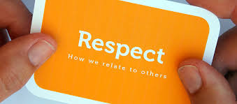
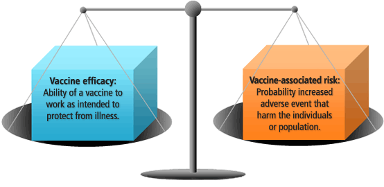
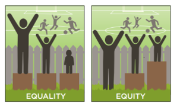

## Brainstorm: When you hear bioethics, what comes to mind?  

## When you hear bioethics, what comes to mind?  

 
 
 
 

* **Morality**
 
* **Medical Procedures**
 
* **Humane treatment of animals**
 
* **Humane treatment of humans**
 
* **Gene editing**
 
* **Human embryos**
 
* **Medical issues**
 
* **Reproductive decisions**
 
* **Transsexuality**

## Ethics: The basics

 

* **Ethics is a field of study that looks at the moral basis of human behavior…**  

 

**Why do we act as we do?**

 
 
 
 
 

* **…and attempts to determine the best course of action in the face of conflicting choices…and provides reasons why.**

 

**How do we decide what to do when people disagree about a complex issue?**

## Bioethics

 

* **The sub-field of ethics applied to the life sciences**
    + largely but not soley related to humans
    
 

* **Scientific breakthroughs and new biomedical technologies have brought great benefits to society, but they also raise difficult questions about when and how they should be used.  **

 

* **Helps us, as a society, make decisions about:**
    * How best to use new scientific knowledge
    * How to make policy decisions regarding medicines or therapies
    * How we should behave toward each other

 

* **YOU will face ethical questions that your parents and grandparents never had to contend with**

## Ethical decisions: Key questions to ask yourself

 

* **What is an ethical question?**
    + involve words like *ought* or *should*
    + several alternate solutions (all w/ challenges)
    + contain conflicting moral choices
    + likely no answer that satisfies all parties
    
*Ethical questions can be distinguished from questions about personal preference, legal, and scientific questions*

## Ethical, legal, scientific, or personal preference?  

 
 

**Which sport is the most exciting?**
 

**Whom should you marry?**
 

**How are embryonic stem cells different from adult stem cells?**
 

**Should embryonic stem cells be used in biomedical research?**
 

**Can scientists patent genes?**
 

**Should people be allowed to patent genes?**
 

**Should you lie to protect the safety of your family?**
 

**Do you need to credit another scientist who worked with you on your paper?**

## Case Study: The Trolley Problem

 

**There is a runaway trolley barreling down the railway tracks. Ahead, on the tracks, there are five people tied up and unable to move. The trolley is headed straight for them. You are standing some distance off in the train yard, next to a lever. If you pull this lever, the trolley will switch to a different set of tracks. However, you notice that there is one person on the side track. You have two options:**

 

**A. Do nothing and allow the trolley to kill the five people on the main track.**
 
**B. Pull the lever, diverting the trolley onto the side track where it will kill one  person.**

**Lets have a secret vote.....**

##

<iframe width="560" height="315" src="https://www.youtube.com/embed/yg16u_bzjPE" title="YouTube video player" frameborder="0" allow="accelerometer; autoplay; clipboard-write; encrypted-media; gyroscope; picture-in-picture" allowfullscreen></iframe>

## Opinion vs Ethics: The Trolley Problem

* **You probably had a “gut” feeling about the trolley problem…you may not even be able to explain why you came to the decision**
  
 

* **This is where ethics comes in!**

 

* **Is ethics is not a matter of opinion? An important part of ethical thought is to provide a justification for a course of action—successful arguments are well-reasoned**

## Ethical decisions: Key questions to ask yourself

 

* **What is an ethical question?**

 

* **What are the relevant facts necessary to think carefully about it?**
    * Particularly important for bioethics

 

*Think about making judgments about vaccines. You need to know about the risks of getting a disease, the magnitude of harm that could occur if the disease is contracted, the risk of suffering that harm, as well as efficacy and side effects of a vaccine.*

 

* **Ethical decisions are often made with incomplete information!**

    
## Ethical decisions: Key questions to ask yourself

 

* **What is an ethical question?**

 

* **What are the relevant facts necessary to think carefully about it?**

 

* **Who or what could be affected by the way the question gets resolved?**
    * Think about the range of individuals, groups, or institutions that may have a stake       in the outcome of an ethical decision
    * Consider how stakeholders are affected physically, emotionally, and economically
    * May not always be humans:  animals, plants, the environment

## Ethical decisions: Key questions to ask yourself

 

* **What is an ethical question?**

 

* **What are the relevant facts necessary to think carefully about it?**

 

* **Who or what could be affected by the way the question gets resolved?**

 

* **What are the relevant ethical considerations? ** 

## Core ethical considerations

**1. Respect for persons**

 

* **Not treating an individual as a means to an end or goal**
    + For example, even if one persons organs could help five people live, it would be an ethical violation of respect for persons to kill that one person and distribute the organs to save the five who need them.
    
 

* **Often involves not interfering with a persons ability to make and carry out decisions**

## Core ethical considerations

**1. Respect for persons**

 

**2. Maximize benefits while minimizing harms**

 

*Focuses on trying to promote positive consequences by balancing harms and benefits. 
Harms and benefits come in a variety of types: physical, emotional, economic and social.
Central tenet of modern medicine*

## Core ethical considerations

**1. Respect for persons**

 

**2. Maximize benefits while minimizing harms**

 

**3. Justice or fairness**

 

*Ensure that resources, risks, and costs are distributed equitably
There are many ways of determining what is fair:  giving equal amounts, giving according to need, giving according to merit.*

## Core ethical considerations

**1. Respect for persons**

 

**2. Maximize benefits while minimizing harms**

 

**3. Justice or fairness**

 

*Sometimes these ethical considerations will point out the best way to act, while at other times they conflict and cannot all be satisfied.*

 

*Sometimes it is not easy or even possible to act in accordance with all relevant considerations.*

 

*Each individual prioritizes and chooses which considerations should be favored in their own way (influenced by experience, culture, religion, etc.)*

 

*Often, there is no one right answer!*

