## Review: Key questions to ask in bioethics...

 

* **What is the ethical question?**

 

* **What are the relevant facts necessary to think carefully about it?**

 

* **Who or what could be affected by the way the question gets resolved?**

 

* **What are the relevant ethical considerations?**
    * Respect for persons
    * Maximize benefits while minimizing harms
    * Justice or fairness
    

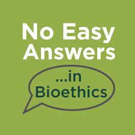

## Its a bold new world in modern science...

* **Advancements in biotechnology and medicine have created new ethical issues never before faced by humanity**
    + YOU will face ethical questions that your parents never had to contend with

 

* **Current themes in bioethics:**
    + Human reproduction
    + Shaping human beings
    + Beginning and end of life
    + Health and society
    + Food, farming and the environment
    + Crime and security
    + Research ethics
    + Vaccine distribution
 

**Just because humans CAN do something, SHOULD we?**

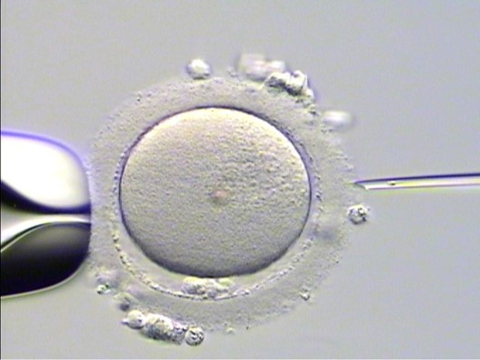

##
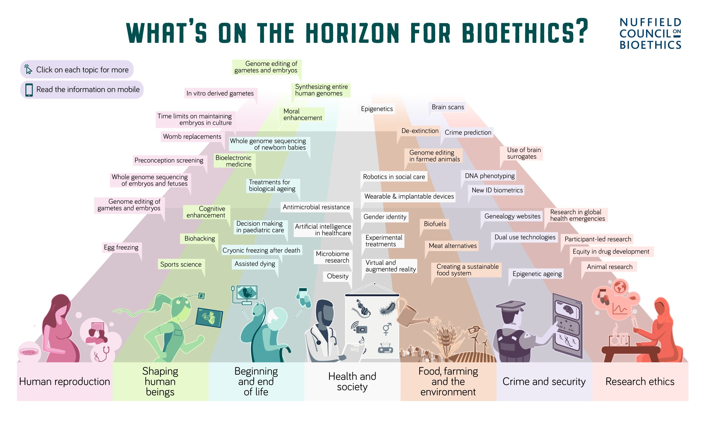

## Genetic testing and genomics

 
 
 

* **The ability to perform sophisticated genetic tests or sequence an entire genome is revolutionizing diagnosis of disease**
    + increasing tests are non-invasive
    
 

* **Prenatal tests can diagnose potentially fatal diseases**

 

* **Many diseases with adult onset have gene alterations that are not causative but associated with it**
    + e.g. Alzheimer’s and APOE

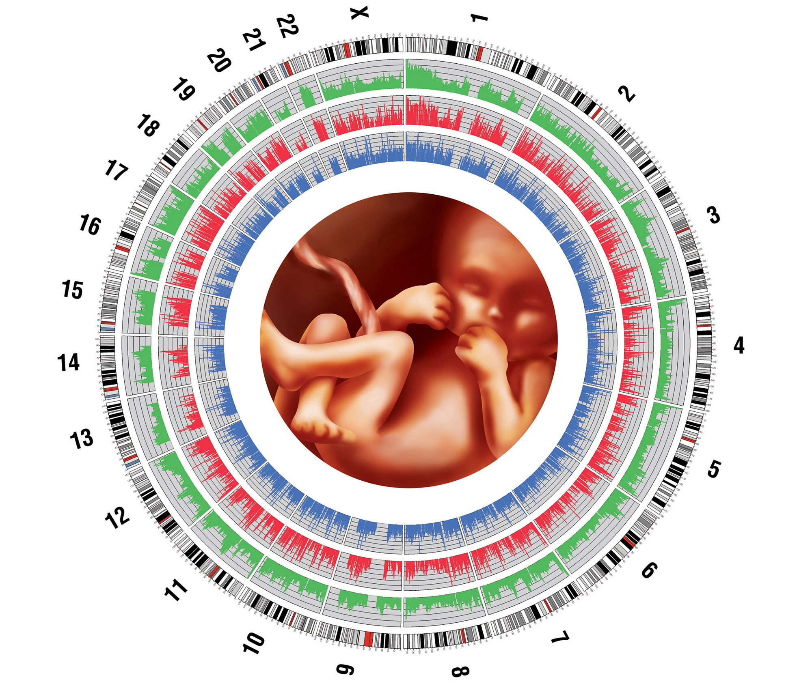

## Genetic testing and genomics

* **Who should be allowed to see this information?**
    + Insurance companies?

 

* **Is it better not to know?**
    + Many individuals experience high levels of stress and anxiety after test results
    
 

* **Should a fetus with a fatal disease be terminated**
    + Down-syndrome vs autism vs IQ
    + What about false-positives?

 

* **What would be the consequence of mass genetic screening?**
    + Stigmatization
    + Eugenics concerns

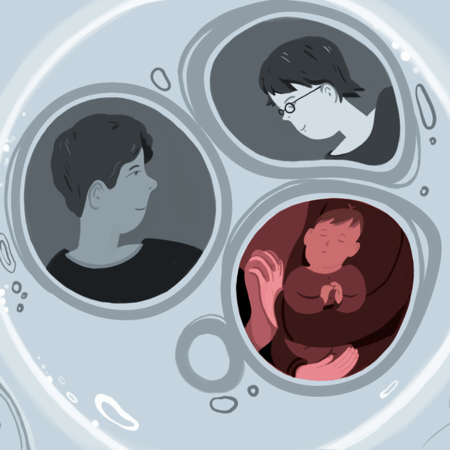

## Gene editing and genetically modified organisms

 

* **CRISPR-Cas9 has now made gene editing a reality in nearly any type of cell**
    + including a human embryo

 

* **Some diseases can be corrected (e.g. sickle cell)**
    + https://www.youtube.com/watch?v=mQ8Ola_C5po&t=7s
    
 

* **Chinese scientist used CRISPR on human embryos to edit the receptor that HIV uses to gain entry**

 

* **Crops are being modified to withstand various ecological challenges**
    + genetically engineering C4 photosynthesis

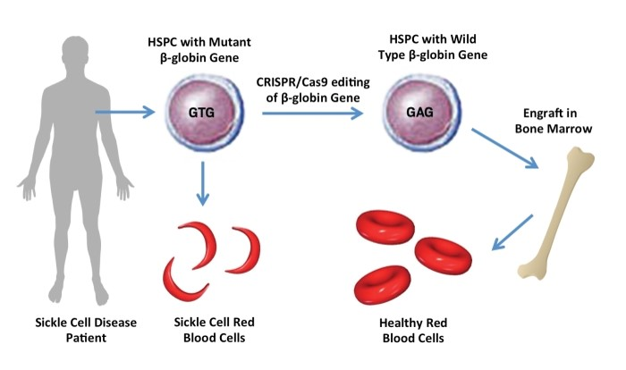
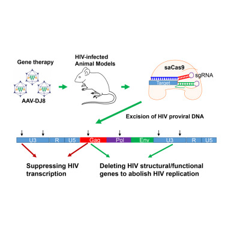

## Gene editing and genetically modified organisms

 

* **Alterations may increase the likelihood of one disease while protecting you from others**

 

* **Possibility of mistakes exists**
    + Risks further damage to health
    + Long-term effects?
    
 

* **Opens door for cosmetic changes in humans**

 

* **Consequences for the natural world**
    + Should we alter species DNA to save biodiversity?

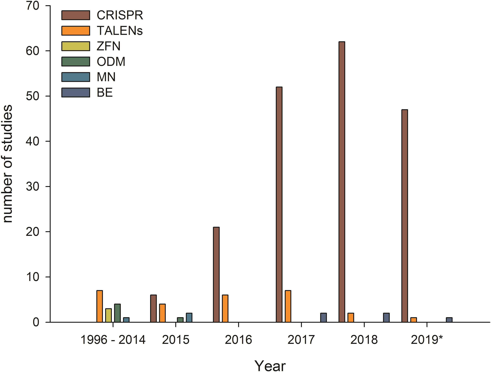

## Reflection: How do you feel about gene editing?

https://www.theatlantic.com/science/archive/2018/02/biohacking-stunts-crispr/553511/

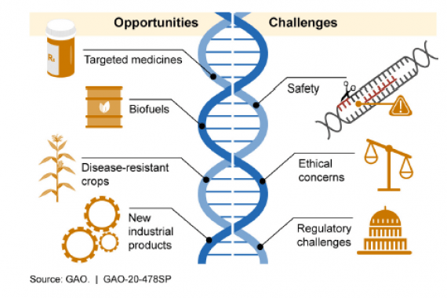

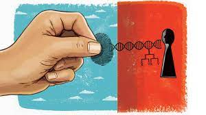

## Stem cell research and therapy

* **Stem cells can be obtained from an embryo or induced from somatic cells**

* **Great promise for disease-specific cell lines and regenerative medicine products**

* **Stem cells are stored in *biobanks* to provide blood transplantation resources**      

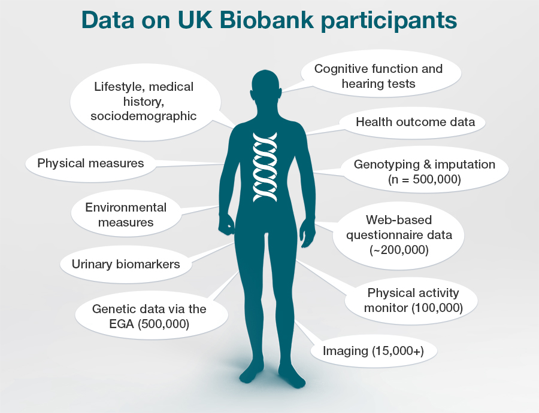

## Stem cell research and therapy

 

* **Creation of embryos specifically for research purposes**
    + and destruction
    
 

* **Status of organoids generated**

 

* **Use of animal models and potential for xenografts**

 

* **Economic interference: the potential to overpromise and overexpect**

 

* **Identity concerns after patient donations of stem cells**

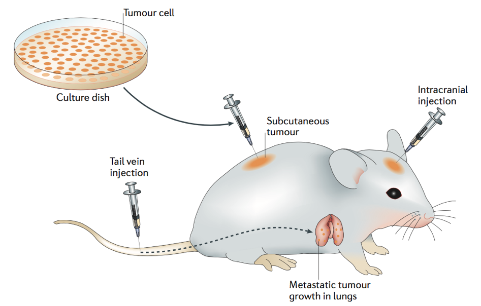
    
## Cloning

 
 
 

* **Cloning of humans is almost certainly possible at this point**
    + Human embryos cloned:  2001
    + Adult human cells transformed into embryonic cells: 2007
    + Genetic material from skin cells grown into embryo: 2011

 

* **There are potential uses for regenerative medicine**
    + cloned embryos a source for stem cells
    

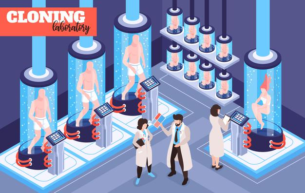

## Cloning

* **Would a clone be the same person?**
    + Phenotype versus genotype
    + How to distinguish a clone from the original?

 

* **Psychological harm to a human clone:**
    + Should a clone have the same rights?
    + Societal issues

* **Low success rate of cloning—many abort late term**

 

* **Cloned organisms may develop health problems**

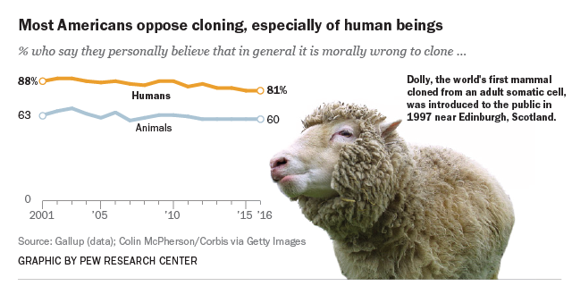

## Wildlife ethics: Handling invasive species

 
 

* **Negative consequences of invasive species are far-reaching**
    + 42% of threatened/endangered species are at risk
    + Commercial, agricultural, and recreational activities depend on healthy native ecosystems
    
 

* **Invasive species’ are the villains of the wildlife conservation world.**

 

* **Management of invasive species is expensive**
    + U.S. loses $13 billion annually in crops from invasive insects
    + *Eurasian watermilfoil* (aquatic plant) reduced Vermont lakefront property ~16%

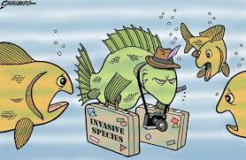

## Wildlife ethics: Handling invasive species

* **Is the demonisation of ‘invasives’ morally wrong?**
    + Management usually results in the killing of the species
    + Narrative oversimplifies complex biological processes

 

* **Biocontrol often fails**
    + Is it ethical to introduce a predator into a system?

 

* **Are the terms ‘invasive’, ‘non-native’ and ‘foreign’ morally appropriate?**
    + Consider the human perspective
    + Many non-native species have little impact

 

* **War rhetoric often used to describe the behaviors of invasive species**
    + Insects, molluscs, plants, etc. are not intent on destruction 

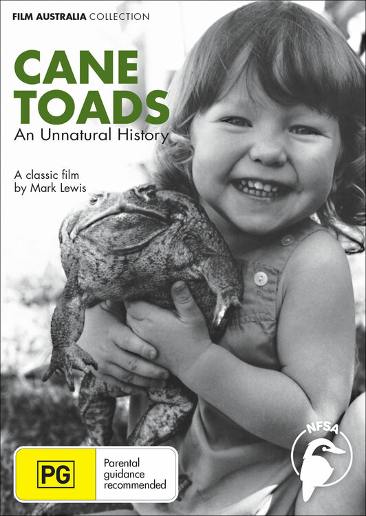

## Global health disparities

 
 
 

* **Healthcare and life expectancy in underdeveloped countries lags far behind first world countries**

 

* **Sub-saharan African countries: 20-25 years lower**

 

* **Do richer countries have an obligation to act?**

 

* **Socio-economic background a major factor in the US**

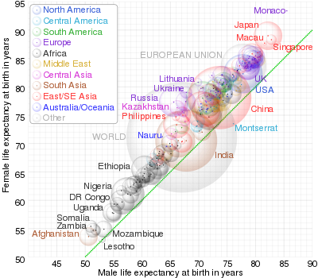

## Global health disparities

 

* **Moral responsibility to minimize suffering**
    + disease burden impart due to life-sytle choice
    
 

* **What is the relationship between health ethics and human rights?**
    + Governments obligation to respect, protect, and fulfill human rights
    + Protecting community health may require limiting the liberty of people 
    + Limited resource distribution

 

* **Goes beyond a health issue**
    + Affects security and economics

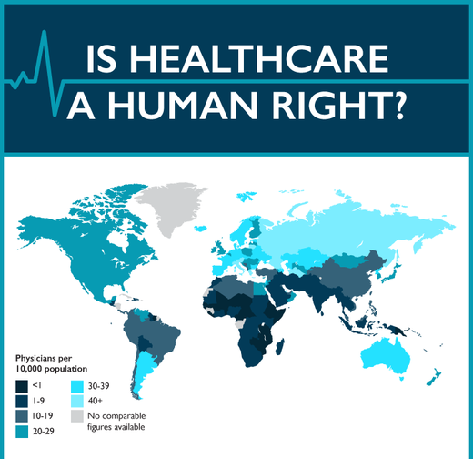
