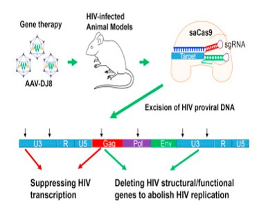

## Review: Key questions to ask in bioethics...

 

**1. What is the ethical question?**
**2. What are the relevant facts necessary to think carefully about it?**
**3. Who or what could be affected by the way the question gets resolved?**
**4. What are the relevant ethical considerations?**
    * Respect for persons
    * Maximize benefits while minimizing harms
    * Justice or fairness

## Its a bold new world in modern science...

* **Advancements in biotechnology and medicine have created new ethical issues never before faced by humanity**
    + YOU will face ethical questions that your parents never had to contend with

 

* **Current themes in bioethics:**
    + Human reproduction
    + Shaping human beings
    + Beginning and end of life
    + Health and society
    + Food, farming and the environment
    + Crime and security
    + Research ethics

 

**Just because humans CAN do something, SHOULD we?**

##

## Genetic testing and genomics

* **The ability to perform sophisticated genetic tests or sequence an entire genome is revolutionizing diagnosis of disease**

 

* **Prenatal tests can diagnose potentially fatal diseases**

 

* **Many diseases with adult onset have gene alterations that are not causative but associated with it (e.g. Alzheimer’s and APOE)**

## Genetic testing and genomics

* **Who should be allowed to see this information?  Insurance companies?**

 

* **Is it better not to know?**
    + Many individuals experience high levels of stress and anxiety after test results
    
 

* **Should a fetus with a fatal disease be terminated**
    + Down-syndromw vs autism vs IQ
    + What about false-positives?

 

* **What would be the consequence of mass genetic screening?**
    + Stigmatization
    + Eugenics concerns

## Gene editing and genetically modified organisms

* **CRISPR-Cas9 has now made gene editing a reality in nearly any type of cell inclusing a human embryo**

 

* **Some diseases can be corrected (e.g. sickle cell) **

 

* **Chinese scientist used CRISPR on human embryos to edit the receptor that HIV uses to gain entry**

 

* **Crops are modified to withstand various ecological challenges**

## Gene editing and genetically modified organisms

 

* **Alterations may increase the likelihood of one disease while protecting you from others**

 

* **Possibility of mistakes risking further damage to health**
    + Long-term effects?
    
 

* **Opens door for cosmetic changes in humans**

 

* **Consequences for the natural world**
    + Should we alter species DNA to save biodiversity?

## 

## Stem cell research and therapy

* **Stem cells can be obtained from an embryo (hESCs) or induced from somatic cells (iPSCs)**

* **Great promise for disease-specific cell lines and regenerative medicine products**

* **Stem cells are being stored in *biobanks* to provide blood transplantation resources**        + other tissue types are following

## Stem cell research and therapy

* **Creation (and destruction) of embryos specifically for research purposes**

 

* **Status of organoids generated**

 

* **Use of animal models and potential for xenografts**

 

* **Economic interference:  the potential to overpromise and overexpect**

 

* **Identity concerns after patient donations of stem cells**

    
## Cloning

 

* **Cloning of humans is almost certainly possible at this point**
    + Human embryos cloned:  2001
    + Adult human cells transformed into embryonic cells: 2007
    + Genetic material from skin cells grown into embryo: 2011

 

* **There are potential uses for regenerative medicine**

* **Low success rate of cloning—many abort at late term**

* **Cloned organisms may develop health problems / not live as long**

* **Would a clone be the same person?**
    + Phenotype versus genotype
    + How to distinguish a clone from the original?
    
* **Psychological harm to a human clone:**
    + Should a clone have the same rights?
    + Relationship issues

## Extreme cost of pharmaceuticals

 

* **Developing a novel drug is an extremely expensive undertaking with no guarantee of success**

 

* **“Orphan” drugs treat diseases that are so uncommon a drug company doesn’t intentionally pursue them**

 

* **Zolgensma costs $2.1 million for a course of treatment for spinal muscular atrophy (in some cases is curative)**

##

## Extreme cost of pharmaceuticals

 

* **Drug companies should expect a reasonable return on their investment in research and development**

 

* **Do drug companies have an obligation to find curative drugs rather than maintenance?  (e.g. diabetes)**

 

* **Patients in drug studies sacrifice their health and well being**

 

* **Taxpayer money is ultimately used to develop any drug**

 

* **Excessive prices can harm people, threatening public health and depleting taxpayer** money

## Global health disparities

* **Healthcare and life expectancy in underdeveloped countries lags far behind first world countries**

* **Sub-saharan African countries: 20-25 years less**

* **Do richer countries have an obligation to correct this disparity?**

* **Socio-economic background also major factor in the US**

## Global health disparities

* **Moral responsibility to minimize suffering**

* **Goes beyond a health issue:  also affects security and economics**

