## Shepherd University writing requirements

* **Core curriculum requirements:  **
    + Writing in the major
    + Capstone in the major

 

* **This writing-intensive course views “writing as a mode of learning”**
    + employs writing assignments as ways of helping students learn the material rather than as vehicles for regurgitating material. 

 

* **A major instructional focus is on the writing process through detailed evaluation, feedback, and revision opportunities**
    + highlights multiple stages of the writing process
    + e.g., idea formulation, refinement of argument/hypothesis, structuring/outlining, drafting, revising

 

* **Students should write no fewer than 30 pages**
    + includes all pages in all stages of the writing process (i.e., drafts, early versions, outlines, revisions).

## Biology department capstone requirements

 

* **BIOL 425 addresses the learning outcomes of oral communication, written communication, lifelong learning, ethical practices and ethical reasoning, and experiential learning.**
    +  meets Core Curriculum requirements for Writing in the Major and Integrative Learning        +  prepares students to describe, explain, and communicate about natural phenomena 

 

* **Prepare a research paper detailing their research experiences.**
    + encompass several drafts and revisions with the guidance of their research mentor
    + final draft is typically 15-65 pages

 

* **Present research in an oral forum to the biology faculty and others in the University science community with the use of appropriate visual aids, conduct themselves professionally, and field questions from the attendees.**

## The capstone paper 

 
 

* **You will choose a biological topic of interest to you and prepare an original piece of scientific writing in the form of a written paper**
    + make this a part of your career development
    
 

* **This is not a book report:  An important aspect of the project is its novelty—your goal is to synthesize information around a topic and draw conclusions about a hypothesis or question**

 

* **Various aspects of both parts will be evaluated and critiqued by me, other biology faculty members, and your classmates**

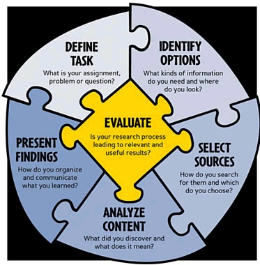

## Types of capstone papers

 
 
 
 
 

* **Data-driven scientific paper**
    + own scientific research
    + open-source data (*new option*)

 

* **Narrative literature synthesis**

 

* **Literature meta-analysis **

## Original research paper

 

* **Based on research you have performed yourself (at Shepherd or elsewhere)**
 
**or**
 
* **A question you address using publicly available (non-published) data**

 

* **Data presented in narrative and graphical form (i.e. has data figures/tables)**

 

* **Essentially a primary research paper in the traditional format: Abstract, Introduction, Experimental Procedures, Results, Discussion, Conclusion, Literature Cited**

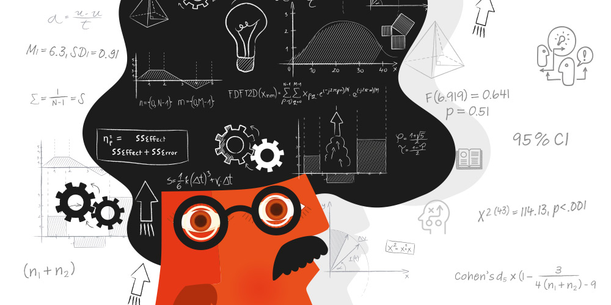

## Research paper example

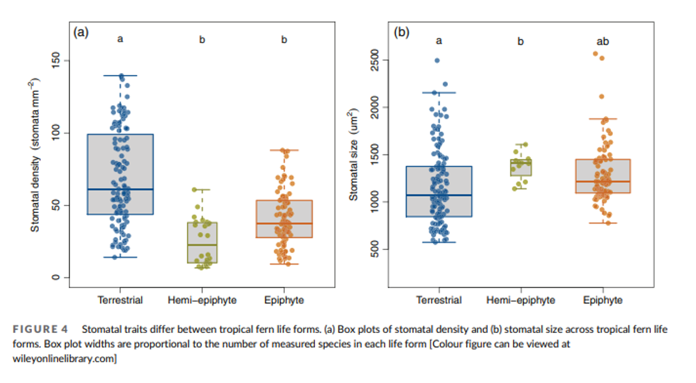

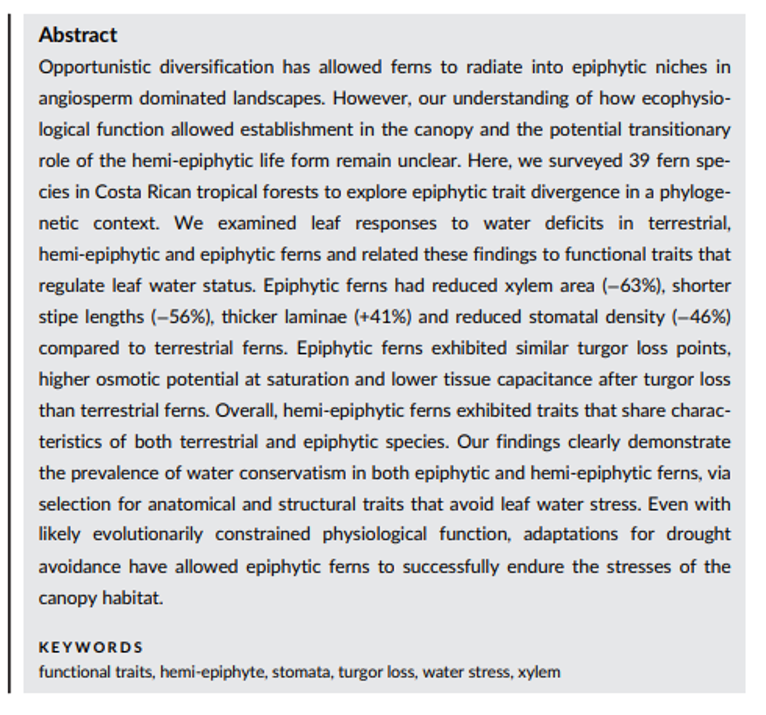

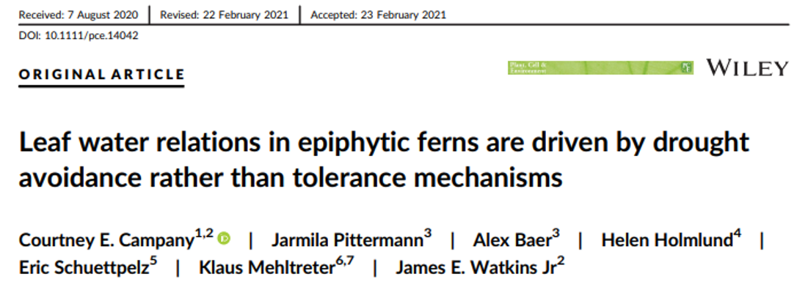

## Narrative literature synthesis

 

* **Based on an extensive review of the primary literature around a given topic or question**
    + Researcher reviews results of many studies and makes judgments about the connection between the variables
    + Evaluate, analyze, compare and contrast these studies focusing on your central question—reveal strengths, biases, weaknesses
    + The goal is to present the primary papers in a new light or tie them together in a new way

 

* **Contains representative figures, summary data tables, and/or informational figures**

 

* **Similar to a journal review article with this format:  Abstract, Introduction, Body with subheadings (each section examines a different aspect of your topic/question), Discussion/Conclusion, Literature Cited**

## Review paper example

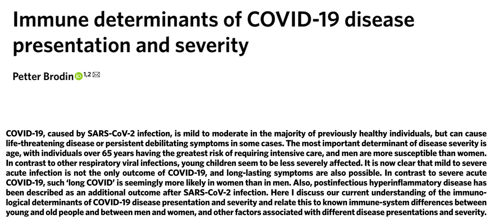

## Literature meta-analysis

 

* **A systematic review of a focused topic in the literature that provides a quantitative estimate for the effect of an experimental treatment**
    + Used to examine a specific issue to determine whether a conclusion can be reached regarding the effect of a treatment or exposure
    + Often used to address controversial issues in medicine
    + Used to understand global patterns in ecology

 

* **Relies on data reported in primary research papers—a meta-analysis uses a statistical method to “combine” this data together to reach a conclusion**

 

* **Format:  Abstract, Introduction, Materials and Methods, Results, Discussion, Literature Cited, Tables and Figures**

## Meta-analysis example

**Douglas RM, Hemila H, D'Souza R, et al. Vitamin C for preventing and treating the common cold. Cochrane Database Syst Rev. 2004;4:CD000980.**
 
 
 
 
 
 
 
 
 
 
 
 
 
 
 
 
 
 

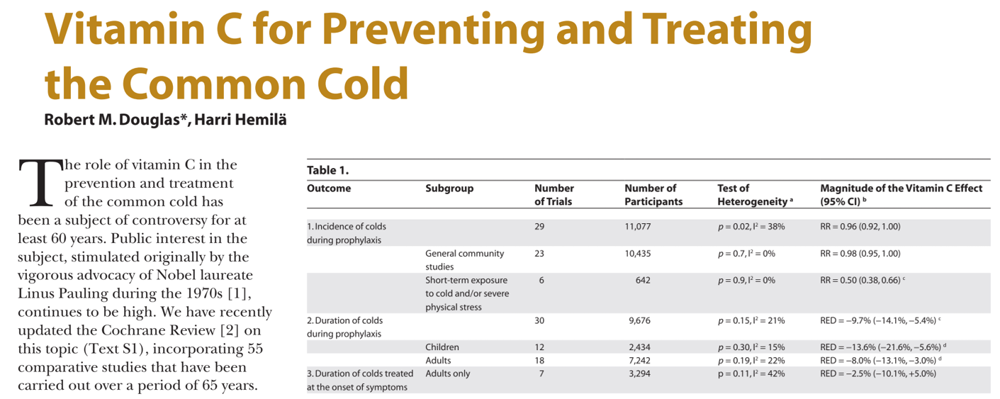

**“The lack of effect of prophylactic vitamin C supplementation on the incidence of common cold in normal populations throws doubt on the utility of this wide practice.”**

## Meta-analyses are important: Cesar Terrer

**Mycorrhizal association as a primary control of the CO 2 fertilization effect (Science 2016)**
 

**Ecosystem responses to elevated CO2 governed by plant–soil interactions and the cost of nitrogen acquisition (New Phytologist 2018)**
 

**Nitrogen and phosphorus constrain the CO 2 fertilization of global plant biomass (Nature Climate Change 2019)**
 

**A trade-off between plant and soil carbon storage under elevated CO2 (Nature 2021)**

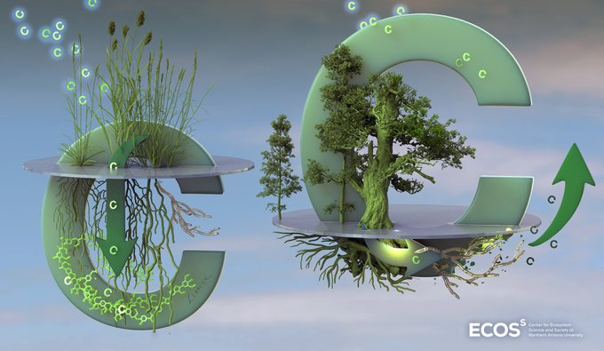

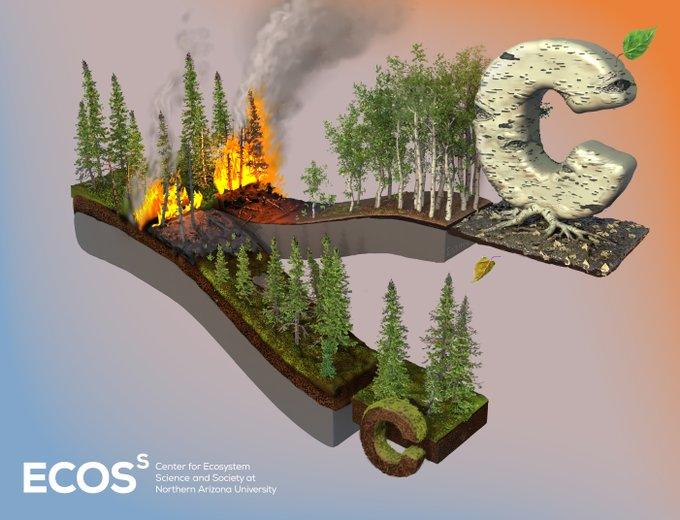

## General considerations for capstone paper evaluation

* **Papers will be reviewed as drafts being submitted for peer review at a journal (i.e. not rough drafts).**
    + However, the paper is the work of the student and not a professional

 

* **Papers must contain every sections appropriate to that type of paper.**

 

* **The text will be reviewed for scientific content.  The paper should be written with sufficient detail that a reviewer can understand the project's rationale and conclusions without being an expert in the field.**

 

* **The text will be evaluated for quality of writing, including sentence structure, word usage, grammar spelling, and other writing mechanics.**

 

* **Papers will also be reviewed for technical elements such as appropriate use of references and citations, figure legends, reference citations, and appropriate figure legends.**

## How will the capstone paper be evaluated?

**Rough and final drafts of your capstone paper will be evaluated according to a rubric on Brighspace**

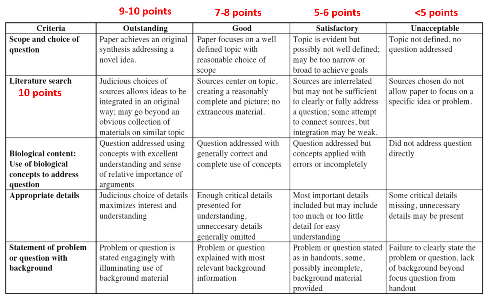

## Content, style and error-free writing matter!

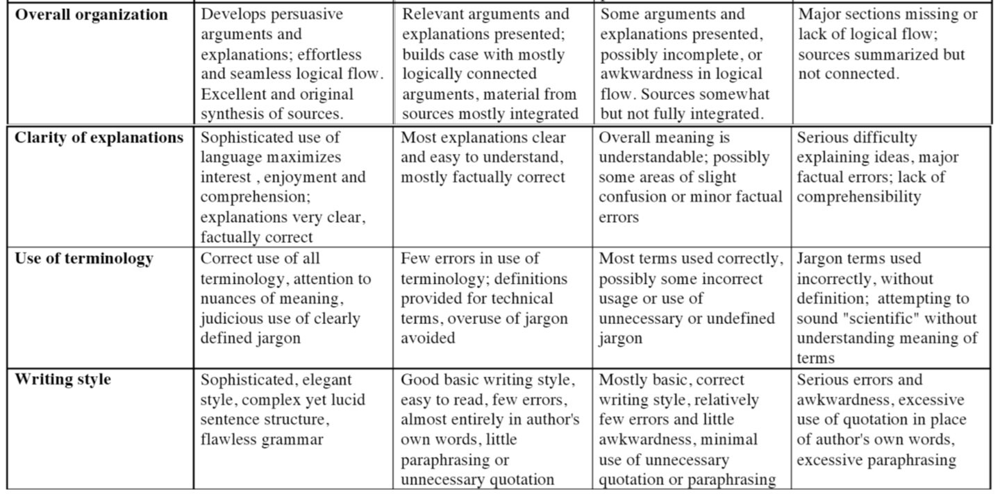