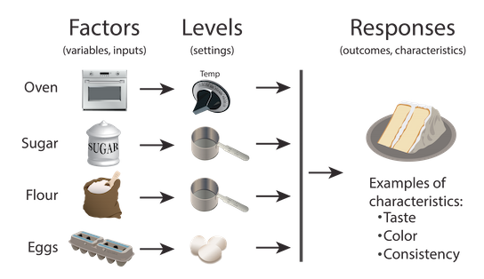

## Study design considerations  

 

* **Your capstone paper should mirror the scientific process, so you need to think critically about the sources and information you use**

 

* **When reading primary research papers, it is important to understand and evaluate the way a study was performed:**
    + Is the question appropriate?  (i.e. testable/answerable)
    + Is the experimental approach logical?
    + What types of methods/instruments/sites were involved?
    + How were the results assessed?  What was measured?  Does it make sense to measure it? Is there a better way to measure it?

 

* **The same is true if you are designing/performing research**

## Evaluating experimental results

## Evaluating experimental results

## Evaluating experimental results

 
 
 
 
 
 
 
 
 
 
 
 
 
 
 

**How different is “different enough” between two groups to declare an effect?**

 

**How many times do you need to sample something to be representative?**

## Statistics to the rescue!

## Expectations for a scientific paper

 
 

* **Goal is to use collected observations to make the strongest possible conclusion about whether to accept a hypothesis**

 

* **So…**
    + Experimental data should be quantified and analyzed appropriately
    + Large groups of data should be summarized for the reader

 

* **Expectations for the use of statistics is higher in some fields of biology than in others**
    + Generally, ecological studies make greater use of statistics

## Descriptive Statistics

* **Procedures that organize, summarize, or present data in an informative way**
    + describe aspects of center and spread in data

* **Central tendency = a single value that describes a dataset by identifying the central position**

* **The MEAN is the most common statistic used for this purpose**
    + Example:  the average score on an exam in a class

## Aspects of Spread: Variance

* **The spread of distribution, or VARIANCE, around the mean is also important information**

 
 
 
 
 
 
 
 
 
 
 
 
 

* **These three data sets have the same mean but different VARIANCES**

 

* **Higher variance indicates that the values in the data set are more spread out**

## Standard deviation is a common measure of variance

 

* **Standard deviation = a measure of how far each value in the data set is from the mean**

 

* **A higher standard deviation for your data set means you have a greater spread of values**

    
## Inferential statistics

 

* **Results often represent a portion of the overall population, but can be used to estimate information about the entire population with some amount of uncertainty**

 
 
 
 
 
 
 
 
 
 
 
 

* **The larger your sample size, the more representative it is of the entire population**
    + increasing the number of measurements increases the power of a statistical analysis
    

## Hypothesis testing is widely used in science

* **Hypothesis testing:**
    + Determine if there is a correlation between two variables
        + If X increases, does Y also increase? (positive)
        + If X decreases, does Y also decrease? (negative)
        
 
 
 
 
 
 
 
 
 
 

* **Determine if there are differences between two data sets**
    + one group receives drug, the other does not
    + number of species in one location versus another location
    + amount of cell death after treatment with a drug

## The null hypothesis proposes no relationship

* **A null hypothesis is a type of hypothesis used in statistics that proposes that there no relationship or difference between two parameters (e.g. two experimental groups, an independent variable and a dependent variable)—in other words, the results are due to chance alone**
    + For any experiment, there is a null hypothesis

 

* **We aren’t proving things in science!  The rejection of hypotheses is how we progress in science**

 

* **Statistical tests allow us to use observed data to reject a null hypothesis and accept the alternative:  that there is a relationship or difference**

## Experimental design (according to a statistician)

 
 
 

**1. Set up the null and alternative hypotheses**

 

**2. Determine what type and how much data you will need to collect in your study**

 

**3. Choose a statistical analysis that will allow you to accept or reject your null hypothesis at a desired confidence level**

 

**4. Perform your experiment, analyze data, and draw conclusions**

## Brainstorm: What are some limits to experimental design?

## How statistical significance is reported

* **When you perform a statistical test, a p-value helps you determine the significance of your results in relation to the null hypothesis.**

 

* **Scientific papers will always report p-values if results have been statistically analyzed**

## Setting the bar for statistical significance 

 

* **p-values range between 0 and 1 and indicate the probability that the null hypothesis is true**
    + how likely are results are due to chance alone

 

* **The smaller the p-value, the stronger the evidence that you should reject the null hypothesis**
    + i.e. the observed difference is NOT due to chance

 

* **A standard value used for significance in science is p = .05.  This means you can conclude that 95% of the time, an observed effect is NOT due to chance**

## Important considerations for statistics

 

**Both descriptive and inferential statistics whittle down large data sets down to a few conclusions**

 

* **Statistical conclusions are never 100% certain**
    + always a small chance that the null hypothesis provides a poor explanation of the data even when it is true.
    + always a small chance that the null hypothesis provides an explanation of the data even when it is false

 

* **A significant test can be misleading if the sample size is so small that an important effect goes undetected**

## How to talk about statistics in a paper

 

* **Unless you have a compelling reason, you do not need to cite specific p values of other researchers in your paper**

 

* **Be decisive in your language—if a peer-reviewed primary paper reaches a conclusion, don’t hedge, but state it as fact**
    + the reader has the citation if they want to evaluate that author's work
    
 

**The basis for downregulation may be related to CO~2~-induced excess photosynthate accumulation in leaves, if sinks for the additional carbon are not available (Stitt 1991, Mooreet al. 1999, Haouari et al. 2013, Campany et al. 2017).**

 

**It was reported that g~m~ increased with increasing light intensity in chickpea and several Eucalyptus species (Campany et al., 2016; Xiong et al., 2018; Shrestha et al., 2019).**

