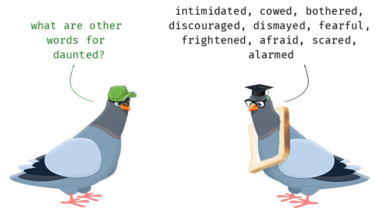

## About me

 

* **Assistant Professor, Shepherd University**
    
 

* **Plant Ecophysiologist**
    + climate change
    + physiology
    + evolution
    
 

* **Ecosystem Ecologist**
    + global change

## About me

 

* **Assistant Professor, Shepherd University**
    + long road to academia
    
 
 
 
 
 
 
 

* **Love to teach!!**

 

* **Community oriented projects to cure 'Plant Blindness'**
    + Tree Campus USA
    + Monarch Butterfly waystations
    + Urban tree benefits

## What the heck is a capstone?  

## What the heck is a capstone?  

## Goals of the capstone class

 

* **Demonstrate your learning and knowledge of biology in an area of interest to you**

 

* **Hone your written and oral communication skills**

 

* **Manage a large-scale research project**

 

* **Learn to critique peer work**

 

* **Prepare job or graduate/professional school materials**

 

* **Build your resume**

 

## Structure of the class:  Lecture, workshops, and writing sessions

 

* **Always bring your laptop**

 

* **Live lectures Mondays and Wednesdays**
    + My goal is for the class to be as interactive as possible
    + Each week a checklist containing the schedule will be posted on Brightspace
    + Slides for each lecture will be posted on Sakai

## Structure of the class:  Lecture, workshops, and writing sessions

 

* **Always bring your laptop**

 

* **Live lectures Mondays and Wednesdays**
    + My goal is for the class to be as interactive as possible
    + Checklist with weekly schedule will be posted on Brightspace
    + Slides for each lecture will be posted on Sakai

 

* **Weekly live workshops during laboratory period**
    + Focus on a specific topic in more detail
    + Attendance with is required
    + Workshops will vary in length but will typically involve a discussion, working with a partner, and/or activity assignment
    + Assignments due on Brightspace at 5pm on the Friday after the workshop** 

## Structure of the class:  Lecture, workshops, and writing sessions

 

* **Always bring your laptop**

 
 

* **Fridays are in-person Writing sessions**
    + Writing is time intensive and requires discussion
    + I will be available as an in-person resource
    + Significant progress towards project completion will be made
    
 

* **A progress journal will be submitted at the end of each session (for points)**

## Course syllabus has a detailed schedule

 

**This class has a lot of deadlines**

 

**Assignments with asterisks are required to pass the course**

## 

## The capstone project

* **You will choose a biological topic of interest to you and prepare a semester-long research project consisting of:**
    + A research paper
    + A scientific poster and presentation

 

* **This is not a book report:  An important aspect of the project is its novelty—your goal is to synthesize information around a topic and draw conclusions about a hypothesis or question**
    + you must address a scientific question

 

* **Your capstone project will be prepared as:**
    + a data-driven scientific paper using original research, OR 
    + a literature ‘meta-analysis’ (i.e., use some form of statistical analysis)

 

* **Various aspects of both parts will be evaluated and critiqued by me, other biology faculty members, and your classmates**

## How will the capstone paper be evaluated?

* **You will submit the paper in steps over the semester:**
    + Topic declaration
    + Rough outline with references
    + Expanded outline
    + Rough draft
    + Final paper

 

* **These will be reviewed by me and feedback given**

 

* **The rough draft of the paper will be critiqued by another biology faculty member and a classmate**

 

* **The final draft of your capstone paper will be graded by me**
    + rubric on Brightspace**

## Capstone poster guidelines

 

* **The poster is a different format for presenting your capstone project—a condensed, easily understood version of your paper that you will present to the group**

 

* **Also submitted in steps:**
    + Rough draft (peer-reviewed in a workshop)
    + Final version
    + Poster presentation to class

 

* **You will present your poster in the final workshop class of the semester**

 

* **The final poster and presentation will be graded by me**
    + rubric on Brightspace

## 3-Minute Thesis competition

* **This semester we will run the first annual capstone 3-M Thesis**

 

* **Internationally recognized competition that challenges students to present a compelling oration on their thesis and its significance in just 3 minutes**
    + presented in language that anyone can understand

 

* **Rules:**
    + One static PowerPoint slide (no transitions or animations)
    + no other media allowed
    + no props
    spoken word only (no poems, raps or songs)
    + strict 3 minute time limit
    + *no audience questions*

 

* **Will prepare you for your poster presentation**

    
## Course Grading

**Evaluation of the capstone project and its various parts constitute the majority of your grade**

 

**Capstone deadlines on the syllabus (see astricks) must be met to pass the class**

 

* **Lecture and workshop materials**
    + Knowledge check #1 ()
    + Knowledge check #2 ()
    + Workshop activities (50 points)
    + Presentation evaluations ()
    
 

* **3 Minute Thesis ()**

* **Capstone Paper (% of Grade)**
    + Scientific question and basic outline (10 points)
    + Full project outline (10 points)
    + Student peer review (10 points)
    + Rough draft (50 points)
    + Final draft (100 points)
    
 

* **Capstone poster**
    + Poster (50 points)
    + Presentation (25 points)

## A word about plagiarism…

**We will devote at least one entire class to plagiarism—what it is and how to avoid it**

 

* **Everything submitted in this course should be in your own words—it will be checked using multiple methods**
    + utilize writing sessions to avoid plagiarism
    + utilize the writing center to avoid plagiarism
    + utilize peers to avoid plagiarism

 

* **Findings are tentative since the REAL explanation may not have been considered**

 

* **Ignorance is not an excuse—it doesn’t matter if you plagiarize accidentally or intentionally!**
    + Talk to me if you are unsure.

<!--  -->

## This is a challenging project!

* **BUT:**
    + Its alright to feel daunted
    + We’re going to tackle it in steps together
    + I am here to help you in any way possible

 

* **You should have a major sense of accomplishment when your complete your capstone**

## 

