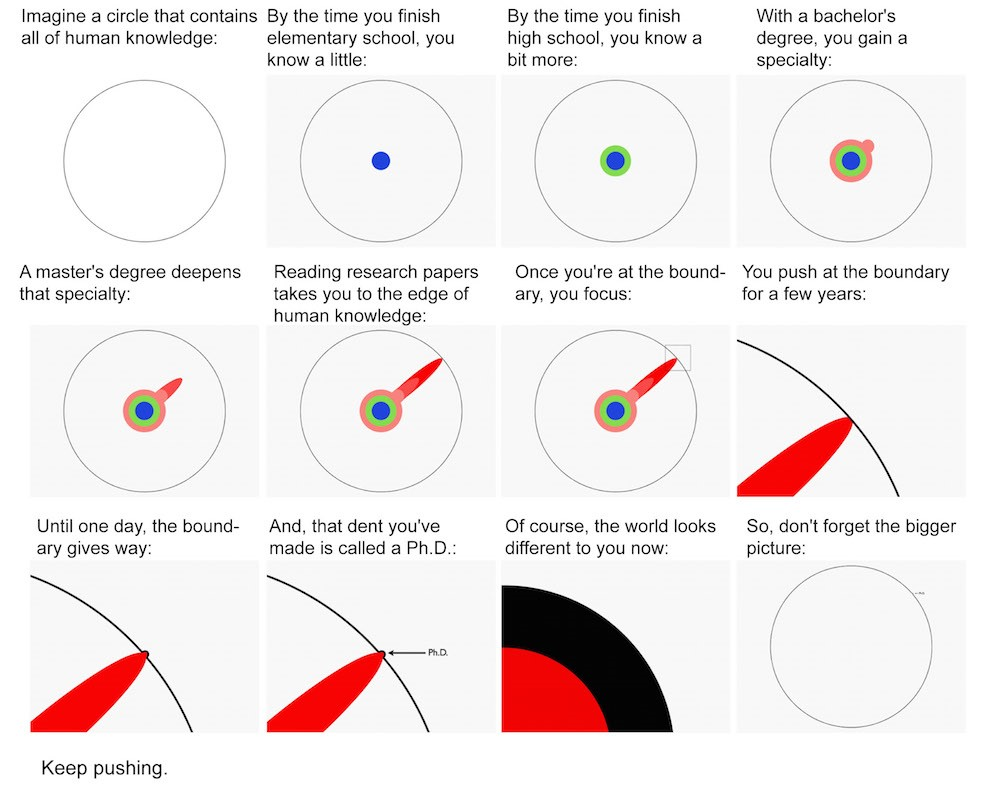
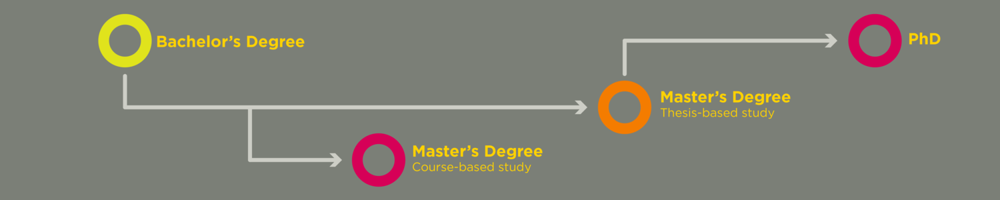
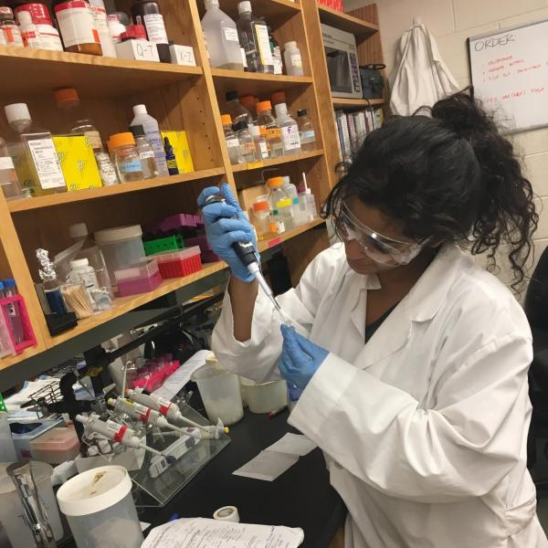
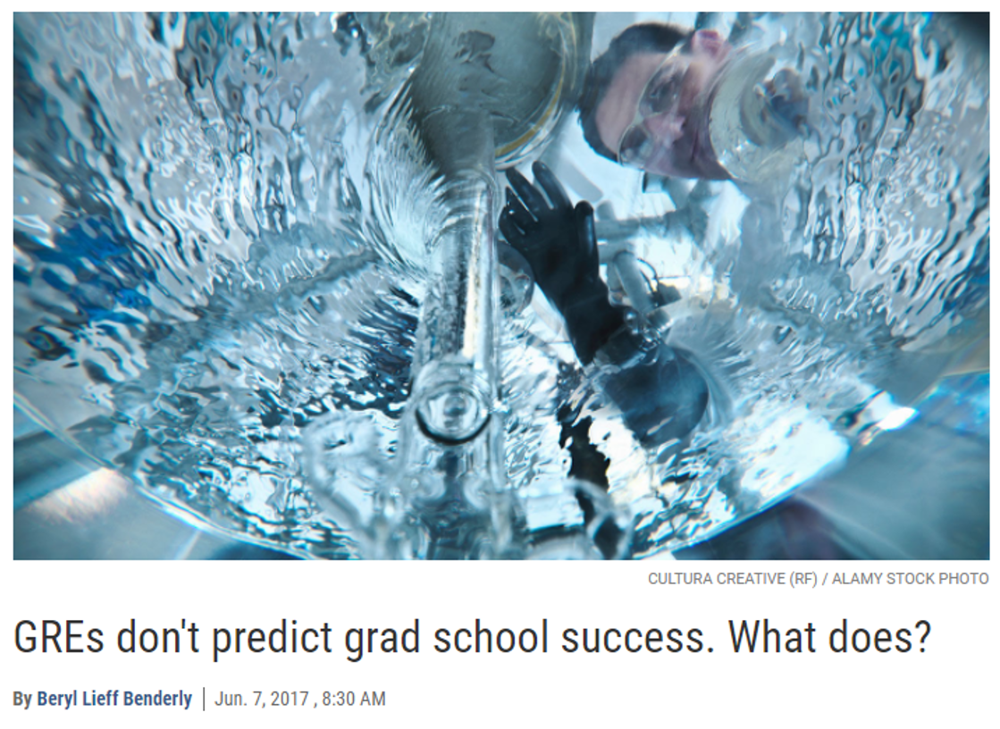
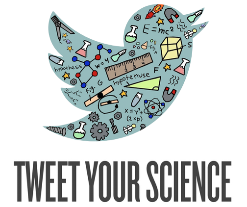
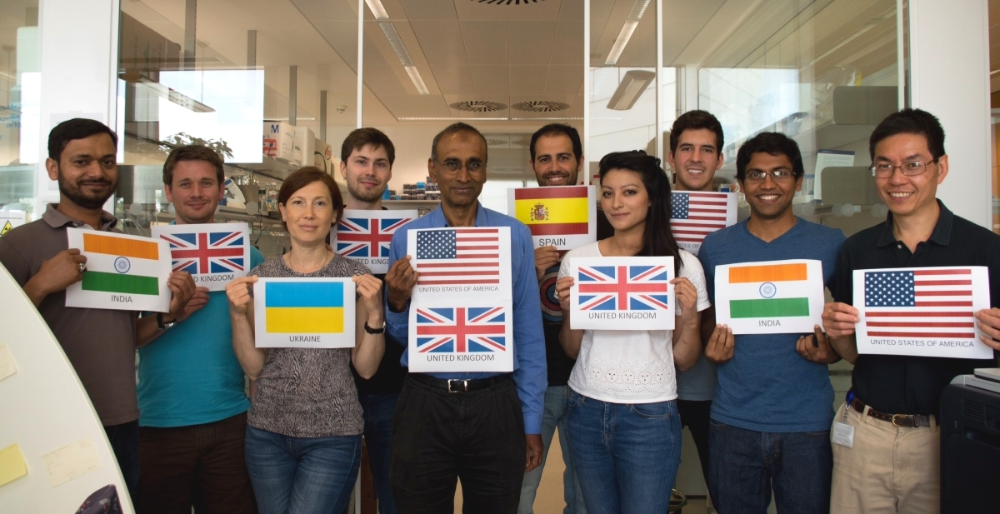
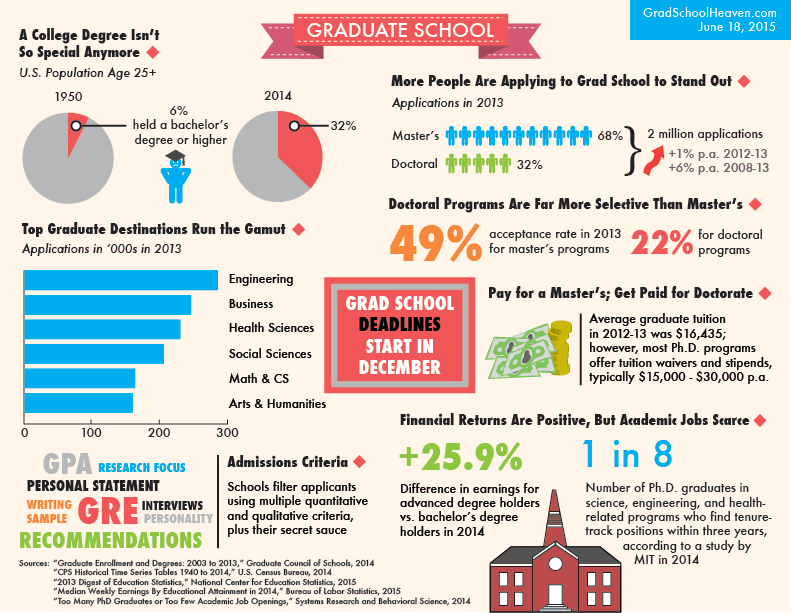

## 

## Why go to graduate school?

* **It is an exciting and rewarding experience to advance your field**

 

* **Potential job potential:**
    + More career opportunities
    + Salary is commensurate with education/experience (BUT not guaranteed)
    + Networking opportunities

 

* **Avoid the “real” world**
    + potentially work abroad!

 

* **However:**
    + Work can be challenging and stressful
    + Time commitment:  2-7 years (postdoc another 3-6 years)
    + Different people have different graduate experiences

## Masters degree versus Ph.D.

* **Schools may offer M.S., Ph.D. or both**
    + coursework, research only or both

 

* **What type of job do you want?**

 

* **Think about your timeline:**
    + some programs can role a MS to a Ph.D.

* **Masters programs are typically less competitive**

 

* **Good option if you:**
    + Are trying to decide if research is right for you
    + Need to establish a stronger application for PhD
    + Don’t want to commit to 5-7 years

## To thesis or not to thesis?

 

* **Some Masters programs require an original research project and written thesis**

 

* **Thesis: essentially an expanded primary scientific paper**

 

* **Many jobs will favor (or require) research experience**

 

* **A non-thesis Masters program typically requires less time and is not dependent on successful research results**
    + specific for certain fields
    + teaching, career advancement
    + additional prep for Vet, Med school

## Graduate school application requirements

* **Applications typically open in the fall (Sept. 1) with deadlines starting in December**
    + often new grants create positions at other times

 

* **Application form: CV, personal details, academic transcripts, test results, and names of references**
    + Academic transcripts:  Official versus unofficial
    + Application fees: ~50-85$

 

* **Personal statement: Critical piece of writing that reflects on your reasons for wanting to study at the chosen program.**
    + Blend of your relevant personal and professional experience
    + Indication of how you hope to benefit from the program of study.

 

* **Letters of recommendation:  2-3 people who you have a good relationship with who can speak positively to your abilities as a student and researcher.**

 

* **Some application (Ph.D.) may require a writing sample**

<!--  -->

## Not so secret tip....

 
 

* **Research experience:  the single most important thing you can do to improve your application aside from grades.**

 
 
 

* **Research with a faculty member demonstrates sustained interest in science, forms personal relationships for letters of recommendation, and develops your research skills and experiences**

## The graduate record exam (GRE)

 
 

* **Used to be required for admission, but many science graduate schools are moving away from it.**
    + slow change, check your schools of interest
    + not needed internationally

 

* **Three part exam that measures verbal reasoning, quantitative reasoning, and analytical writing skills**

 

* **There are also subject tests (generally not required)**
    + biology, chemistry, physics

## Undergraduate course choice

 

* **The Shepherd biology curriculum is designed to meet requirements for entrance into graduate / professional school**

 

* **The more rigorous the undergraduate program, the better**
    + Biomedical sciences:  calculus, organic chemistry, cell, genetics, developmental biology, biochemistry
    + Ecological sciences:  field courses (herpetology, ornithology, plants and humanity, etc.), statistics

 

* **Some graduate schools require specific undergraduate courses**
    + Visit the web pages of schools you are interested in and check for specific requirements

## Picking a program: Academic considerations

* **Select schools with active research programs**
    + Look up faculty member publications on Google scholar—are they publishing regularly?
    + Look at faculty webpage for student histories

 

* **Larger programs typically have more advanced equipment and more research and funding options**

 

* **Bigger does not always mean better!!!!!**
    + Experts in a particular field can be at any university

 

* **University may have more than one program appropriate to your interests:**
    + Different departments = separate graduate programs
    + Biomedical sciences often grouped together into umbrella programs: you indicate your particular interest (these are often tied to medical schools)

## Picking a program: Academic considerations

 

* **Scientific interest—are there faculty there doing research you are interested in?**
    + join a list serve or search them weekly (in your field)

 

* **Will another degree help you obtain your career goals?**
    + a bachelor degree is not longer "special"

 

* **Wills a advanced degree guarantee more money in your field?**
    + great salary vs fewer advanced opportunities

 

* **Are you willing to re-locate?**
    + Grad programs/mentors are unique and often require moving

 

* **Can you succeed with a family?**
    + lots of factors

 

* **Do you have the time? Grad school always results in a delay of 'normal' pay**

## Finding a faculty mentor

* **Divide between biomedical and ecological sciences graduate programs:**
    + *Biomedical*: typically apply to a departmental or umbrella program before speaking to any faculty members
    + *Ecology*: you must email potential mentors ahead of time to discuss the possibility of working with them.
    + You can always email the director of the graduate program to ask how best to approach this

 

* **Be specific in your application about your scientific interests**
    + do they align with the mentor's?

 

* **In Ph.D. programs, you may do short rotations through different labs to find the right fit for your interests and goals**

## Debunking Grad School Myths: Funding

* **Typically, tuition in biology graduate programs is waived**

 

* **You often receive a small stipend from the university**

 

* **This assistance typically comes from:**
    + Teaching assistantships (labs)
    + Research Assistantships: Supported by mentor grant
    + Fellowships or Training Grants (NIH/NSF)

 

* **Outside funding sources:**
    + Pre-doctoral fellowship (NSF/NIH)
    + Private foundation fellowships
 

* **Broadly, you should NOT pay to go to grad school**
    + exception: non-thesis masters

## Finding schools and programs

* **Simply search websites of universities in a geographic area**

 

* **Talk to professors—there are often field-specific considerations**
    + Some schools specialize in particular research areas
    + network!!!

 

* **There are internet databases organized by discipline:**
    + www.gradschools.com
    + https://www.petersons.com/graduate-schools.aspx
    + ecolog

 

* **Be resourceful, these programs rarely recruit**

 

* **Start a science twitter and follow your field**

## The interview visit

* **Top applicants will typically be invited for a 1-2 day interview**
    + may or may not be final selections

 

* **Here, you will talk with professors and graduate students to find out about:**
    + Student expectations
    + Financial support
    + Research space and equipment
    + Setting and local area
    + Social life
    + Course work required for degree
    + Preliminary or qualifying examinations – When? How?
    + Inter-relationships (within and between labs)

 

* **This style of interview is usually pretty fun!**

## Dr. C's final thoughts

## 

