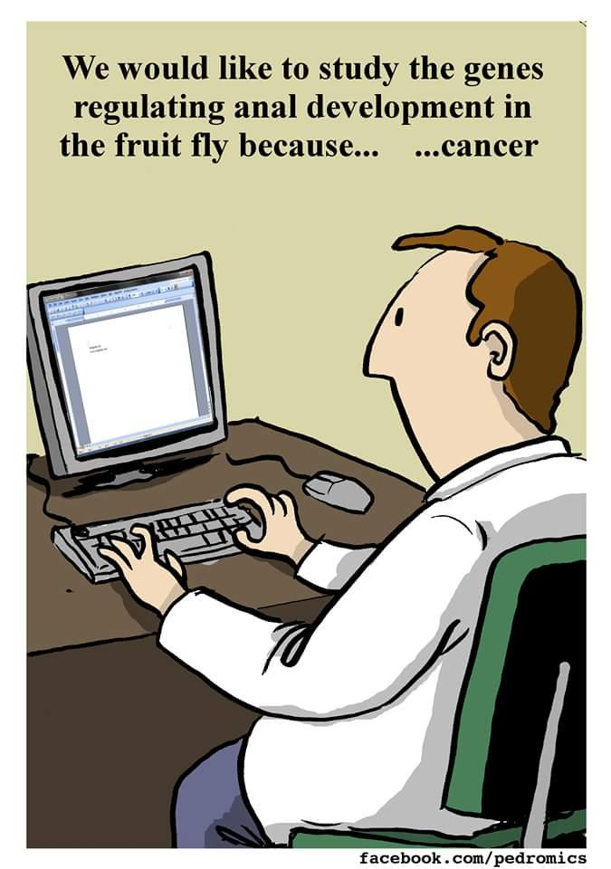
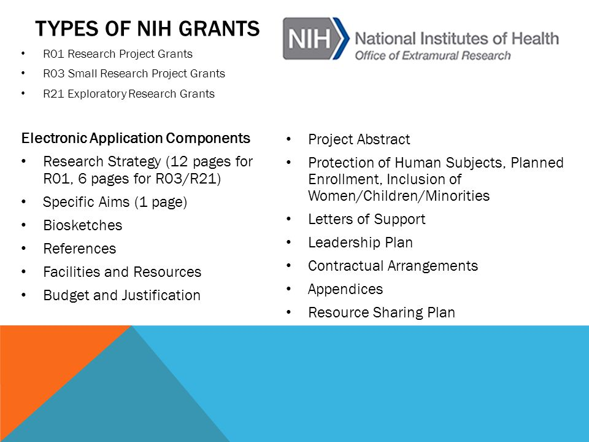

## Who picks up the tab for science?

 
 

* **Science supported by grants from government agencies, corporations, & private foundations**

 

* **Grant proposals usually a part of doing science, especially at academic institutions**

 

* **Less of an issue at government institutions**
    + internal vs external funding

 

* s**Not an issue at private companies**

## Where is the grant money going?

## Writing Proposals is an Essential Activity of Scientists

* **Undergraduate**
    + REU application (NSF)
    + summer research programs in medicine (AAMC)
    + grant in aid for research (Sigma XI)
    + Fulbright Scholarships
    
 

* **Graduate School**
    + NSF GREF program
    + federal, state and private grants by field of study
    + Fulbright Scholarships

 

* **Post Docs**
    + NRC research associate programs
    + federal, state and private grants by field of study

* **Faculty**
    + NSF, NIH, DOE, etc..
    + Dr. C: WVSR, Monarch alliance, WV Division of Forestry

## Sources of Funding in the Sciences

**One of the most important first steps in acquiring funding, of course, is to know all the potential sources of funding for research in science:**

 
 

National Science Foundation (NSF)
 
Office of Naval Research (ONR)
 
Department of Energy (DOE)
 
Department of Education (DOEd)
 
National Academy of Sciences (NAS)
 
National Security Agency (NSA)
 
Air Force Office of Scientific Research (AFOSR)
 
Army Research Office (ARO)
 
Defense Advance Research Projects Agency (DARPA)
 
NASA WVU
 
USDA National Institute of Food and Agriculture (NIFA)
 
Environmental Protection Agency (EPA)
 

## Sources of Funding in the Sciences: Medical 

 

**The sources of funding for medical research are also vast**

 
 

Agency for Healthcare Research and Quality (AHRQ)
 
Alfred P. Sloan Foundation
 
American Medical Association (AMA)
 
Arnold P. Gold Foundation
 
Arthur Vining Davis Foundations
 
AstraZeneca Medical Education Research Grants
 
National Institutes of Health (NIH)
 
The Robert Wood Johnson Foundation

## Sources of Funding in the Sciences

 

**Increasing number of private funding sources for science:**

 

**NY Times Sunday, March 15, 2014: “Billionaires With Big Ideas Are Privatizing American Science,” William J. Broad**

 
 

Moore Foundation
 
Simons
 
Gates
 
Ellison
 
Brin
 
Koch
 
Bezos
 

## Searching for grants for your research...

**Scientists must investigate various programs to find a potential match**

 

**1. What projects are already funded?**
 

There can’t be too much overlap of your proposed work with an
existing program

 

**2. What is the typical range of funding offered by the program?**
 

You should have some idea of the typical funding range offered by
the program, because your proposal can be dismissed outright if your
budget requests are too extravagant

 

**3. What are the stated program goals of the funding agency?**
 

Make sure that your research goals can be, and are, written so as to
coincide as closely as possible with the stated goals of the funding
agency and the specific program!

## How often do grants get funded? NIH

## How often do grants get funded? NSF

## Scientists are writing more grants than ever...

**There are currently over 900 federal grant programs offered by 26 different grant-making agencies (grants.gov)**

 

* **In 2019, the federal government distributed $721 billion to states and local governments**
    + ~16% of the United States budget. 

 

* **In 2019, the United State’s Health & Human Services sector awarded approximately $531 billion total in grants**
    + 29% of all awarded federal grants 
    
 

* **In 2019, NIH received 54,903 research project grants and funded 11,035**
    + acceptance rate of 20%

 

* **Between 2008 and 2019, Federal grants to states rose by 42% even after adjusting for inflation** 

## It is the exception to get funded, not the rule

**The limited pot of research funds worldwide means competition is fierce. **

 

* **At NSF, proposals worth a total of almost US$4 billion were rejected in 2017 because they were beyond the organizations budget**
    + reviewers had rated them as very good or excellent

 

* **At the NIH, the aggregate success rate for research grants was 20.5% in 2017**

 

* **At the biomedical-research funder Wellcome in London ~20% were funded in 2017–18**

 

* **The National Health and Medical Research Council (Australia) had a success rate of 7% in 2019**

## Is rejection culture toxic to science? 

* **Academics’ careers are strongly linked to their success in publishing and funding applications**
    + Unfortunately, rejection rates are high in both categories**

 

* **High rejections squander a valuable opportunity for professional learning and development**
    + success is binary (y/n) unlike scientific learning

 

* **High rejections waste an extraordinary amount of scientists time**

 

* **Rejection culture contributes to stress and anxiety among academics**
    + mental health problems 2x higher than general pop'
    

    
## Is grant funding biased in science? If so, WHY?!?

* **Currently, more men submit grant applications than women (~66%)**

 

* **Commonly, reviews of proposals are completed 'blind'**
    + reviewers cannot know who wrote application

## Kolev et al. 2019 findings

* **A study by Kolev et al. 2019 found that women were still 16% less likely to get funded**
    + data from 6700 Gates foundations Global Challenges application in 2017
    
 

* **Gender bias is not due to specific subject or field of science**

 

* **Gender bias is not due to experience or number of publications**
    + average male applicant is more senior w/ more publications, reflecting the history of gender bias in science
    + women still have top rated publications (which matters)

 

* **Language matters. Men tended to use more 'broad' words while women used 'narrow' words**
    + word choice related to communication styles
    + style vs substance
    + mattered more when males where reviewers!!

## Funding gaps *must* be closed in academia

* **Necessary fix the leadership gap and salary gap that women scientists currently face**
    + remember how success is determined in academia

 

* **Each step up the ladder of the scientific research system sees a drop in female participation until, at the highest echelons of scientific research and decision-making, there are very few women left**
    + aka 'leaky pipeline'
    

## Look around the room!!

**Women slightly outnumber men pursuing bachelor’s and master’s degrees in science (53%), but their numbers drop off abruptly at PhD level**
 

**The discrepancy widens at the researcher level, with men now representing 72% of the global pool**

## How are grant proposals evaluated?

* **Intellectual Merit**
    + potential for the proposed activity to advance knowledge and understanding within field or across  fields?
    + are proposed activities creative, original, or potentially transformative concepts?
    + is the plan for carrying out the proposed activities well-reasoned, well-organized, and based
on a sound rationale?
    + how well qualified is the individual or team to conduct the proposed activities?
    + are there adequate resources available to the PI?
    
 

* **Broader Impacts**
    + potential for a research project to benefit society or advance desired societal outcomes
    + growing in importance of National Science Foundation
    + e.g. building STEM talent or engaging wider audiences
    
 

* **Personal Statement to address how your activities address the Intellectual Merit & Broader**        

## Why are broader impacts so important?

<!--  -->

## Whats constitutes a typical grant?

<!--  -->

## Next time: You will be a NSF panel

