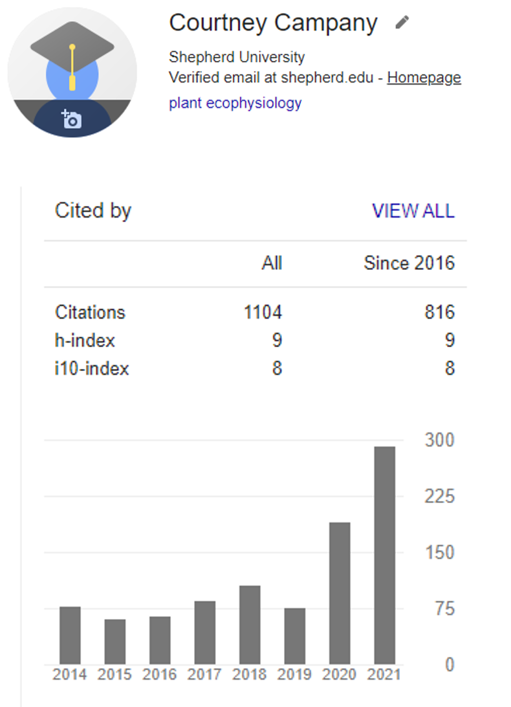

## Once upon a time…

## Why do you need references?

 

* **Allows you to acknowledge the contribution of other researchers in your work**
    + credit to other scientists from whom you have borrowed ideas

 

* **BUT ITS NOT JUST ABOUT PLAGIARISM…**
 
1. Provides evidence to support the claims in your work
2. Makes your writing more persuasive 
3. Demonstrates the depth of your own research into a topic
4. Allows verification of your work
5. Indicative of the extent of information on a topic

 

* **Currency for academics and journals**

## What information needs a reference?  

 

* **In general:**
    + When you provide information that you ordinarily would not have known before conducting your research
    + When you provide information that you cannot assume the reader knows

 

* **Anytime you:**
    + discuss, summarize, or paraphrase the ideas of an author
    + use data or statistics
    + use images, videos, or other media
    + provide a direct quotation (which we are **NOT** doing in this class)

 

* **To support one of your own assertions**

## There are a bazillion different reference styles…

 
 
 
 
 
 
 
 
 
 
 
 

**Different publications have different ways of formatting references in the Reference section at the end of a paper:**
 
Nature Reviews:  Jones, P. A. & Laird, P. W. Cancer epigenetics comes of age. Nature Genet. 21, 163–167 (1999).
 

Nature Genetics:  Jones, P. & Laird, P. Cancer epigenetics comes of age. Nat. Genet. 21, 163-167 (1999).
 

Cell:  Jones, P. & Laird, P. (1999). Cancer epigenetics comes of age. Nat. Genet. 21, 163–167.
 

Cancer Research:  Jones P. A., Laird P. W. Cancer epigenetics comes of age. Nat. Genet., 21: 163-167, 1999.

## There are a bazillion different reference styles…

 
 
 
 
 
 
 
 
 
 
 
 

**Different publications have different ways of formatting in-line references in the text:**
 
(Jones and Laird, 2011)
 

(Jones & Laird, 2011)
 

“yadda yadda yadda [1]”
 

(Jones et al., 2012)
 

"Jones et al. 2000 ..."

## In Capstone we will use APA formatting

 

* **The in-line and reference lists in your capstone project will be formatted according to the American Psychological Association (APA) 7th edition**
    + APA is a common format that is simple without using many abbreviations

 
 
 
 
 
 
 
 
 
 
 

* **Details:https://apastyle.apa.org/style-grammar-guidelines/references**

## Reference software to the rescue!

 
 
 
 
 
 
 
 
 
 
 
 
 
 
 

**Mendeley is (FREE) software that collects and organizes your references**
 

**It also interfaces with Word and automagically formats your in-line references and reference list with the click of a button**
 

**Download at:  https://www.mendeley.com/download-desktop/**

## Using Mendeley desktop (required for Capstone)

**Mendeley consists of two parts:**
 

1. the reference manager program 
2. a citation tool in Word

## Basic things to do in Mendeley

    
## Basic things to do in Mendeley: REFERENCE MANAGER

 
 
 

* **Add articles to your database using “Add Files” OR drag & drop PDFs into Mendeley**

 

* **Organize articles by folders (topics, projects, classes)**
    + set citation styles
    + format individual references
    
 

* **Take notes, highlight, annotate your own PDF (viewable within Mendeley)**
    
## Using Mendeley in Microsoft Word (citation plugin)

**In the “References” tab of Word, you will now see the “Mendeley Cite-O-Matic” menu**

 

**This is how you insert in-line citations into text and insert a bibliography (reference list) at the end of your paper**

 

**You can choose different formats and with the click of a button, Mendeley will reformat all references**

## Mendeley also has an online 'Web Library'

 
 
 
 
 
 

* **You can sync your desktop library to Mendeley Reference Manager**
    + moves papers to the cloud for storage
    + making papers available on other computers
    + Allows additional features (social/community)

## Let's get downloading and trouble shooting

## Todays Goal: Familiarize yourslef with Mendeley

 

**1. Download software (desktop and word)**
 
**2. Create an account**
 
**3. Download web extension (if possible)**

 

**4. Create a folder for your capstone in Mendeley**
 
**5. Download or collect citations from some papers**

 

**6. Practice citing in Word**
 
**7. Create a bibliography in Word**

 

**8. Correct a citation (e.g. title in all caps)**

## Pro Tip: Become ONE with Mendeley

 

* **Start collecting references in Mendeley (even if you don’t have the full text yet)**
    + The web importer is handy for this

 

* **Papers can be difficult to track down again if you try to go back and find them**
    + it is better to take the time to get them right away
    
 

* **It will make your life soooo much easier**

 

* **You will not lose points**
    + handwritten bibliographies are NEVER perfect

## Mendeley resources and guides

 
 
 
 

**From the company:  https://www.mendeley.com/guides**

 

**A Beginner’s Guide (U of Otago): https://otago-med.libguides.com/mendeley**

 

**UC Davis:  https://www.library.ucdavis.edu/guide/mendeley/**

