## New age of open science

 
 
 

* **"Open Science" = umbrella term encompassing everything related to reproducible, transparent science.**
    + *reproducible science* = 
    
 

* **Movement to make all scientific data, methods, and materials accessible to all levels of society**

 

* **Appeals to every area of science, from life sciences to computational sciences to theoretical sciences.**

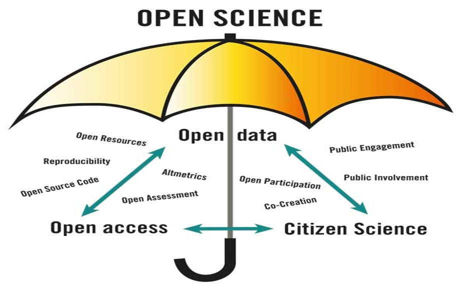

## Why is 'Open Science' a good thing?

 
 
 

* **The vast majority of research is publicly funded**
    + logical that the public have access to it!
    
 

* **Open and transparent research makes peer review and replication much easier**

 
 
 
 

* **There is evidence that Open Science gives projects more downstream impact in the scientific community**
    + *question* - how would this concept work with cancer research?

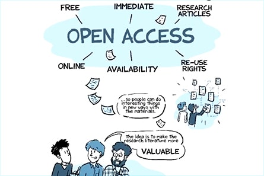

## Major themes that comprise 'Open Science' guidelines

 

**Open data: all data used in the project should be made available.**

 

**Open source: all code written in the project should be publicly available.**

 

**Open methods: the exact procedure of the project is publicly documented.**

 

**Open review: correspondence between reviewers and authors is public.**

 

**Open access: resulting publications are publicly available.**

 

**Open education: all education materials are publicly available**

## Open data is the core of 'Open Science'

 

* **Publish all of the data used in your study and experiments online.**

 

* **Definite shift from prior precedent**
    + most raw data from scientific experiments not available

 

* **Many repositories and online data banks now exist**
    + authors still given credit (DOI)
    + Many research institutions/companies host their own open data repositories

 

* **Amazon has released its own set of large public datasets:**
    + https://aws.amazon.com/public-data-sets/
    

## Brainstorm: Are there any issues with 'Open Science'?

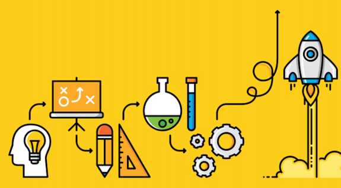

##

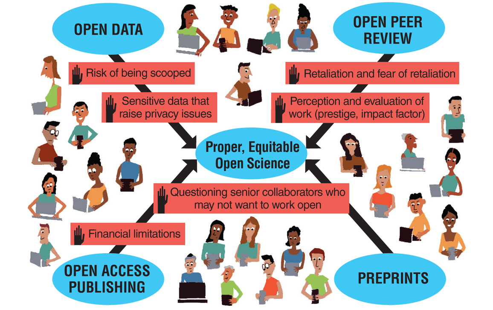

## Can you use these data for your capstone: YES!!!

 
 

* **Explore data portals based on your career interest**
    + ecological &rarr; health care
    
 

* **Propose a scientific question**

 

* **Make sure that the data is not published**
    + if it is, use in review-type paper

 

* **Work with Dr. C to download data**
    + data sets can be really big
    

## National Ecological Observation Network (NEON)

 

* **Offers ecological data from sites across the continent to fuel current ecological science** 

 

* **NEON is a network of field research sites, designed by ecologists to provide open data for all**
    + 81 field sites across the U.S.
    + fully operational in 2019
    
 

* **NEON monitors ecosystems across the United States**
    + freshwater = streams, rivers and lakes
    + terrestrial = deserts &rarr; tropical forests
    
     

* **Data is free to use!!**

## https://www.neonscience.org/data

**NEON takes millions of measurements and collects thousands of samples every year**

## Lots of medical, human population and public health databases

 
 

* **Center of Disease Control (CDC)**
    + public health data

 

* **1000 Genomes project**

 

* **Data.gov**

 

* **World Health Organization (WHO)**

 

* **SEER**

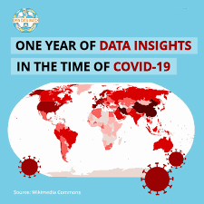

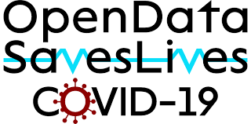

## CDC Wonder

 

* **An integrated information and communication system for public health by the CDC**
    + promote information-driven decision making by placing timely, useful facts in the hands of public health practitioners and researchers
    + To provide the general public with access to specific and detailed information from CDC.
    
 
 
  
**Wide-ranging data portal for epidemiologic research**

 

**Access to a wide array of public health information**

## https://wonder.cdc.gov/

## 1000 Genomes Project

 
 
 

* **Detailed catalogs of human genetic variation**

 

* **Sequenced more than 2500 individuals from 26 different populations around the world**

 

* **Integrated set of phased haplotypes with more than 80 million variants for these individuals**
    + group of genes within an organism that was inherited together from a single parent

## https://www.internationalgenome.org/data-portal/sample

## Data.gov

 

* **Home of the U.S. Government’s open data**
    + over 300,000 data sets
    + includes a broad coverage of science data

 

* **Data, accountability, and transparency: creating a data strategy and infrastructure for the future**

 

* **Federal Data Strategy (FDS) encompasses a 10-year vision for how the Federal Government will accelerate the use of data to deliver on mission, serve the public, and steward resources while protecting security, privacy, and confidentiality.**

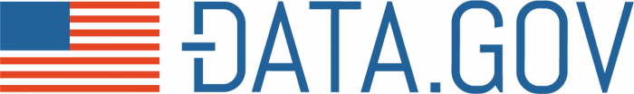

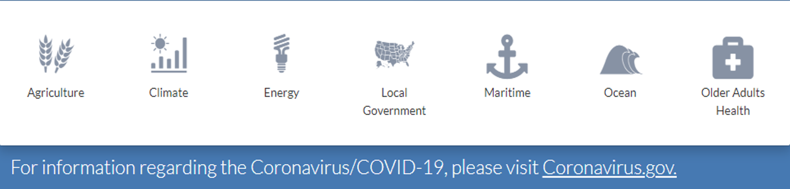

## https://labs.data.gov/dashboard/offices/qa

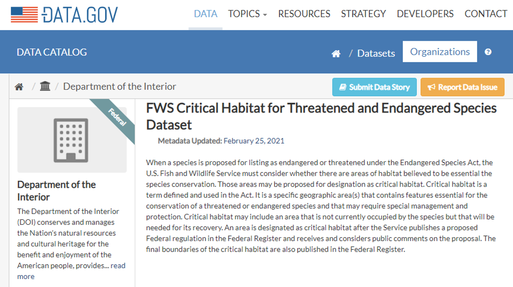

## World Health Organization (WHO)

* **Founded in 1948, WHO is the United Nations agency that connects nations, partners and people to promote health, keep the world safe and serve the vulnerable**

 

* **WHO manages and maintains a wide range of data collections related to global health**

 

* **WHO has several global missions:**
    + leads global efforts to expand universal health coverage
    + direct and coordinate the world’s response to health emergencies
    + promote healthier lives – from pregnancy through old age

 

* **The Global Health Observatory (GHO) data repository is WHO's portal to health-related statistics**
    + provides access to over 1000 health topics indicators
    + many available to download

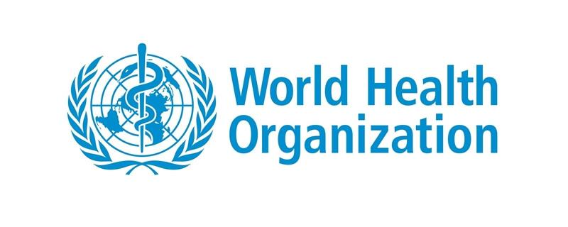

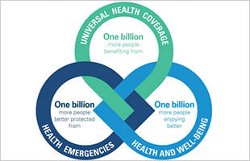

## https://www.who.int/data

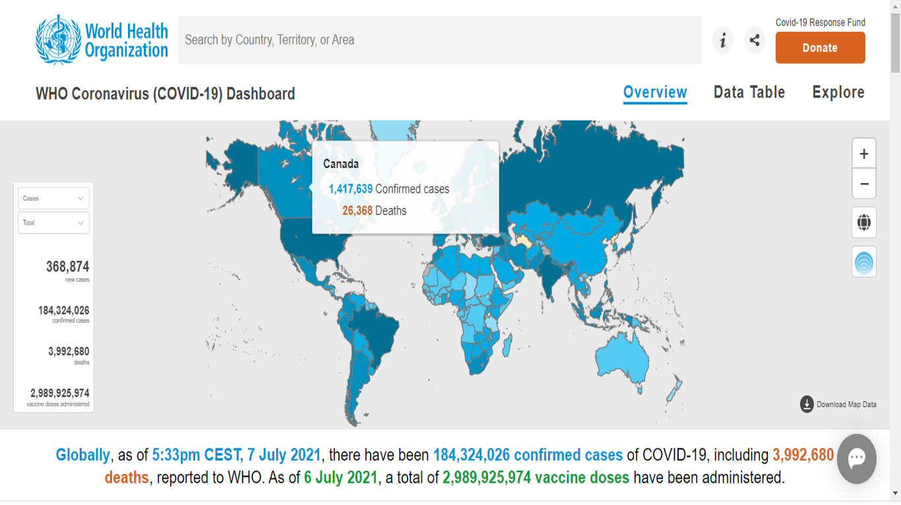

## Workshop Assignment: Exploring open data portals

 
 
 

* **Download the assignment worksheet from Brightspace**

 

* **Using the available data portals from WHO, explore data trends and collaboratively propose questions that can only be answered with large open data sets**
    + focus on the Triple Billion Targets or the Covid-19 Dashboard
    
 

* **Work in collaborative teams up to 3 people**
    + submit your own work