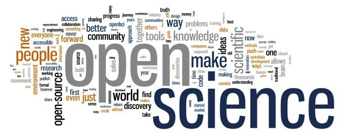
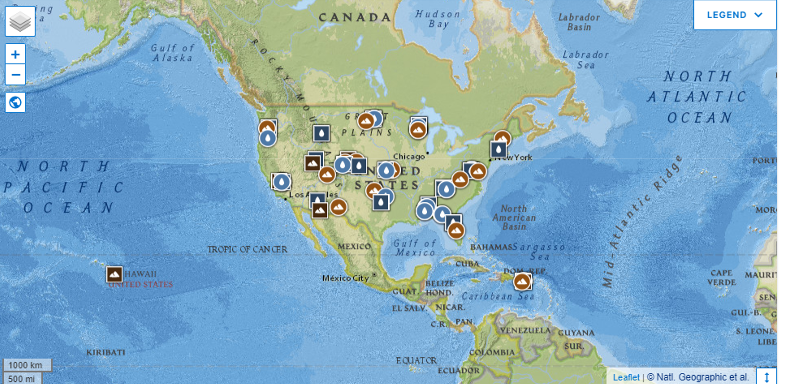
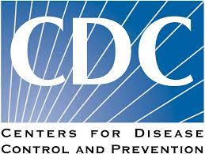
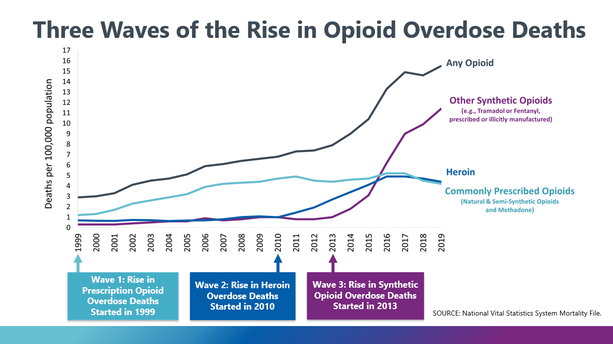
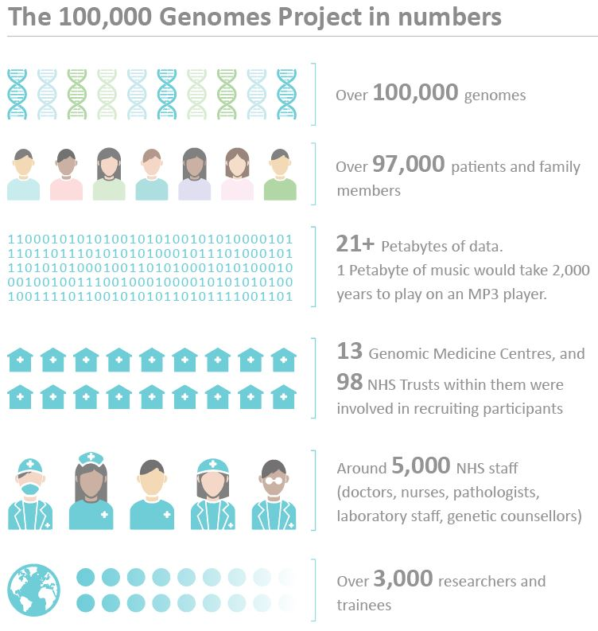
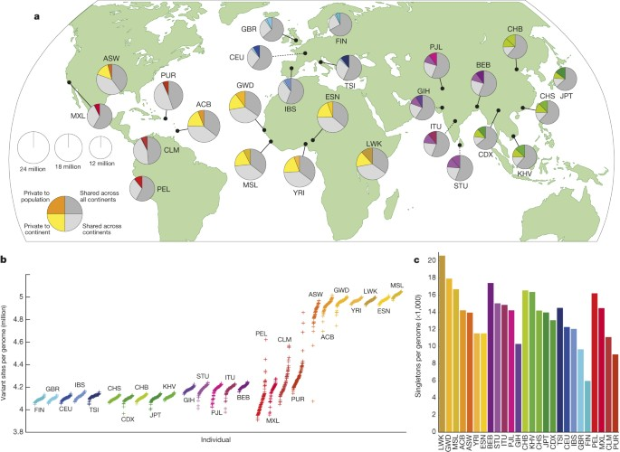

## New age of open science

* **"Open Science" is something of an umbrella term encompassing everything related to reproducible, transparent science.**

 

* **meant to appeal to every area of science, from life sciences to computational sciences to theoretical sciences.**

 

* **movement to make all scientific data, methods, and materials accessible to all levels of society**

## Why is 'Open Science' a good thing?

* **The vast majority of research is publicly funded**
    + logical that the public have access to it!
    
 

* **Open and transparent research makes peer review and replication much easier**

 

* **There is some convincing evidence that Open Science gives projects more downstream impact in the scientific community**

## Major themes that comprise 'Open Science' guidelines

**Open data: all data used in the project should be made available.**
 

**Open source: all code written in the project should be publicly available.**
 

**Open methods: the exact procedure of the project is publicly documented.**
 

**Open review: correspondence between reviewers and authors is public.**
 

**Open access: resulting publications are publicly available.**
 

**Open education: all education materials are publicly available**

## Open data is the core of 'Open Science'

* **All of the data used in your study and experiments are published online.**

 

* **This is definitely a shift from prior precedent; most raw data from scientific experiments remain cloistered.**

 

* **Repositories and online data banks have sprung up around this idea. Many research institutions host their own open data repositories, as do some large tech companies.**

 

* **Amazon has released its own set of large public datasets:**
    + https://aws.amazon.com/public-data-sets/
    
## Can you use these data for your capstone: YES

## National Ecological Observation Network (NEON)

 

* **Offers expert ecological data from sites across the continent to power the most important science being done today** 

 

* **NEON is a network of field research sites, designed by ecologists to provide open data for all**
    + 81 field sites across the U.S.
    + fully operational in 2019
    
 

* **NEON monitors ecosystems across the United States**
    + freshwater = streams, rivers and lakes
    + terrestrial = deserts &rarr; tropical forests
    
     

* **Data is free to use!!

## https://www.neonscience.org/data

**NEON takes millions of measurements and collects thousands of samples every year**

## Lots of medical and public health databases

 

* **Center of Disease Control**
    + public health data

 

* **1000 Genomes project**

 

* **Data.gov**

 

* **World Health Organization (WHO)

* **SEER

## CDC Wonder

 

* **An integrated information and communication system for public health by the CDC**
    + promote information-driven decision making by placing timely, useful facts in the hands of public health practitioners and researchers, and
    + To provide the general public with access to specific and detailed information from CDC.
    
  
 
**Wide-ranging Online Data for Epidemiologic Research**

 

**Access to a wide array of public health information.**

## https://wonder.cdc.gov/

## 1000 Genomes Project

 

* **established the most detailed catalogue of human genetic variation**

 

* **Sequenced more than 2500 individuals from 26 different populations around the world**

 

* **Produced an integrated set of phased haplotypes with more than 80 million variants for these individuals**

## https://www.internationalgenome.org/data-portal/sample

## Data.gov

 

* **A systematic review of a focused topic in the literature that provides a quantitative estimate for the effect of an experimental treatment**
    + Used to examine a specific issue to determine whether a conclusion can be reached regarding the effect of a treatment or exposure
    + Often used to address controversial issues in medicine
    + Used to understand global patterns in ecology

## https://labs.data.gov/dashboard/offices/qa

**“The lack of effect of prophylactic vitamin C supplementation on the incidence of common cold in normal populations throws doubt on the utility of this wide practice.”**

## World Health Organization

**Mycorrhizal association as a primary control of the CO 2 fertilization effect (Science 2016)**
 

## https://www.who.int/data

* **Papers will be reviewed as drafts being submitted for peer review at a journal (i.e. not rough drafts).**
    + However, the paper is the work of the student and not a professional

 

* **Papers must contain every sections appropriate to that type of paper.**

 

* **The text will be reviewed for scientific content.  The paper should be written with sufficient detail that a reviewer can understand the project's rationale and conclusions without being an expert in the field.**

 

* **The text will be evaluated for quality of writing, including sentence structure, word usage, grammar spelling, and other writing mechanics.**

 

* **Papers will also be reviewed for technical elements such as appropriate use of references and citations, figure legends, reference citations, and appropriate figure legends.**

## How will the capstone paper be evaluated?

**Rough and final drafts of your capstone paper will be evaluated according to a rubric on Brighspace**

## Content, style and error-free writing matter!

