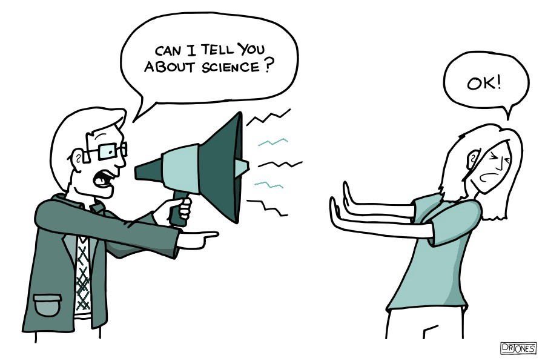

## Forms of scientific communication

* **Peer-reviewed journal article**
    + Gold standard
    + Has been carefully reviewed by other scientists

 

* **Oral presentation at a conference**
    + May contain published and/or unpublished results
    + Presented to an expert audience w/ questions

* **Poster presentation at a conference**
    + Informal presentation
    + Visually appealing
    + Usually contains unpublished results
    
 

* **Modern sci-comm is changing!**
    + blogs, podcasts, tweets, etc

## First impressions and the “elevator pitch”

 

* **Your first impression on the audience is critical to guarantee their interest**

 

* **Begin your presentation with a very short synopsis with three vital bits of information:**
    + What is your research topic?
    + What have you found?
    + Why is it important?

 

* **Focus on the big picture (top of the funnel)—you want to hook them with the big picture so they are then excited to hear about the small details.**
    + 3 minute thesis will help!

## Telling your story

 
 

* **After your elevator pitch, build the narrative of your research in around 5 min**
    + Like any story, it needs a beginning, middle, and end

 
 

* **Beginning:  set the scene and introduce the main characters**
    + Provide the necessary background information for your audience
    + How did this lead to your research question?
    + What were you hoping to find out and why?
    + Who are the main characters? (e.g. drug, disease, gene, cell type, technique, etc.)

## Telling your story

 
 

* **Middle: the adventure…**
    + How did you get from your research question to your conclusion?
    + Why did you choose to take that route?
    + What did you find on your way?
    + Were there any interesting twists?

 
 

* **End: the conclusion to the story.**
    + What is the ultimate consequence of your journey?
    + What does this mean for your main characters?

## Pro Tips: Nailing your poster presentation

* **Be confident — you are the expert on this subject**
    + Try to be yourself and let your personality show through
    
     
    
* **Try not to talk too rapidly**
    + avoid too much jargon
    
 

* **Make eye contact with your audience**

 

* **Use poster images to help you explain things—a picture is worth a thousand words**

 

* **It is a good idea to check your audience’s understanding**
    + “Have I been clear enough…?” 
    + “Should I go into more detail…?”

## Consider your audience and objectives

 
 

* **Presenting a poster is a performance, and just like any performance, practice is a major factor in success**

 

* **Rehearse what you will say ahead of time OUT LOUD**
    + write down notes with the main points.  You can refer to them as you develop your presentation (not while speaking).
    + Force yourself to speak aloud even if it seems silly
    + After you feel more confident, try giving it to friends and family

## Before your presentation…

* **Understand completely why everything is included on the poster and its implications for your project or topic**

 

* **Memorize your “elevator pitch”**

 

* **Know your key points without referring to written notes**

 

* **Be ready to answer likely questions with confidence**
    + think about what questions ahead of time
    
 

* **Know how to deal with difficult questions that you might not be able to answer fully**
    + expect someone will ask that ? you can't answer
    + it is 'OK' to say you do not know

## 3 Minute Thesis: Your elevator pitch

 
 

* **International competition to explain your research in a language appropriate to a non-specialist office**
    + Someone else's grandma in the elevator

 

* **Goal is to increase your capacity to effectively communicate science**
    + used at >900 universities across 85 countries  
    
 

* **Recent winners:**
    + https://threeminutethesis.uq.edu.au/watch-3mt
  

## 3 Minute Thesis: The Rules

* **A single static PowerPoint slide is permitted**

 

* **No slide transitions, animations or 'movement' of any description are allowed.**
    + no additional electronic media or props

 

* **Presentations are limited to 3 minutes maximum**
    + competitors exceeding 3 minutes are disqualified.

 

* **Presentations are to be spoken word (e.g. no poems, raps or songs)**

 

* **Dr. C will provide prizes!!!**
    + grade based mostly on participation 

<!-- ## Dr. C in the HOT SEAT! -->
<!-- 
 -->

<!--  -->

<!--  -->

<!-- ## -->

<!--  -->
