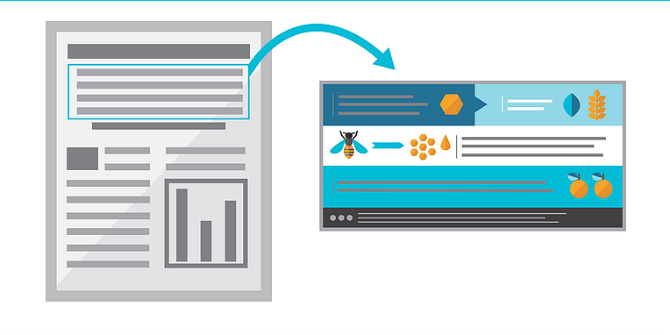

## Forms of scientific communication

* **Peer-reviewed journal article**
    + Gold standard
    + Has been carefully reviewed by other scientists

 

* **Oral presentation at a conference**
    + May contain published and/or unpublished results
    + Presented to an expert audience w/ questions

 

* **Poster presentation at a conference**
    + Informal presentation
    + Visually appealing
    + Usually contains unpublished results
    
 

* **Modern sci-comm is changing!**
    + blogs, podcasts, tweets, etc

## Poster sessions at conferences

 

* **A major part of many conferences is the poster session**

 

* **During a poster session, the author of the poster stands at their poster and informally presents it to interested passersby**

 

* **The presenter walks the person through their research project and latest results, answering questions and hearing criticisms from other scientists**

 

* **Posters are all about connecting with other scientists:  LOTS of science happens this way**

## Always remember your goal as a communicator

 
 

* **As a part of the capstone project, you will create a scientific poster and present it to the class**

 

* **Like any form of scientific communication, the goal of your poster presentation is to present information to your audience as effectively as possible**

 
 

* **Keep in mind the THREE Cs and K.I.S.S**

 
 

* **Poster organization and design is less rigid than a paper.**
    + chance to inject some creativity and personality into scientific communication**

## Major considerations for a poster

 

**Follow size, layout, and materials specifications**

 

**Consider your audience and objectives**

 

**Use a clean organization and layout**

 

**Large, readable design**

 

**Minimize text, maximize figures**

 

**The presentation:  prepare for discussion and questions**

## General poster prep and rules for conferneces

 

* **Posters should be readable by viewers 3-5 feet away.**
    + Use large print and block letters when possible

 

* **Poster dimensions are 36” high by 48” wide**
    + minimum font size of 28 point
    + maximum of 600 words

 

* **Additional requirements:**
    + headline strip that runs the full width of the poster
    + title, authors, & affiliations on the strip
    + abstract in the upper left-hand corner (if required)
    + include a contact email address

## Consider your audience and objectives

 

* **Your audience depends on the venue where you are presenting your poster:**
    + Expert scientists in your field
    + Scientists in different fields
    + Peers or other students
    + Non-scientists

 

* **In general, it is best to assume that your audience has no expert knowledge**

 

* **Consider whether your poster needs to be geared toward any specific communication objective**
    + original research poster
    + narrative review

## Parts of a scientific poster

* **Posters generally have these elements:**
    + Good, informative **Title**
    + **Introduction / Background**: contains the information necessary to understand the research question.  
        + May contain a statement of your problem/hypothesis
    + a brief methods section
    + **Data and results**: as visual as possible
    + **Discussion or Conclusions**: summarizes only the main points

 

* **Optional elements:**
    + Brief References section
    + Acknowledgements
    + Abstract: conferences require you to submit an abstract ahead of time

## Pro Tips: Poster Design

 

* **Minimize blocks of text**
* **Maximize use of figures**
* **Color-blind friendly palate**
* **Pay attention to trends**

 

* **Uncluttered, clean layout =  good use of white space**
    + simplicity is best:  resist the urge to include everything (you can always say more)
    + maintain balance:  visual elements should cover slightly more than 50% of the poster area
    + if you have only a few figures, make them large.
    + arrange into columns so eye movement over the poster is natural
    + Use fonts large enough for easy readability

## 

##

##

##

##

##

##

##

##

## How do you actually make a poster?

* **Use Powerpoint and treat the poster area as one large “slide”**
    + Design &rightarrow; Slide Size &rarr; Custom Slide Size 

 

* **For the capstone poster, use 36” x 48” dimensions in either landscape or portrait format**

 

* **Premade Powerpoint templates are available online**
    + Google ‘scientific poster template’ and profit!
    

## The capstone poster assignment

 

* **You will create a scientific poster that will be presented to the class.  This part of the capstone consists of:**
    + A rough draft of your poster
    + Written review and workshop discussion of a classmate’s poster
    + A final draft of the poster
    + The poster presentation via Zoom near the last week of class (exact date TBD)

 

* **Key features to be evaluated are:**
    + Quality and production of the poster:  clarity, layout, and scientific content
    + Demonstration of a clear understanding of the research/topic
    + Ability to explain research topic beyond scope of the poster
    + Ability to answer questions and discuss the work with others

 

* **A full rubric will be provided as the poster draws near**

