## Health sciences careers are growing

 
 

* **Numbers of health sciences jobs are on the rise with the baby boomer population aging**

 

* **The US Bureau of Labor and Statistics web site has all kinds of fascinating information about careers**
    + https://www.bls.gov/bls/employment.htm
    

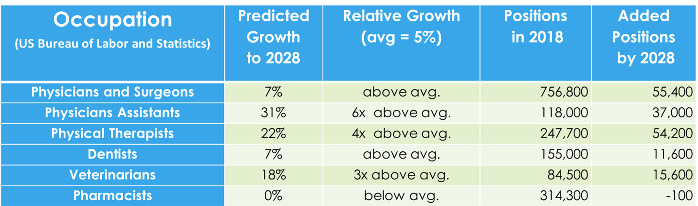

## Comparison of professional school degrees

* **Physician (MD, DO)**

 

* **Physician’s Assistant (PA)**

 

* **Physical Therapist (PT)**

 

* **Pharmacist**

 

* **Dentist**

 

* **Veterinarian**

 

* **Chiropractor**

 

* **Optometrist**

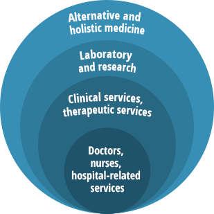

## Why choose professional school? 

 

* **High income potential (for some professions…)**
 

* **Job security**
 

* **Workplace flexibility**
 

* **Saving and improving lives**
 

* **Continuing learning**
 

* **Prestige**

 

* **However:**
    + Training process is long and demanding
    + High debt (MD:  ~$250K tuition, DDS: ~$165K, vet: ~$125K)
    + Stressful professions

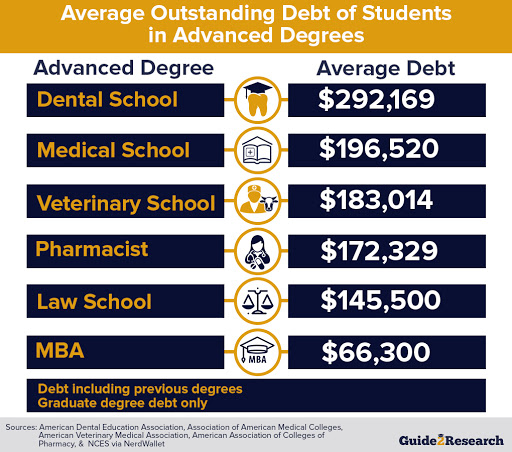

## Factors in professional school admission

 

* **A competitive test score on a standardized admissions tests**

 

* **Grade point average >3.2 for most schools**
    + 3.55 for medical school (NYU = 3.92)
    
 

* **Well-written essays**

 

* **In-depth professional exposure for health related professions**
    + shadowing, scribing
    
 

* **Research experience**

 

* **Highly supportive letters of recommendation**

 

* **Demonstrate strong interpersonal and communication skills**

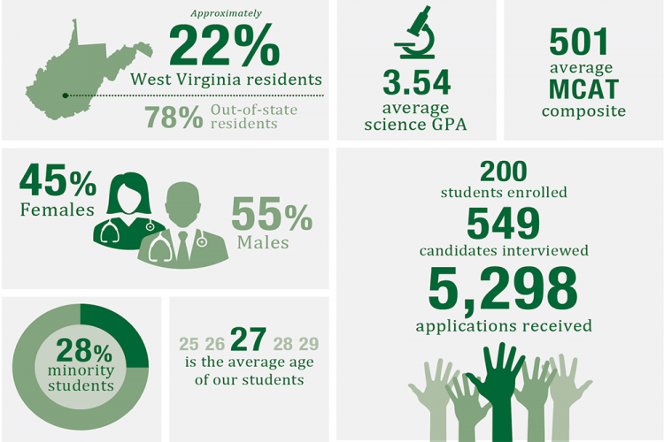

## Physician

 

* **Practices all aspects of modern medicine including prescribing drugs, surgery, and the use of technology to diagnose disease, evaluate injury, and promote wellness.**
    + MD (Medical Doctor): traditional degree from an allopathic medical school (http://www.ama-assn.org/)
    + DO (Doctor of Osteopathy): same functions as MD with a emphasis of total patient care (http://www.aacom.org)

 

* **Training time:**
    + Medical school: 4 years 
    + Residency: 3-5 years
    + Fellowship for specialty: 0-3 years (optional)

* **133 allopathic medical schools & 29 osteopathic medical schools in the US**
    + Requires national and state medical licensure examinations
    + Requires medical board licensure for a specialty

 

* **Admission test: MCAT (Medical College Admissions Test)** 

## Medical School Admissions

* **Evidence of academic success**
    + GPA >3.5 in BCPM (biology, chemistry, physics, math)
    + MCAT of >500 (125 per section)

 

* **Course requirements (minimum grade):**
    + Biology, chemistry, biochemistry, physics, labs, behavioral sciences, medical terminology
    + There are grade minimums (usually C)

 

* **MD admissions moving away from concrete course requirements**
    + Looking for “proficiency” in subjects

 

* **Check specific requirements for each school!**

* **Evidence of other activities**
    + Shadowing at a hospital/physician’s office
    + Hospital volunteering or work
    + Leadership and service in community
    + Undergraduate research
    

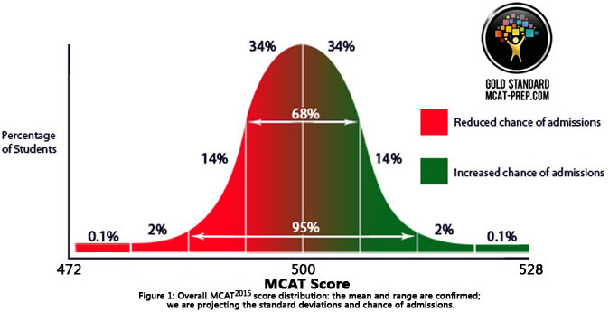

## Medical school resources

 

* **Many medical school admission resources available at: https://students-residents.aamc.org/**

 

* **Everything you need to know about the MCAT: https://students-residents.aamc.org/applying-medical-school/taking-mcat-exam/**

 

* **https://medicine.hsc.wvu.edu/about/**

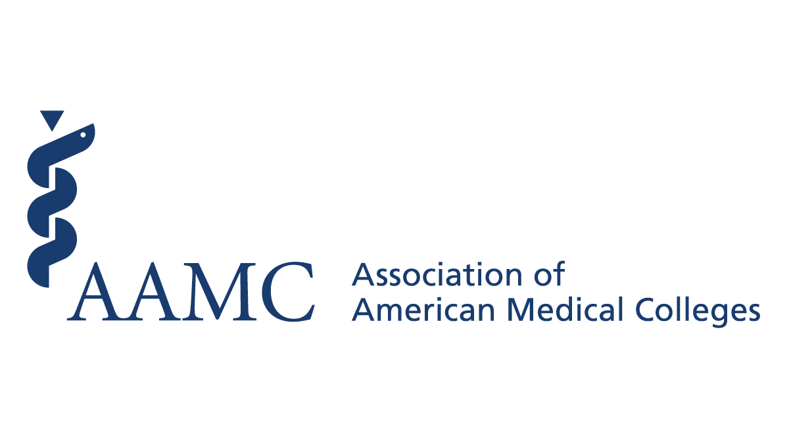
    
## Physician Assistant

* **The role of the physician assistant (PA) is to practice medicine under the direction and supervision of a licensed physician in virtually all medical specialties and settings.**
    + See:  http://www.aapa.org/
    + MS in Physician Assistant Studies (or similar)

 

* **Training time:  2-3 years**
    + Extensive clinical rotations begin in 2nd year

* **196 graduate programs in U.S.**
    + Requires national and state licensure examinations
    
 

* **Admissions test: Graduate Record Examination (GRE)**

* **Academic and experience requirements similar to medical school**
    + addition of human anatomy and physiology
    + a little less stringent
    

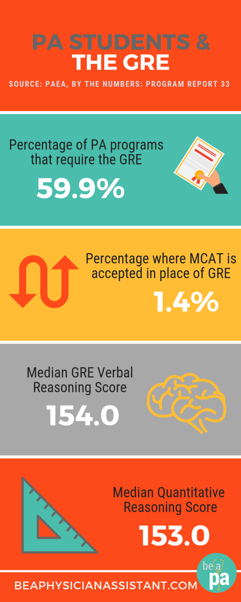

## Regional physician assistant programs

 

* **Shenandoah University - Division of Physician Assistant Studies, Winchester, VA**

 

* **Alderson Broaddus University - Physician Assistant Department, Philippi, WV**

 

* **Eastern Virginia Medical School - School of Health Professions, Norfolk, VA**

 

* **James Madison University - Master of Physician Assistant Studies Program, Harrisonburg, VA**

 

* **Jefferson College of Health Sciences, Roanoke, VA**

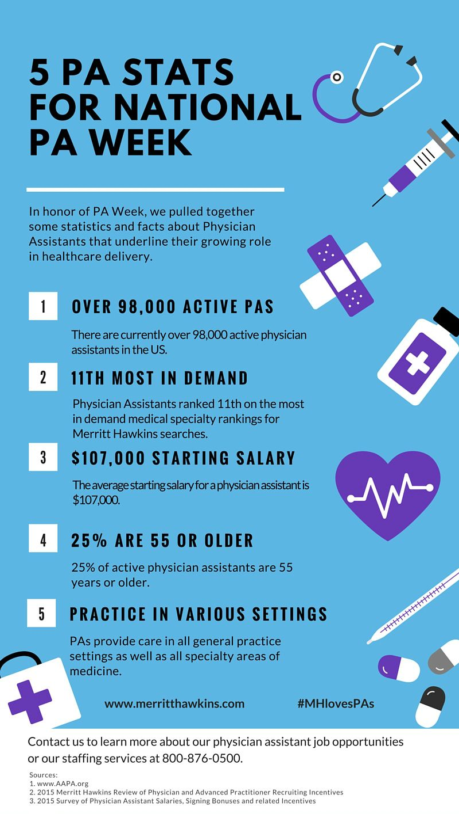

## Dentist

* **Dentists diagnose and treat problems with patients' teeth, gums, and related parts of the mouth. They provide advice and instruction on taking care of the teeth and gums and on diet choices that affect oral health.**
    + See http://www.ada.org/
    + DDS (Doctor of Dental Surgery)

 

* **Training time:  4 years**

 

* **61 schools in the U.S. (including WVU, UM, Virginia Commonwealth)**
    + Requires national and/or state licensure

 

* **Admissions test: DAT (Dental Admissions Test)**

 

* **Academic and experience requirements similar to medical school**

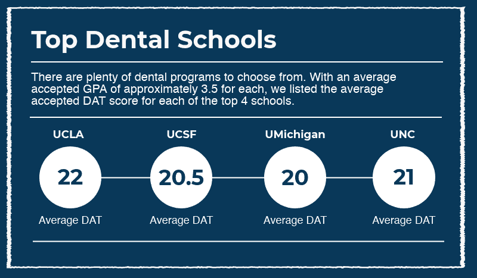

## Physcial Therapist

* **Physical therapists are movement experts who improve quality of life through prescribed exercise, hands-on care, and patient education.**
    + See:  https://www.apta.org/your-career/careers-in-physical-therapy/
    + Doctorate in Physical Therapy
    + Masters in Occupational Therapy

 

* **Training time:  2-3 years**
    + Includes clinical rotations

 

* **212 programs in the U.S.**
    + WVU, Marshall, Shenandoah University)
    + Requires national and state licensure 

 

* **Admissions Test: Graduate Record Examination (GRE) **
    + Academic requirements:  Human anatomy and physiology
 

<!-- 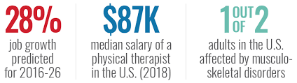 -->

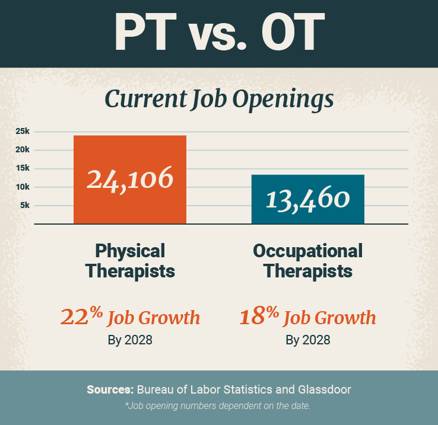

## Pharmacist

* **Pharmacists dispense prescription medication along with key information, such as side effects, contraindications with other medicines, and a range of other concerns.**
    + See:  http://www.aacp.org
    + PharmD (Doctor of Pharmacy)

 

* **Training time: 4 years**
    + Usually includes 1-2 year residency

 

* **100 programs in the U.S.**
    + WVU, Marshall, Shenandoah
    + Requires national & state licensure 

 

* **Admissions test: Pharmacy College Admission Test (PCAT)**
    + sometimes optional

 

* **Academic requirements:  Human anatomy and physiology, microbiology**

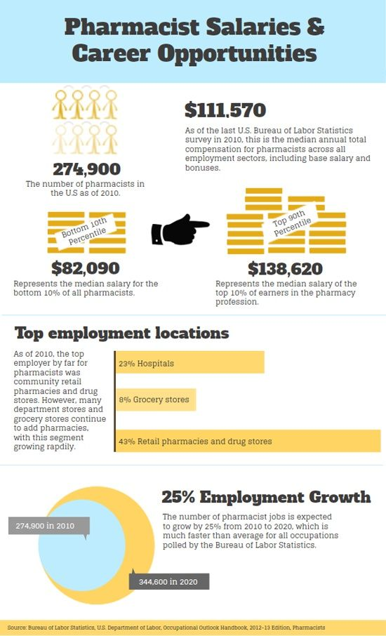

## Veterinary Medicine

* **Veterinarians care for the health of animals & work to protect public health. They diagnose, treat, & research medical conditions & diseases of pets, livestock, and other animals.**
    + See:  http://www.aavmc.org
    + DVM (Doctor of Veterinary Medicine)

 

* **Training time:  4 years**

 

* **30 programs in the U.S.**
    + Requires national & state licensure

 

* **Admissions test: moving away from tests (some GRE)**

 

* **Vet school admission is extremely competitive**
    + Academic and experience requirements same as medical school*

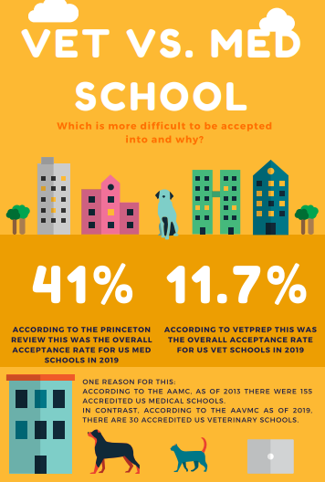

## Centralized Application Services

 

* **Most professional schools participate in a centralized application service**

 

* **Applicant fills out a single application including all required materials that can be sent to specific schools**

 

**Medical school: AMCAS**
 
**Physician assistant: CASPA**
 
**Dental school: ADEA AADSAS**
 
**Veterinary school:  VMCAS**
 
**Physical therapy: PTCAS**
 
**Chiropractor: ChiroCAS**
 
**Optometry:  OptomCAS**

 

* **Each school still maintains their own application deadlines**

## Parts of a CAS application

 

**1. Admissions test results**
 
 
**2. Background Information**
 
 
**3. Coursework and Official Transcript(s)**
 
 
**4. Work and Activities: extracurricular activities, related experiences and exposure, employment, volunteer work, internships, and/or research**
 
 
**5. Letters of Evaluation: 2-3 letters**
 
 
**6. Personal Statement**
 
 
**7. Secondary Application: School-specific application that helps explain why you’re interested in that particular institution; how your goals, experiences, and plans align with their mission and goals; and how/what you would contribute and develop as a learner at that institution.**
 
 
**8. Other admission components:  interview, social media / internet search, financial information, and criminal history**

## Admissions timelines

* **Fall of junior year: **
    + Study and take practice tests
    + Prepare admission materials
    + Learn about deadlines (set by individual schools)

 

* **Spring of junior year:  take admissions test**

 

* **Summer/fall of senior year:**
    + Finalize admission materials
    + Apply using CAS by school deadline (typically November 1)

 

* **Fall/spring of senior year: **
    + In-person interviews
    + Make decision!

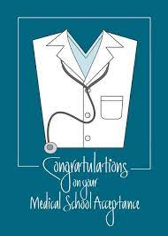

## 

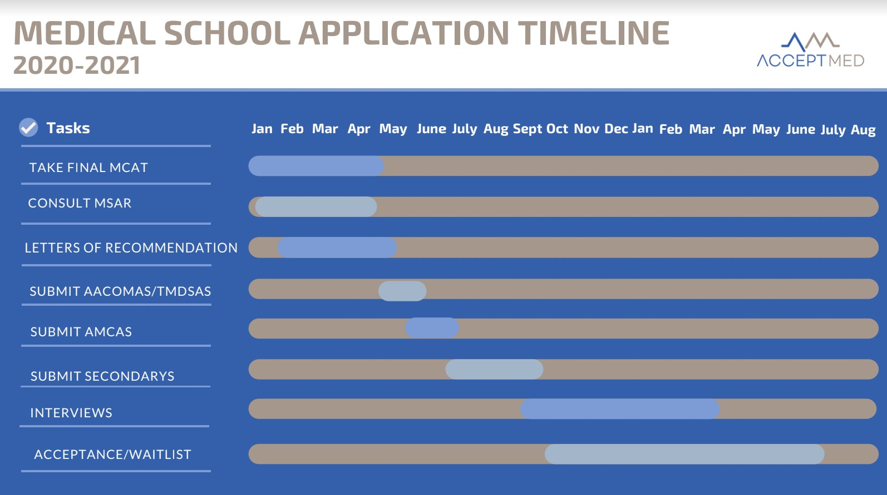

## Practive admissions tests!

 
 
 

* **The best way to prepare for admissions tests is to take practice tests**

 

* **All the major tests have free tests available, but you can also purchase others**

 

* **For-profit companies also offer preparatory classes for MCAT and GRE**

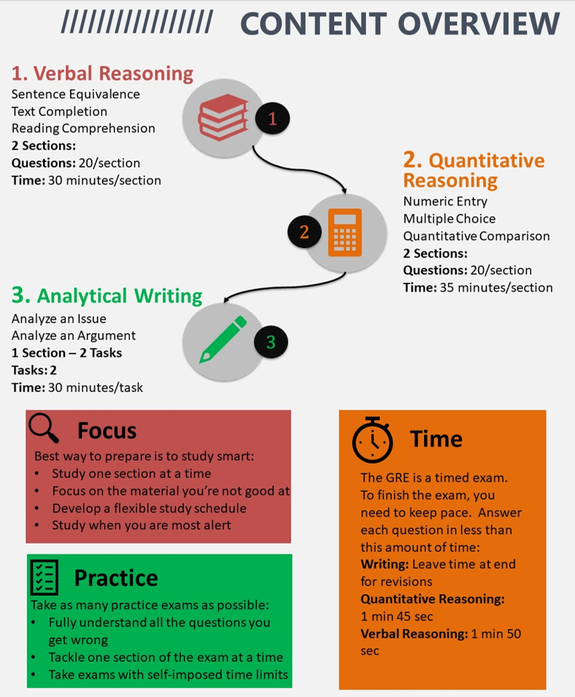
