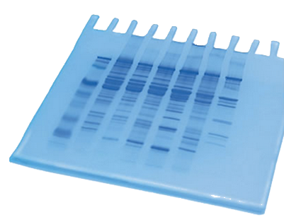
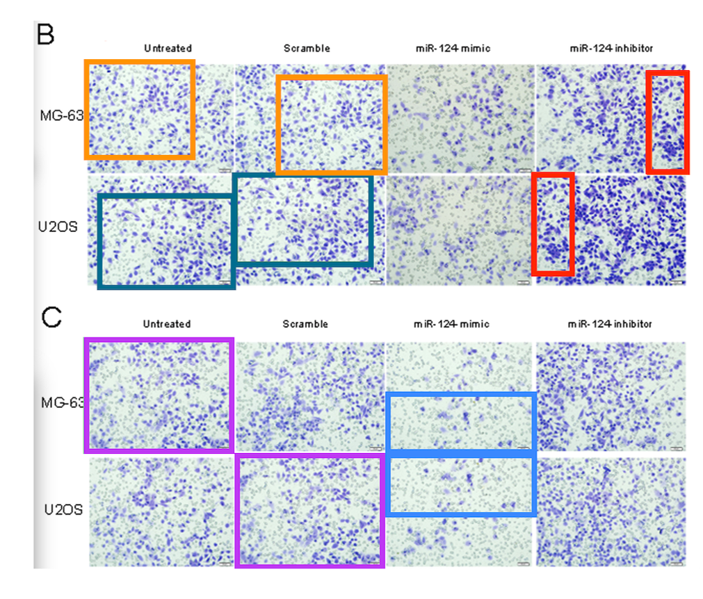

## Brainstorm: What is research misconduct? 

## Defining research misconduct

 

* **Fabrication, falsification or plagiarism in proposing, performing, reviewing and/or reporting research**

 

* **Fabrication/ Falsification of data**
    + enhancing digital Images partially
    + excluding data from articles, presentations, grants
    + performing statistical analysis in a deliberately dishonest way
    + creating data that was never recorded or performed

 

* **Plagiarism**
    + copying text to use in a manuscript, article, thesis, grant or poster
    + republishing your own work (self-plagiarism)

## Why would anyone participate in research misconduct? 

 

**Science is a competitive, pressure-filled endeavor**

## Some famous cases of research misconduct

 
 

**William Summerlin (1974): Claimed to have developed a method to prevent immune rejection of transplanted skin grafts. He transplanted skin from black mice onto white mice. It was determined that he faked success by using a marker to color mouse skin.**

 
 
 
 
 
 
 
 
 
 

**Stephen Breuning (1980s): A psychologist who purported to show that stimulant drugs (e.g. Ritalin) were more effective for treatment of hyperactivity in mentally retarded individuals. This recommendation, which was incorporated into standards of care, was based on fraudulent data.**

## Why does research misconduct matter?…

 

**Andrew Wakefield (1998):  Wakefield published evidence for a connection between the MMR vaccine and autism in The Lancet based on fraudulent data.  He has since had his medical license stripped in the UK.**

 
 
 
 
 
 
 
 
 
 
 

**Surgisphere (2020) claimed to have hospital data which was used to support studies of the effectiveness of hydroxychloroquine in treating COVID-19. Papers in The Lancet and New England Journal of Medicine were retracted in June 2020 when the data was found to be implausible.**

## Maintaining public trust in science

* **It is vital that the public trust science!**

 

* **As a result of these and other incidents:**
    + congress passed legislation to address ethical research behavior (including animal welfare)
    + the NIH has an entire branch devoted to ensuring integrity in research
    + there is mandatory training in responsible conduct of research for anyone receiving research money from the NIH
    + large universities have offices devoted to accountability, compliance, and resolution of research misconduct issues

## COVID-19 State of Vaccine Confidence

## COVID-19 State of Vaccine Confidence

 
 

* **Highlights from CDC insights report (June 21 2021)**
    + pressure created by abundant marketing campaigns, unprecedented incentives,
and vaccine requirements might alienate consumers who are unsure about
getting vaccinated
    + while the ‘return to normal’ appears to be motivating some consumers to get
vaccinated, it seems to be decreasing urgency for others
    + The origin story of the virus that causes COVID-19 is reducing confidence in
COVID-19 vaccines for some
    + vaccine effectiveness is confusing (e.g. # of jabs, variants)
    + adverse effects
    + natural immunity vs vaccination for previously infected
    
 

**https://www.cdc.gov/vaccines/covid-19/downloads/SoVC-report-10-508.pdf**

## 

## Paper retractions as a measure of scientific misconduct

 

* **Currently, ~ 4 of 10,000 papers are retracted**
    + millions of dollars have been granted to retracted research
    + biomedical retractions have not impacted patients (yet)

## Paper retractions as a measure of scientific misconduct

* **The proportion of retractions involving plagiarism of text—stealing someone else’s or duplicating one’s own—has risen**
    + introduction in 2004 of iThenticate, an inter-net-based plagiarism detection service
    + fake peer reviews occur when authors give journals email addresses that they control, allowing them to review their own manuscripts.      + Flawed images include instances of intentional manipulation and of error

## How can data be falsified? Shouldn’t peer review catch that?  

 
 
 
 

* **Approximately 70% of research misconduct involves western blots**

 

* **Western blots detect the presence of a specific protein in a sample**

 

* **Bands are easy to cut out in graphic software and move around, rotate, and splice together**

    
## Curing cancer with Photoshop?

## Bamboozling blots

## Bamboozling blots

## Magic microscopy malfeasance

## Fluorescent flimflam

## Ecological hanly-panky

## Responsible conduct of research is a wide umbrella	

 

**Animal care and use**
 

**Authorship and publication**
 

**Climate, the environment, and culture**
 

**Collaborative research**
 

**Conflicts of interest**
 

**Data management**
 

**Use of human subjects**
 

**Laboratory management and safety**
 

**Mentoring**
 

**Peer review**
 

**Social responsibility**

## Modern push to publish data and code

