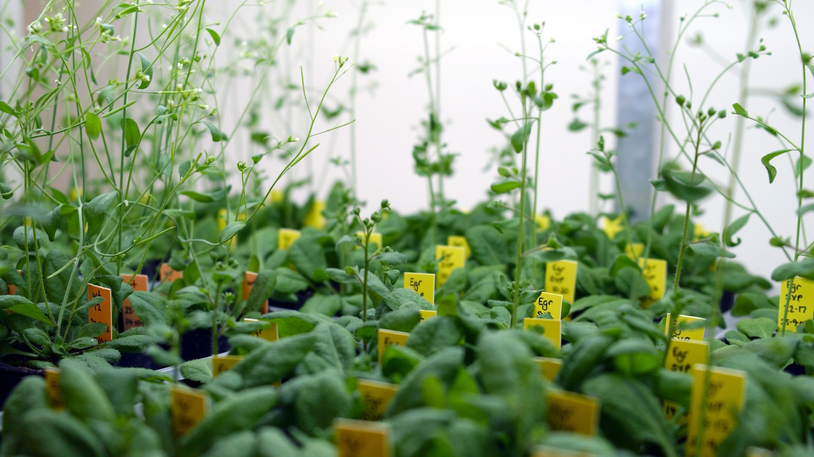

## Biological research generally divides into two camps

 
 
 
 
 
 
 
 
 
 
 
 
 
 
 

 

**Cell / molecular / biomedical**

**Ecology / organismal**

## Biological research generally divides into two camps

 
 
 
 
 
 
 
 
 
 
 
 
 
 
 

 

**Cell / molecular / biomedical**

**Ecology / organismal**

**BUT… the basic principles underlying both are exactly the same!**
 

**There is more crossover in these disciplines than ever before**

## What is the point of doing research?

 
 

* **Research allows us to:**
    + Examine ideas and explanations
    + Gather information and data
    + Find and eliminate flaws in our thinking

 

* **In other words, move beyond philosophy to science**

 

* **Science values empiricism over dogma**
    + empiricism = 
    + dogma = 

 

## Two types of reasoning used in science

**Two kinds of reasoning (or logic) are used in scientific research:**
 

1. *Inductive reasoning*: takes a specific example and induces that it can be applied to a much larger group
 

2. *Deductive reasoning*: starts with a general principle & deduces that it applies to a specific case

## 

**Generally…**

 

* **Inductive reasoning is used in an attempt to discover a new piece of information**

 

* **Deductive reasoning is used to prove that piece of information**

## Inferences applied to Evolution by Natural Selection

## Lets practive: Which type of reasoning?

 

**Every day, I get in my car to leave for work, at 8:00am. The trip takes 45 minutes, and I arrive at work on time. If I leave for work at 8:00am today, I will be on time.**

 

**Today, I left for work at eight o'clock and was on time. Therefore, every day that I leave the house at eight o'clock, I will arrive at work on time.**

## Lets practice: Which type of reasoning?

 

**Every day, I get in my car to leave for work, at 8:00am. The trip takes 45 minutes, and I arrive at work on time. If I leave for work at 8:00am today, I will be on time.**

 

**Today, I left for work at eight o'clock and was on time. Therefore, every day that I leave the house at eight o'clock, I will arrive at work on time.**

 
 

**All dogs are mammals, and all mammals have kidneys.  Therefore, dogs must have kidneys.**

 

**Hamsters, cats, humans, and platypuses have kidneys.  All of these animals are mammals.  Therefore, all mammals have kidneys.**

## The importance of model organisms

 
 
 

**In many areas of biology, model organisms are used to gather information that can be applied more generally to other organisms**

 

**Society has decided it is ethical to perform experiments on animals that benefit human society**

 

**Ultimate example of *inductive reasoning*, but there are pitfalls**

##

## The scientific process is the method scientists use to study things

 

**Based on observation and analysis of data:**
 

1. Make observations
 
2. Develop a question and form a logical hypothesis
* **A hypothesis is a tentative answer to a well-framed scientific question **
 
3. Test predictions arising from the hypothesis (with experiment or more observation)
 
4. Analyze experimental data
 
5. Revise hypothesis and repeat

 
 

**The scientific process is ongoing.**

## A hypothesis is an explanation for an observation

* **A hypothesis is a tentative explanation—it isn’t written in stone**

 

* **Occam’s razor is the principle that the simplest explanation (i.e. having the fewest assumptions/steps) is usually correct**

 

* **A hypothesis must be both testable and falsifiable**
    + a hypothesis that a ghost cast a spell on a car to make it stop working cannot be tested

 

* **Hypotheses should strive to distinguish between causality and correlation**
    + Two things that are correlated are not necessarily causally linked

 

* **Other factors to consider regarding causality:**
    + are there multiple causal factors?
    + Is there a direct or indirect (remote) cause?

    
## An experiment is a test of a hypothesis

 
 

* **Predictions (if this, then that…) arise out of hypotheses that can be tested by experiments**
    + Good experimental design strives to disprove a hypothesis

 

* **Scientists often perform controlled experiments in which an experimental group is compared with a control group**

 

* **Ideally, experimental and control groups differ in only the one factor under investigation**
    + Controls are necessary to rule out the effects of other factors that might affect results

 
 
## “Proof” in science

 
 

**Science does not prove ideas**

 

**Instead, it works by rejecting hypotheses based on supporting and refuting evidence to advance understanding**

 

**Findings are tentative since the REAL explanation may not have been considered**

 

**Science is based on the principle that any idea, no matter how widely accepted, can be overturned if evidence warrants it**

## Science is ongoing

* **The scientific process produces results that can be used in both inductive and deductive reasoning:**
    + Allow generalization (inductive reasoning)
    + Supports or rejects a model or theory (deductive)

 

* **Research always generates more questions than answers!**

## Practical development of research questions

 
 
 
 
 
 

* **The research you perform depends on many factors:**
    + Your interest
    + Your goal
    + Area of biological research
    + Research setting
    + Resources available

## Different kinds of research have different goals

 
 

* **Scientific research can be roughly divided into two categories with different goals**
    + *Basic research* – research about how the world works
        + Driven by curiosity
        + No obvious or immediate commercial value
    + *Applied research* – research with specific aims
        + To solve practical problems: technological / medical
        + Relies upon previous basic research

 
 

**Both are extremely important to drive scientific and technological advancement**

## Examples of different research types in human health...

 
 
 

**Examples of basic research: **
 

1. An investigation into the symptoms of diarrhea. 
 

2. An investigation into the secondary symptoms of the Human Papilloma Virus (HPV)

 

**Examples of applied research: **
 

1. An investigation to determine the healing properties of mushrooms.
 

2. An investigation to determine the side effects of alcohol consumption.

## Science, technology, and society are interrelated

 

**Science and technology rely on each other to provide benefits for society**

## Research Settings (potential careers)

**The place research is being conducted determines the kinds of questions that will be investigated**

 

* **Each setting has advantages and disadvantages**
    + *Academic – small institution* (Shepherd University)
        + Great freedom, undergrad students
        + low budget, lack of equipment
    + *Academic – large research institution* (WVU)
        + Great freedom, advanced equipment, graduate students
        + constant scramble for grant money
    + *Industrial* – biotech, pharmaceutical, agriculture (Pfizer)
        + Advanced equipment, staff focused on a single task
        + Less freedom
    + *Government* (Department of Defense, USDA, NIH)
        + Some degree of freedom
        + Red tape, scramble for money

##

