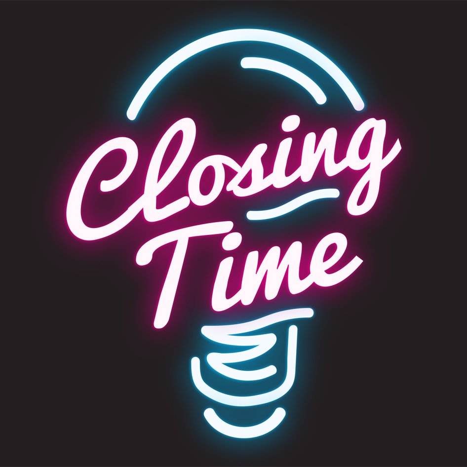
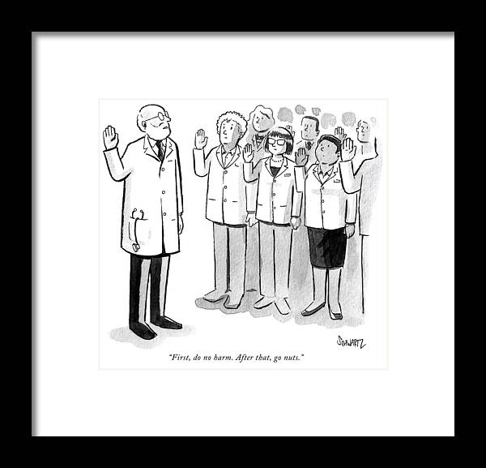

## Cover Letter is an Introduction and a Sales Pitch

 

* **"It should show what sets this individual apart from all others," advises Jeffrey Stansbury,  University of Colorado School of Dental Medicine.**

 

* **Like any good sales pitch, your cover letter should motivate the customer to learn more about the product—in this case, you.**

 

* **A good cover letter, like a good doctor, does no harm:**
    + Avoids making a negative impression. 
    + Demonstrates that you suits your future employer's—specific needs
    + Assures the customer that the quality of the product is superb. 

## The Objective

 

* **A successful candidate impresses the committee right off with the cover letter**
    + makes the selection committe want to dig through the CV and recommendation letters to see the details that start to validate the positive claims

 

* **Provides a glimpse into the applicant's personality and gives some guidance as to whether or not they can communicate in an organized, effective way**
    + Make your cover letter an example of your best writing

## The Match

 

* **Doesn't just emphasize your best qualities; it also shows how well those qualities are likely to mesh with the open position**
    + make a case that you fit the ad

 

* **Show how your education, experience, and interests fit with what the institution is seeking**

 

* **Each cover letter should be tailored to the particular institution**
    + a generic cover letter can make you seem undesirable and lazy

 

* **There will be many applicants qualified for the job, thus your cover letter should answers: How will this person fit in here?**

## Planning

 

* **Learn about the institution, the department, and the open position**
    + read beyond the ad

 

* **Ask yourself what abilities or special qualities a candidate needs to excel in that position.**

 

* **Determine which of your qualifications and accomplishments will particularly interest the hiring committee**

 

* **Emphasize the evidence in your background and experience that prepares you for this opening?**
    + How well do match requirements of the advertisement? 
    + How will you complement the work of the current employees?
    + How will your presence there make the working group better? 
      
## The Opening      

 

* **Start with a salutation**
    + if the direct recipient is unknown, you can use “To Whom It May Concern.”

 

* **The opening paragraph should be short but more than one sentence**

 

* **Salespeople call the opening statement "having a handle"**
    + Your handle is what you offer that makes you especially well qualified for a particular faculty opening. For example, summarizing how well your research interests match the ones the department advertised provides an effective letter opening.

 

* **After the handle, clearly but briefly summarize your most important—and relevant—qualifications**
    + Anything less than a sharp focus and your readers will quickly lose interest and move on to the next application.  
  
      
## The Body

 
 

* **Your achievements, experiences, and plans should constitute the body of your cover letter**
    + depends on the job: research, teaching, lab

 

* **Focus on your most important two or three examples that highlight your fit and qualifications**
    + information about the skills you have gained
    + examples will change as you customize your letters for different jobs
    + expand on points of your resume

## The Closing

 

* **End your letter decisively**

 

* **Don't let it meander to an indefinite or weak close**

 

* **A decisive close projects an image of you as assertive and confident**

 
    
* **Thank the hiring manager for their time and use the closing as an opportunity to sum up why they should hire you**
    + You could also express your interest in the next steps of the hiring process. 

 

* **Include your printed name and signature**

## Do No Harm

 
 

* **Some cover letters inadvertently convey negative impressions of a candidate**
    + if they look sloppy or indicate an inability to communicate in English

 

* **Always have someone else read your cover letter**

 

* **A sloppy cover letter can kill someone's chances**
    + it may be the first thing the committee reads!

## The Basics

 
 
 

* **Cover letter should fit on one page**

 

* **Should be neat and professional**

 

* **Should not reproduce the information in the CV** 
    + should highlight things that the candidate believes will make him or her a good match for the position at hand

