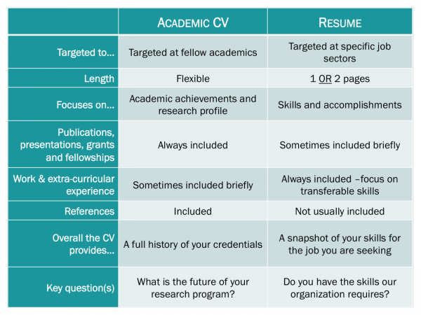
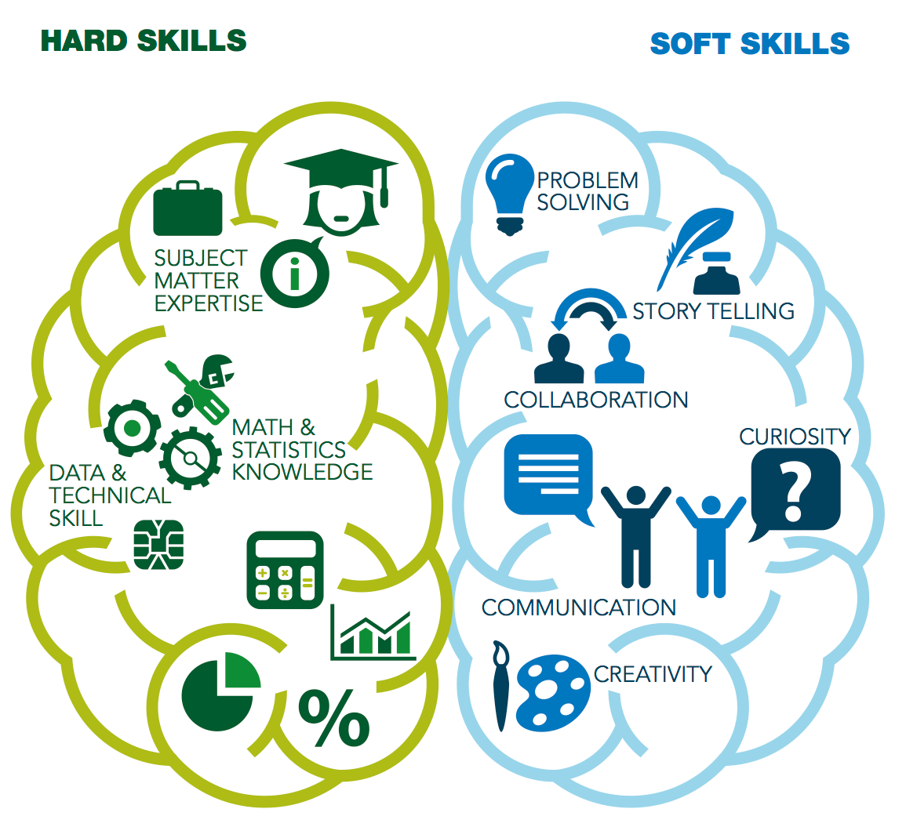

## Resumes and CV

* **Two documents used to present your education, job experience, experiences, and accomplishments to would be employers**

 

* **The resume and CV are different documents used in different situations**

 

## Preparing your job materials: The Resume

 

* **NOT a log of your job history**

 

* **NOT a summary of your skills**

 

* **Can hurt your chances at getting a job if done incorrectly**

 

* **Resume is your marketing tool**
    + selling yourself to potential employers
    
 

* **Your goal is to get potential employers to buy into what you are selling and give you an interview**

## Making your resume as effective as possible

 
 

**Your goal is to clearly articulate how your skills and experiences align to the criteria defined by the job posting**

 

**You should always take the time to tailor your resume to the job opportunity for which you are applying**

 

**Carefully study the job listing (and related listings) to identify skills, experience, education and other qualifications the potential employer is looking to find**

 

**Focus on the "requirements," "skills" or "qualifications" sections and look for buzzwords**

## Be concise

* **Recruiters receive dozens of applications for some positions. The first step involves quickly skimming through submissions and eliminating candidates who clearly are not qualified.**

 

* **A resume should typically be a single page**
    + As you gain job experiences or if you have information that is highly relevant to the position, you can expand to two pages (maximum)

 

* **Look at your resume and ask:**
    + Can a hiring manager see my main credentials right away? 
    + Does critical information jump off the page? 
    + Do I effectively sell myself on the top quarter of the first page? 

## Resume Format

 
 

* **A traditional format that is flexible and can be used by applicants with any level of experience:**
    + **Contact Information** – contact details must be outlined near the top.
    + **Career Objective** – This type of resume introduction can be used by anyone, and allows job-seekers to tailor their resume to their employer.
    + **Education** – Your degrees and certifications (if relevant) should be highlighted.
    + **Work Experience** – highlight previous work related to the position
    + **Additional Skills** – Your skills section can be used to highlight skills or personal attributes relevant to the position.
    + **Awards & Honors** – mention your most impressive

## Contact Information and Career Objectives

* **Contact Info:**
    + Name (largest font on page, middle initial is optional)
    + Mailing Address
    + Telephone Number (check that you have an appropriate voicemail message)
    + Email Address (make sure it’s appropriate, don’t use your sexypanda45@gmail.com)
    + Link to online portfolio (LinkedIn, Researchgate, etc.)

 
 

* **Career Objective**
    + This is a 2-3 sentence statement that provides an overview of your skills and experience.
    + Typical for entry-level candidates

 

**Recent biology graduate of Shepherd University seeking a laboratory research position.  Conducted an independent research project on stem cell proliferation in the developing fruit fly brain.  Looking to join a motivated research team where I can apply my skills to answer new, exciting scientific questions.**  

## Education section

 

* **Having a solid education section helps to display the foundation of your knowledge and expertise.**

 

* **College students that lack professional experience benefit from emphasizing their education by placing it before the professional experience section.**

 

* **Include:**
    + University name
    + Location (city, state)
    + Date of graduation (month, year)
    + Degree(s)
    + GPA (only include if your GPA is above 3.0, format: GPA: 3.5/4.0)

## Relevant work experience

 

* **This will eventually be the core of your resume, where you prove the skills you’ve listed in your qualifications summary and/or career objective.**
    + “Relevant Experience” or “Work Experience” or “Professional Experience.”
    + List only experience that is relevant to the job you are applying for.
    + List your work experiences in reverse chronological order

 

* **For each position, create a heading including the company’s name, city and state, your title, and the dates of employment (month and year).**

 

* **Include 1-3 bullet points that detail your main duties and achievements.**
    + A strong bullet point has:
        + 1st: Action Verb (should always be first)
        + 2nd: Quantifiable Point
        + 3rd: Specific and relevant job duty

## Relevant work experience

 

* **Use non-science work experiences to highlight important transferable skills**
    + leadership, working in teams, managing, etc.  

 

**EXAMPLES:**
 

**Trained 3 undergraduate students, taught basic microscopy skills and guided their research through the semester**

 

**Conducted weekly wetland monitoring surveys, measured turtle species abundance and water quality**

 

**PRO-TIP**: Find key verbs and occupation-specific nouns inside the job listing, then spread them cleverly throughout your resume

## The skills section

 

* **Listing tons of skills on your resume doesn’t actually prove you’re skilled, but it is important to highlight your relevant capabilities throughout your resume to catch the eye of a potential employer**
    + is the ability to lift 40lbs relevant?

 

* **Working various skills into the introduction and work experience sections will strengthen your candidacy.** 

 

* **The skills section is where you will highlight and detail important skill that are *relevant* to the position.**
    + think about the order you present them
    + more is not always better

 

* **There are two kinds of skills that can be included on a resume:  *hard* skills and *soft* skills**

## 

## Awards, honors, or activities

 

* **Adds another layer of customization to your resume by providing further evidence of your abilities and success**

 

* **Can allow you to stand out from your competition (but it is at the end, so might not be taken into account)**

 

* **Some items to consider adding:**
    + Grants
    + Academic Honors
    + Scholarships
    + Volunteer positions
    + Professional Affiliations
    
 

## Stylize your resume

 

* **Choose a suitable font and size: largely dependent on your preference. **
    + Choose easy-to-read fonts
    + Use the same font throughout
    + Change sizes in descending order for your name, headers, and bullet points.
    + Many resumes follow a 24 pt, 12 pt, 10 pt format. 

 

* **Don’t reduce size to fit everything on one page (no less than 10 pt)**
 
* **Don’t pick wacky fonts**
 
* **Don’t have one uniform text size throughout**
 
* **If you use color, use it sparaingly**

 

* **There are TONS of ready-made resume templates for Word available online.  Find an appealing one and fill it in with your details!**

## Workshop assignment, upcoming

 

* **Find an open job for which you currently qualify**

 

* **Prepare a one-page resume following the general format we’ve discussed here tailored to that** position.

 

* **The goal of this assignment is for you to prepare a resume that you can work to improve over time as you get closer to applying for jobs.**

 

* **In your document, provide a link to the job you chose and a one sentence description of it.  This assignment is due by 5pm on Friday, October 22nd.**

