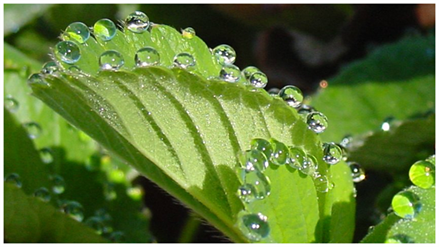
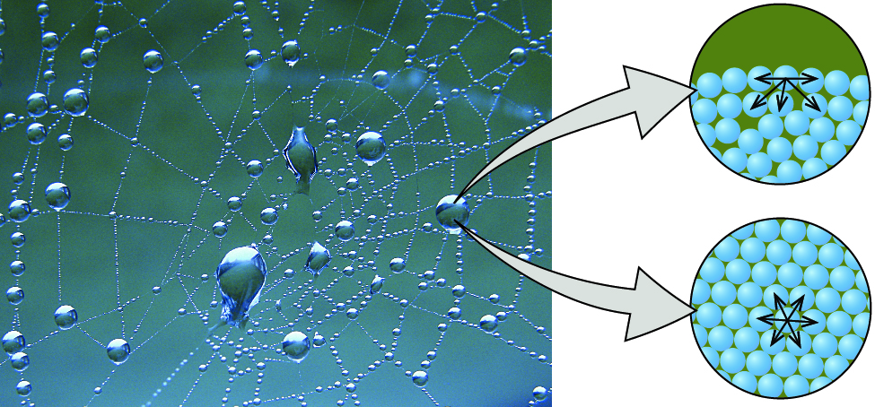
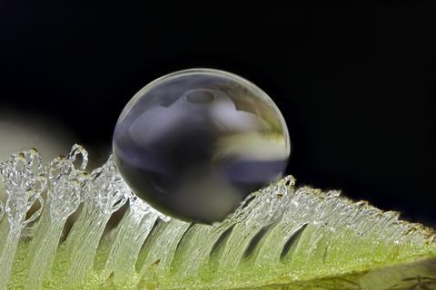
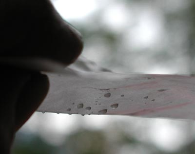

## Investigate a simple scientific question in one day...

 

* **Drops in motion: When liquids are moved on a surface, similar frictional forces arise as those acting on solid bodies**
    
 

* **The behaviour of droplets plays an important role in science and technology**
    + rotary printing press
    + plant ecophysiology
    + how raindrops roll off window panes
    + drainage of tear ducts in corner of eyes
    
 

* **Todays Goal: Shed light on the questions of whether drops roll or slide over a surface**

## Drops in motion: the basics

 
 
 

* **You are familiar with this phenomenon: water drops cling to a pane of glass**
    + even if it is tilted past horizontal
    
 

* **After a certain angle is reached, water drops slide off**
    + liquid overcomes static friction
    
 

* **The puzzle remains: when the drops move, are the *rolling over* or *sliding on* the surface?**
    + is it possible that both are true?
    

## Properties of molecules: The Basics

* **Cohesion = attraction of molecules for other molecules of the same kind**
    + water molecules have strong cohesive forces (thanks to hydrogen bonds)
    + responsible for *surface tension*
    + water drops = ?

* **Adhesion = attraction of molecules of one kind for molecules of a different kind**
    + strong for water, especially with other molecules bearing positive or negative charges.
    +  water can “climb” upwards through thin glass tubes (capillary action)

## Properties of Water: The Basics

 
 

* **Hydrophobic: Non-polar molecules that repel the water molecules**
    + ketchup bottles where the condiment just glides right out
    + glasses that never fog

 
 

* **Hydrophilic: molecules forming ionic or a hydrogen bond with the water molecule**
    + e.g., hydrophilic beach towel consists of thousands of tiny loops of fabric. 

## Today: Design, test and report on 'Water drops in motion'

 

* **In the room is a box of equipment**
    + some or all of these things might be useful

 

* **Design an experiment to measure our central question, starting with a water drop at rest**

 

* **Things to consider:**
    + what surfaces to use (and why)
    + how will you 'see' how water is moving

## Report submitted to Brightspace

 

* **Work in teams of 2 people**
    + turn in your own work

 

* **Assignment components:**
    + Hypothesis
    + Brief methods for each test
    + Results from each test
    + Conclusions

 

* **The assignment should be approx. 1 page. The goal is to practice simply reporting aspects of an experiment**
