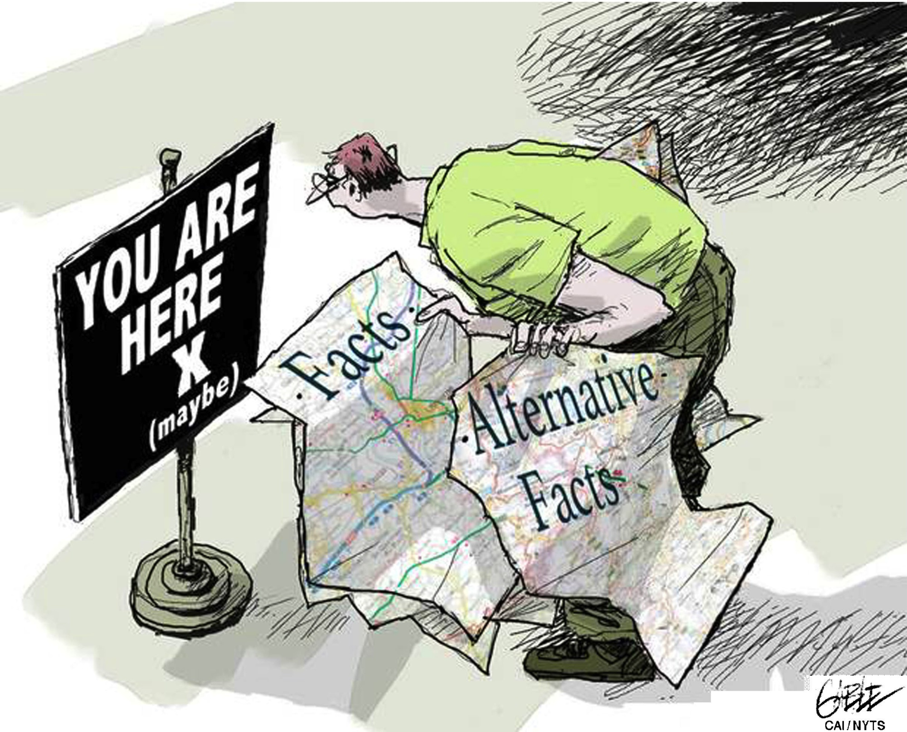
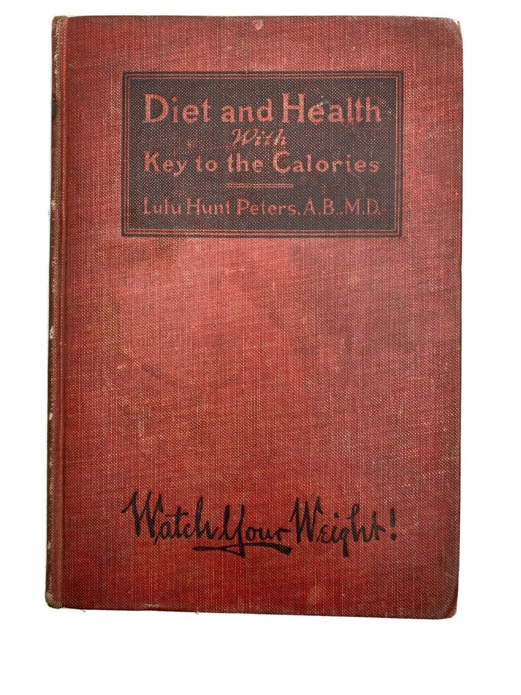

## Who communicates science

• Scientists
 

• Science publishers
 

• Science funders
 

• Science fund raisers
 

• Science policy-makers
 

• Presidents
 

• Politicians
 

• Lobbyists
 

• Entrepreneurs
 

• Venture Capitalists
 

• Investors
 

• Advertisers

• Teachers
 

• Consumers
 

• Doctors
 

• Patients
 

• Medical insurers
 

• Journalists
 

• PR consultants
 

• Broadcasters
 

• Film makers
 

• Playwrights
 

• Museum curators
 

• Bloggers
 

## Professional Science Communication

 

**Brainstorm: Why do scientists communicate with each other?**

## Professional Science Communication

 

**Why do scientists communicate with each other?**

 

**Because science is social**

 

**Because scientists depend on each other for ideas and information**

 

**Because the first requirement of a successful scientist is that s/he succeeds in persuading other scientists that s/he is a successful knowledge producer**

 

**Because scientists are professional critics of their colleagues’ work**

 

**Because the peer reviewed research paper is the official record of scientific achievement**

## Popular Science Communication

 
**Why do scientists engage in popularization?**

## Popular Science Communication

**Why do scientists engage in popularization?**

 
 

**To share their enthusiasm with others**
 

**To “pay back” to society**
 

**To educate the next generation of scientists**
 

**To earn money or fame**
 

**To win research grants**
 

**To satisfy the requirements of grant-givers**

**To advance particular ideas or theories**
 

**To pursue arguments with opponents**
 

**To define particular scientific fields or disciplines**
 

**To persuade policy-makers and funders to support particular areas of research**
 

**To pursue arguments with opponents**
 

**To define particular scientific fields or disciplines**

 
**To persuade policy-makers and funders to support particular areas of research**

## Why scientists should communnicate science...

* **Communicating science effectively needs more than facts**

 

* **Fake news seems to be a new phenomenon, but fake science news is not new**
    + especially relevant in medical biology

 

* **Alternative facts have plagued science for decades**

 
 

“My friends told me I shouldn’t take these toxic drugs — I should use natural medicine instead.”
 

“We were going to save up to buy a water alkaliniser. Could we alkalinise the water she’s given in hospital?”
 

“What if I just take turmeric instead? My son said it’s as good as the drugs.”

## Why this should matter to you, as a next gen scientist...

 
 
 
 
 
 
 
 

**Patients with cancer who rejected conventional anticancer treatments (surgery, hormone therapy, radiotherapy, chemotherapy) in favor of alternative medicine were two-and-a-half times less likely to be alive after five years.**

## Lets discuss...

 

* **The appeal of alternative medicine is well recognized**
    + are they empty promises behind friendly faces?

 

* **Some complementary treatments (meditation/acupunture) to produce clinical benefits**
    + should anyone ever reject proven treatments?

 

* **Who is at fault?**
    + Should we be scrutinizing alternative facts or has science been poorly communicated?

 

* **Who do you think is most vulnerable to alternative science facts?**
    + Why?

## The role of education and media in altertive science facts

 

* **In the same cancer study, those with higher levels of education were more likely to reject conventional treatment!!!!**
    + suggests that those who should be able to weigh evidence, dont do it
    
 

* **Younger people are more likely to choose alternative treatments**
    + 90% of 18-24 yr old engage with social media for health info
    + social media often the primary information source

 

* **The role of social media in promoting or enforcing behaviors can lead to alternative facts based beliefs which are hard to shift**
    + homophily

    
##
    

## Implications for the health industry

 
 

* **Business strategies that include social media can help health industry companies to take a more active, engaged role in managing individuals’ health. **

 

* **Organizations should coordinate integrate information from the social media space and connect with their customers in more meaningful ways that provide value and increase trust.**
    + better positioned to meet needs of consumers

## Why is science communication so relevant...

* **Professional science communicators are important in keeping science in the public eye**

 

* **Scientists have the responsibility and the privilege to be science communicators in our daily lives, to our friends, family and neighbors**

 

* **In the modern age of communication, scientist mush understand where people are coming from**
    + enthusiastic about wonder cures
    + scared for their children
    + anxious about the future

 

* **We share the same feelings, but as scientists we have a different relationship with evidence**

 

* **Why is there such a disconnect?**

## Fact-based approach to Sci Comm can be off-putting

 
 

**Scientists need to be great at communicating on 2 different levels**
 

**1. Communicating our research effectively to other scientists**
 

**2. Effective in making our science accessible to all**

 

* **Every scientists should be able to communicate the 'hook' of their research**
    + why it matters to anyone off the street
    + we will practice this with the 3MT
    + makes you a better scientist!

## The path for effective popular science communication is muddy

 

* **Public skepticism regarding science covers many domains**

 
 

* **Political ideology interacts with climate change skepticism **

 

* **Religious ideology interacts with vaccine skepticism**
    + also with science funding
    
 

* **Level of education interacts with skepticism about genetic modifications**

## Major arguments for promoting popular Sci Comm

 

* **Pipeline Argument:** continued health of science depends on each generation of scientists enthusing the best and brightest of the next generation to become scientists

## Major arguments for promoting popular Sci Comm

 

* **Practical Argument:** An adequate knowledge of science is vitally important to individuals’ health, wealth and well-being

## Diet books as Science Communication

 
 
 
 
 

**Lulu Hunt Peters, Diet and Health with the key to the calories, 1918**

 

**The first successful modern diet book, selling some 2 million copies, Diet and Health introduced many people to the concept of ‘calories’**

## Major arguments for promoting popular Sci Comm

 

* **Cultural Argument:** Science is inherently valuable, and should be communicated to the public as a key part of culture

## Major arguments for promoting popular Sci Comm

 

* **Political Argument:** Science is directly or indirectly relevant to a great deal of public policy, so people need to understand science in order exercise their democratic duties as citizens

## Why am I telling you this?

 

* **Popular science communication can be a career**
  
  
 
* **Science writing**
    + newspapers, magazines, books, journal blogs
 

* **Science broadcasting**
    + radio, TV
    + >1600 NPR Scicommers (incuding undergrads)
    + nprscicommers@gmail.com
 

* **Science museums and events**
    + science cafes, science festivals, etc.
 

* **Science on the web**
    + multi-media for various companies

## For next time

 

* **Select any science, engineering or technology topic that interests you**

 

* **Explore this topic in the 'professional' or 'popular' sense (or both)**

 

* **Prepare a 2-minute oral presentation, for a smart but uninformed, non-specialist audience**
    + no notes allowed
    
* **Try not to stress, this is just practice**
