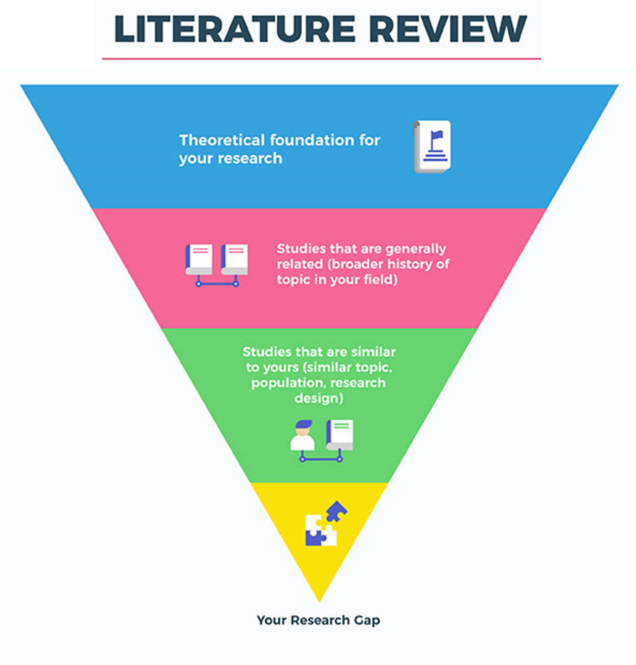
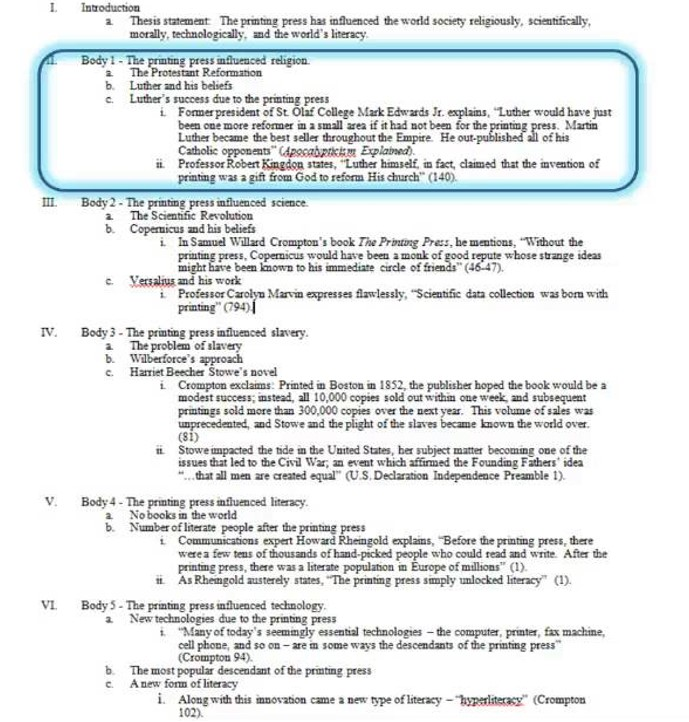
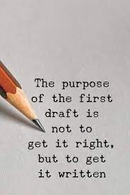

## Once upon a time…

 

* **You want to craft a clear, compelling story and tailor your capstone to the intended audience.**

 

* **You can’t assume that your reader will understand why you have chosen to write about a particular topic or why they should care about it**

 

* **An important aspect of your capstone paper will be to convey why what you are writing about is important**
    + what do we know about the topic?  
    + what do we NOT know about the topic?
    + why is this information important?
    + what message do I want readers to take away?

## Structure of a scientific paper

**All three capstone types will follow the same general structure**

## Build your capstone reference database

* **Use PubMed, Google Scholar, and Web of Science to collect references in Mendeley**
    + even if you do not have the full text yet
    + Request full texts from inter-library loan
    + Dr. C can also help (a little)

 

* **On Google Scholar, search the papers that have cited a paper you have found**
    + use 'Cited by #' and 'Related articles' options
    + https://scholar.google.com/
    + go down the rabbit hole!

 

* **Read and summarize papers on a set schedule**
    + extract information that will be useful in your paper
    + organize into the appropriate section
        + Introduction, Discussion, sub-section

## Getting started…

 

**…is the hardest part. So take small steps!**

 

* **You don’t need to have everything in hand before beginning**
    +  you can always go back and add to your text

 

* **Assemble your notes, papers, and ideas together in one place**
    + create a detailed outline
    
 

* **Dr. C likes to build one paragraph at time**
    + organizing papers, opening statements, actual writing
    

## Brainstorming…

 

* **Jot down ideas, important bits of research, and any outstanding questions.  You can always eliminate later.**
    + create a mind map
    + start a document with main ideas
    + free write as ideas come to you

* **Write a working title for your paper**
    + Establishes your roadmap
    + Keeps you focused

## Putting together an outline is key

 

* **The goal of an outline is to organize your many ideas (eventually into a coherent story)**

 

* **Your first outline can be broad—don’t worry about writing complete sentences/paragraphs**
    + group cite-able articles into appropriate sections (First outline)
    + extract information from those articles (Final outline)
    
 

* **Do not try to achieve perfection!**

 
 

* **CAPSTONE BENCHMARK: Outline due September 17^th^**

## Organizing your ideas will keep you focused

 

* **Review your brainstorming notes and place related ideas in the same group**
    + use highlighters to mark up your mind map or written notes
    + sort your index cards
    + have a blank piece of paper for each grouping and rewrite your notes on them
    + or adapt an online version of above

 

* **Each of these groups will form a main point (or perhaps a subsection of the paper)**
    + add a section to your outline
    + develop 'stories' that will be written as paragraphs

## Group your information…

 
 

* **Broad ideas correspond to main points**

 

* **Specific details are supporting pieces of information**

 

* **Use the main points to create your subheadings and/or paragraphs within different sections of the paper (Introduction, Discussion, etc.)**

 

* **Order the subheadings and paragraphs according to the overall structure of your paper**
    + keep in mind the inverted pyramid
    + keep in mind a persuasive 'flow' of ideas

## Moving from outline to draft...

 
 

* **Each paragraph will be based on a main point in your outline:**
    + The main point will form the topic sentence of a paragraph 
    + Details that support or elaborate upon the main point make up the rest of the sentences

 

* **Try to write in paragraph chunks**
    + compare and contrast findings from published sources
    + group 'like' information into single statements with multiple citations
    + take your time to synthesize the 'story'

 

* **We will utilize a 2^nd^ detailed outline, then a draft**

    
## Paragraphs have structure and tell a story

 

**Topic sentence: Key topic in the paragraph**
 
**Development: Develop your topic in more detail**
 
**Support: Provide evidence or data that show your development is valid**
 
**Summary and Transition:  Summarize the main point, transition to next paragraph**

    

## Working on your first draft

 
 

* **If you get stuck, talk to someone about what you are writing (me)—this can lead you to new ways of saying things**
       
 

* **Don’t worry about length. If you have an appropriate amount of ideas and supporting material, your paper will be the correct length.**
    + the more citations you have, the easier it is to write!
    
 

* **Again, don’t strive for perfection as you write.  There will be time to go back afterward and revise**
    + keeping writing momentum is key

## The first draft: an author’s perspective

 

**Writing is a process, and very rarely (if ever) will you produce your best work on your first try!**

 
 

“Get it down. Take chances. It may be bad, but its the only way you can do anything really good.” — William Faulkner

 
 
 

“I’m writing a first draft and reminding myself that I’m simply shoveling sand into a box, so that later, I can build castles.” — Shannon Hale

## Revise!  Revise!  Revise!

 
 
 
 
 
 
 
 

* **It can’t be overstated how important revision is to writing!**

 

* **Revision is the step focused on improving the readability and professionalism of your paper**

 

* **Revise with a purpose!**
    + check for specific errors each time (grammar, tense, figures)
    + just re-reading will not work
 

* **What should you evaluate when revising your outline?**

