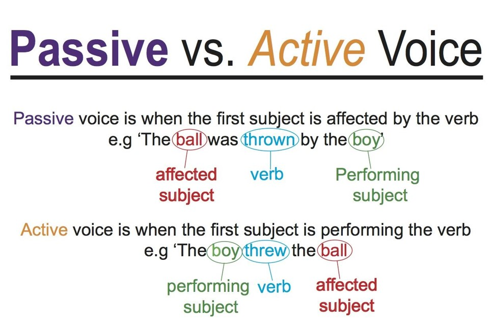

## Your goal as a writer

 

* **Your goal as a scientific writer is to communicate information to the reader in as clear and concise a manner as possible**
    + you want your reader to understand what you wish to say effortlessly

 

* **Writing is a process, and very rarely (if ever) will you produce your best work on your first try!**

 

* **Adhere to the K.I.S.S principle = **

## Revising is hard work but worth it!

**Writing a draft of your paper is an important first step, but it is revision that makes your paper great**
    + each time you revise you add points
    
 

* **Revision literally means “to see again,” to look at your paper from a fresh, critical perspective**

 

* **This can be a difficult process after you are so invested in your writing**

## What is revision?

* **Revision is not simply correcting spelling and grammatical errors—this is proofreading (which is also important!)**

 

* **Revision is a chance for you to look critically at what you have written to see:**
    + Is it worth saying?  
    + Does it say what you intended it to say?
    + Will the reader understand what you’re saying?
    + **Can I say it more simply (K.I.S.S)**

 

* **This is not a quick process—this is why your capstone rough draft is due far in advance of the final paper!**

## Important questions to ask during revision…

> - **Think about your purpose: Does your introduction state clearly what you intend to do or discuss? Are your aims clear to your readers?**

 

> - **Examine the balance within your paper: Are some parts out of proportion with others? Do you spend too much time on one trivial point and neglect a more important point? Do you give lots of detail early on and then let your points get thinner by the end?**

 

> - **Check the organization: Does your paper follow a pattern that makes sense? Do transitions move your readers smoothly from one point to the next? Do the topic sentences of each paragraph appropriately introduce what that paragraph is about? Would your paper work better if you moved some things around?**

 

> - **Check your information: Are all your facts accurate? Are any of your statements misleading? Have you provided enough detail to satisfy readers’ curiosity? Have you cited your information appropriately?**

 

> - **Check your conclusion: Does the last paragraph tie the paper together smoothly and end on a stimulating note?**

## Important questions to ask during revision…

 

* **Turn these points into a personal checklist before submission!!!***

## Pro Tips: Make writing a scheduled part of your semester life

 

* **The more you can imagine yourself as a reader looking at this for the first time, the easier it will be to spot potential problems.**

 

* **The more you demand of yourself in terms of clarity and elegance, the more clear and elegant your writing will be**
    + you should be proud of what you turn it

## Dr. C’s practical tips for revising

 

* **Don’t revise immediately after writing something—come back a few hours later with fresh eyes.**

 

* **Work from a printed copy (at least a few times)**
    + Some problems you overlook on the screen show up better on paper.

 

* **Read the paper out loud. This is a good way to see how well things flow. Listen for places you get lost**
    + if it sounds weird, it probably reads weird

 

* **Remember all those questions? Don’t try to address all of them in a single revision session**
    + proofread with a purpose

 

* **Ask yourself lots of questions while you read your draft and don’t shy away from answering them honestly**
    + is this sentence shit? 
    
## Your goal as a writer

 

* **Your goal as a scientific writer is to convey information to the reader in a clear, concise, and complete manner**

 

* **Luckily, there are some fairly straightforward ways to make your writing as clear as possible**
    

## Strengthen your writing: Avoid overwordiness

 

* **Use forceful verbs—replace long verb phrases with a more specific verb**
    + Replace “She argues for the importance of the idea” with “She defends the idea.”
    + **“It is clear by looking at Figure 1 that…” vs. “Figure 1 shows…”**
    + “We obtained estimates of” vs. “We estimated”

 

* **Cut as many prepositional phrases as you can without losing your meaning**
    + “There are several examples of the issue of integrity in Huck Finn” would be improved with “Huck Finn repeatedly addresses the issue of integrity.”

 

* **Don’t worry about length. If you have an appropriate amount of ideas and supporting material, your paper will be the correct length.**
    + the more citations you have, the easier it is to write!
    
 

* **Avoid awkward passive voice**
    + “In an initial case study by Burns et al. (1997) of identical twins, it was noticed that identical twins were more likely…” vs. “Burns et al. (1997) noticed that identical twins are more likely…”

## Cutting down an overwordy sentence: Let's try

 
 
 
 
 
 
 
 

**This paper provides a review of the basic tenets of cancer biology study design, using as examples studies that illustrate the methodologic challenges or that demonstrate successful solutions to the difficulties inherent in biological research.**

## Cutting down an overwordy sentence: Let's try

 
 
 
 
 
 
 
 

**This paper provides a review of span style="color:red">the basic tenets of cancer biology study design, using span style="color:red">as examples span style="color:red">studies that illustrate the span style="color:red">methodologic challenges or span style="color:red">that demonstrate successful solutions span style="color:red">to the difficulties inherent in biological research.**

## Cutting down an overwordy sentence: Let's try

 
 

This paper provides a review of span style="color:red">the basic tenets of cancer biology study design, using span style="color:red">as examples span style="color:red">studies that illustrate the span style="color:red">methodologic challenges or span style="color:red">that demonstrate successful solutions span style="color:red">to the difficulties inherent in biological research.

 
 
 
 

**This paper reviews cancer biology study design, using examples that illustrate the challenges and solutions faced by scientists.**

## Strengthen your writing: use a variety of language

 

* **Avoid using the same word or phrase twice or more in consecutive sentences**
    + alternative ways to say the same thing
    + combine the two sentences.

 

* **Increase your sentence variety. If more than two sentences in a row start the same way (e.g. with a subject followed by a verb), then try using a different sentence pattern.**
    + blend short and long sentences
    
 

* **Aim for precision in word choice. Don’t settle for the best word you can think of at the moment**
    + thesaurus (shift-F7 in Word!) 
    
 

* **Look for sentences that start with “It is” or “There are” and revise with active voice**
    + “There are many species of frogs in the rainforest.” vs. “The rainforest plays host to many frog species.”

## Some common mistakes in scientific writing

 

* **Overuse conjunctive adverbs (however, moreover, thus)**
 
* **Use useless phrases (note that, be aware, etc.)**
 
* **Use excessive hedging (may possibly, might be, suggests, etc.)**
 
* **Use judgmental adverbs (obviously, clearly, etc.) **
 
* **Use passive voice**
 
* **Use contractions**
 
* **Use unfamiliar words (you should be able to define every word in your paper!)**
 
* **Use unnecessary adjectives and adverbs**
 
* **Be inconsistent with abbreviations**

 
 
 

**Mistakes in a museum: https://www.youtube.com/watch?v=9zmy7FIMDWU **

 

**ACS webinar series on writing: https://www.youtube.com/watch?v=91jo4kX7Cq0**

 

**The UNC writing center: https://writingcenter.unc.edu/tips-and-tools/**

 

**Duke scientific writing resource: https://sites.duke.edu/scientificwriting/**

